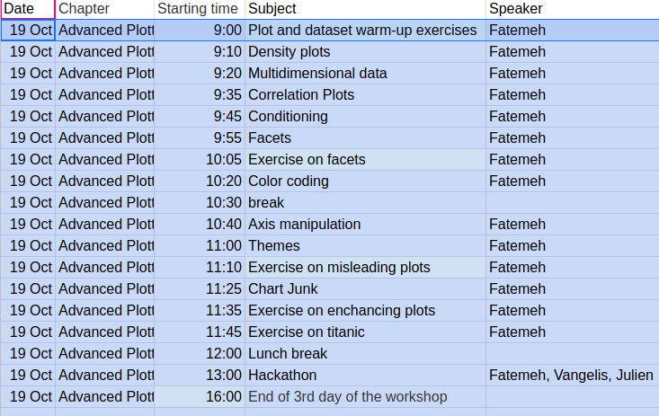
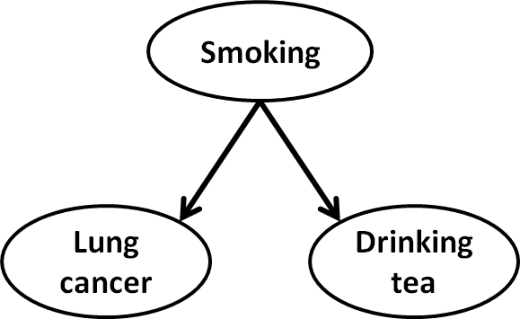

<!-- Center image on slide -->
<script src="http://ajax.aspnetcdn.com/ajax/jQuery/jquery-1.7.min.js"></script>
<script type='text/javascript'>
$(function() {
    $("p:has(img)").addClass('centered');
});
</script>
</script>
<script type = 'text/javascript'>
$('p:has(img.build)').addClass('build')
</script>

<script type='text/javascript'>
// parameters
var sections = ["Correlation", "Multidimensional Data", "Conditioning", "Colors", "Interactive Plots", "Do's and dont's"];
var title = "Overview";
var fontsize = "20pt"
var unselected_color = "#888888"
// function
function toc(cur) {
  // header
  document.write("<h2>"+title+"</h2>");
  // find current
  ind = sections.indexOf(cur);
  if (ind==-1 && cur.length>0) {
     document.write("<br/>Error: section not defined '"+cur+"'");
     return;
  }
  // write all out
  document.write("<br/><ul>");
  for (i = 0; i < sections.length; i++) { 
    if (cur=="") 
      // all the same
      document.write("<li style='font-size:"+fontsize+"'>"+sections[i]+"</li>");
    else {
      if (i==ind)
        document.write("<li style='font-size:"+fontsize+"'><b>"+sections[i]+"</b></li>");
      else
        document.write("<li style='color:"+unselected_color+";font-size:"+fontsize+"'>"+sections[i]+"</li>");
    }
  }
  document.write("</ul>");
}
</script>


```{r global_options, include=FALSE, cache=F}
# setwd(file.path(getwd(), 'lectures-WS1718'))
source("../../config.R")
opts_chunk$set(
    echo=TRUE, warning=FALSE, message=FALSE, cache=F, 
    results="show",
    out.width="500px", out.height="400px", fig.height = 3, fig.width = 4, 
    dpi=200
)
# options(width=100)
imgprefix <- 'assets/img/lec06_07_plotting/'
figprefix <- 'assets/fig/lec07_'

ind <- fread('../../../extdata/CPI_HDI.csv')

mysize <- 15
mytheme <- theme(
    axis.title = element_text(size=mysize), 
    axis.text = element_text(size=mysize),
    legend.title = element_text(size=mysize),
    legend.text = element_text(size=mysize)
    )


options(knitr.package.unnamed.chunk.label="day-03")
```


<!-- START LECTURE -->

## Day 3 Schedule

```{r, out.width = "800px", echo=FALSE}

```

---

## Exercises 1

---

## Density plots

Sometimes histograms are not the optimal plots to investigate distributions. In such cases density plots can be very usefull.

As an example, we can visualize the distribution of the Human Development Index (HDI) in the `ind` dataset by means of a density plot with `geom_density()`:

```{r warning=FALSE, message=FALSE}
ggplot(ind, aes(HDI)) + geom_density() + mytheme
```

---

## Density plots

The `bw` argument of the `geom_density()` function allows to tweak the bandwidth of a density plot manually. The default option is a bandwidth rule, which is usually a good choice.

Setting a small bandwidth on the previous plot has a huge impact on the plot:

```{r}
ggplot(ind, aes(HDI)) + geom_density(bw=0.01) + ggtitle('Small bandwidth') +
  mytheme
```

---

## Density plots

Setting a large bandwidth has also a huge impact on the plot:

```{r}
ggplot(ind, aes(HDI)) + geom_density(bw=1) + ggtitle('Large bandwidth') +
  mytheme
```

---

## Density plots

Thus, we should be careful when changing the bandwidth, since we can get a wrong impression from the distribution of a continuous variable.

---

## Multidimensional data

* For this part, we assume all variables to be quantitative.

* That means, all variable values will be plotted on continuous (xy-)axes.

* More complicated, mixed binary/multinomial/ordinal/continuous data might require specialized plotting and data analysis strategies

---

## Small dimensionality, ~3-10 variables

**Plot matrix**

```{r fig.width=4, fig.height=4, eval=FALSE}
library(GGally)
ggpairs(mpg, columns = c("displ","cyl","cty","hwy"),
        upper = list(continuous = wrap("cor", method = "spearman"))) + mytheme
```

---

## Small dimensionality, ~3-10 variables

**Plot matrix**

```{r fig.width=4, fig.height=4, echo=FALSE}
library(GGally)
ggpairs(mpg, columns = c("displ","cyl","cty","hwy"),
        upper = list(continuous = wrap("cor", method = "spearman"))) + mytheme
```

---

## Medium dimensionality, <100 variables

Correlation plots, "corrgrams", "correlograms"

```{r}
GGally::ggcorr(mtcars, geom = 'circle', params=c(corMethod="spearman")) 
```

---

## High dimensionality, >100, >>100 variables

Heatmaps

```{r   fig.height=3, fig.width=4, out.width="580px", eval=FALSE}
mtcars_melted <- as.data.table(scale(mtcars[1:10,]), keep.rownames = "Cars") %>%
                  melt(id.var = "Cars")
mtcars_melted <- mtcars_melted
ggplot(mtcars_melted, aes(variable, Cars)) +
  geom_tile(aes(fill=value)) +
   scale_fill_gradient2(low='darkblue', mid= 'white', high='darkred') + mytheme
```

---

## High dimensionality, >100, >>100 variables

Heatmaps

```{r lec07_heatmap2,  fig.height=6, fig.width=9, out.width="580px", echo=FALSE}
mtcars_melted <- as.data.table(scale(mtcars[1:10,]), keep.rownames = "Cars") %>%
                  melt(id.var = "Cars")
mtcars_melted <- mtcars_melted
ggplot(mtcars_melted, aes(variable, Cars)) +
  geom_tile(aes(fill=value)) +
   scale_fill_gradient2(low='darkblue', mid= 'white', high='darkred') + mytheme

```

---

## Heatmaps with hierarchical clustering

Rows and colums are clustered based on their similarity (eg Euclidean distance or correlation). This reveals groups of features or observations that are similar. The algorithm will be explained in the next lecture

```{r lec06_hc_heatmap,  fig.height=4, fig.width=4, out.width="400px", eval=FALSE}
library(pheatmap)
pheatmap(mtcars)
```

---

## Heatmaps with hierarchical clustering

Rows and colums are clustered based on their similarity (eg Euclidean distance or correlation). This reveals groups of features or observations that are similar. 

```{r lec06_hc_heatmap2,  fig.height=4, fig.width=4, out.width="400px", echo=FALSE}
library(pheatmap)
pheatmap(mtcars)
```

---

## Heatmaps with hierarchical clustering with scaling

It can be useful to bring all variables to the same scale by subtracting their means and dividing by their standard deviation. This is done with setting the parameter scale='column'. Row-scaling can also sometines make sense.

```{r lec06_hc_heatmap_scale,  fig.height=4, fig.width=4, out.width="400px"}
pheatmap(mtcars, scale="column")
```

---
<script type='text/javascript'>toc("Conditioning")</script>

---
## 

<br/><br/>
_Negative_ correlation between tea drinking and lung cancer, as reported by observational studies:

<br/><br/>


--- &radio
## Question

What is "wrong" with the negative correlation between tea drinking and lung cancer?

1. A. Even if the result is reported as significant, this could be pure chance.
2. B. It is confounded by the country people live in.
3. C. It does not make sense to investigate this correlation, because we know tea drinking does not have anything to do with cancer.
4. D. _It is confounded by smoking status._

***.explanation
Next slide

---

## Question

**What is "wrong" with the negative correlation between tea drinking and lung cancer?**
<br/><br/>

* A. Even if the result is reported as significant, this could be pure chance.
  * *No, that is exactly what significant means, it is not occuring by chance (if statistics are performed properly).*
* B. It is confounded by the country people live in.
  * *Interesting idea, but not in this case.*
* C. It does not make sense to investigate this correlation, because we know tea drinking does not have anything to do with cancer.
  * *That would introduce a severe research bias, I am excluding associations that I do not believe in.*
* **D. It is confounded by smoking status.**
  * *Yes, smokers are not tea drinkers (they seem to prefer coffee), and smoking is causally related to lung cancer.*


---
## Confounders

Correlations are often driven by confounding factors. Depending on the context, this can lead to spurious associations and false interpretations.

<br/><br/>
Negative correlation between tea drinking and lung cancer:

<br/><br/>


--- 


## Simulation of a confounder

A simulated dataset with an RNA concentration (expression), a phenotype variable (eg body height) and genotype at one gene:


--- 


## Simulation of a confounder

10 data points of the simulated dataset:

```{r lec07_cond, echo=F,warning=F}
library(data.table)
library(ggplot2)
AA <- data.table(Expression = rnorm(1000, mean = 5), 
                 Phenotype = rnorm(1000, mean=1, sd = 1.5))
AB <- data.table(Expression = rnorm(2000, mean = 6), 
                 Phenotype = rnorm(2000, mean=4, sd = 1.5))
BB <- data.table(Expression = rnorm(1000, mean = 8), 
                 Phenotype = rnorm(1000, mean=8, sd = 1.5))
dt <- rbindlist(list(AA=AA, AB=AB, BB=BB), idcol = "Genotype")
# shuffle, so head shows different genotypes
dt <- dt[sample(dim(dt)[1],dim(dt)[1]),]
```

```{r}
head(dt, n=10)
```

---

## Confounder variable induces a correlation

Phenotype and expression nicely correlate:

```{r lec07_scat}
ggplot(dt, aes(Phenotype, Expression)) + geom_point()
```

---

## Confounder variable induces a correlation

Phenotype and expression nicely correlate:

```{r lec07_scat2}
dt[, cor(Phenotype, Expression)] 
```
&nbsp;...but are they directly correlated? Does this indicates that one is the cause of the other one?

---

## Facets allows plotting conditioning on a third variable (potential confounder)

```{r lec07_scat_cond, fig.width=4.5, out.width = "450px"}
ggplot(dt, aes(Phenotype, Expression)) + geom_point() + facet_wrap(~ Genotype)
```

---

## Facets allows plotting conditioning on a third variable (potential confounder)

```{r lec07_scat_cond2, fig.width=4.5, out.width = "450px"}
dt[, cor(Expression, Phenotype), by = "Genotype"]
```

---

## Exercise 2

---

## Conditioning can rule out direct correlation and therefore causation

```{r lec07_scat_cond3, echo=F, fig.width=4.5}
ggplot(dt, aes(Phenotype, Expression)) + geom_point() + facet_wrap(~ Genotype)
```

**Statistically speaking**: The two variables *are* correlated, but their correlation is explained away by the genotype. *Conditioned* on the genotype (one also says *given* the genotype), their correlation is zero. This rules out a causal relationship from one to the other. Note that correlation never proves causation. However, conditioning can rule out causation.


---
## The `diamonds` data
```{r, echo=FALSE}
head(diamonds, 1)
```
Description of R datasets are available through the help.

```{r}
?diamonds
```

---

## The `diamonds` data

Variable  | Description
------------- | -------------
price  | price in US dollars (\$326-\$18,823)
carat  | weight of the diamond (0.2-5.01)
cut | quality of the cut (Fair, Good, Very Good, Premium, Ideal)
color | diamond colour, from J (worst) to D (best)
clarity | a measurement of how clear the diamond is (I1 (worst), SI1, SI2, VS1, VS2, VVS1, VVS2, IF (best))
x | length in mm (0-10.74)
y | width in mm (0-58.9)
z | depth in mm (0-31.8)
depth | total depth percentage = z / mean(x, y) = 2 * z / (x + y) (43-79)
table | width of top of diamond relative to widest point (43-95)

---

## Conditioning with categorial variables: multi-way histograms
We introduced that, one can map variables to colours easily with ggplot.
```{r, lec07_pos1, fig.height=5, fig.width=8, out.width="500px"}
ggplot(data = diamonds, aes(cut, fill = cut)) + 
  geom_bar() + mytheme
```

---

## Conditioning with categorial variables: multi-way histograms

What happens if you map fill colour to other variable like `clarity`? 

---
## Conditioning with categorial variables: multi-way histograms `stack`
```{r, lec07_pos2, fig.height=5, fig.width=8, out.width="500px"}
ggplot(diamonds, aes(x = cut, fill = clarity)) + 
  geom_bar() + mytheme
```

The stacking is performed automatically by the position adjustment specified by the position argument. The default position is "`stack`". 

---

## Conditioning with categorial variables: multi-way histograms `fill`

```{r, lec07_pos3, fig.height=5, fig.width=8, out.width="500px"}
ggplot(diamonds, aes(x = cut, fill = clarity)) + 
  geom_bar(position = "fill") + mytheme
```

`position = "fill"` works like stacking, but makes each set of stacked bars the have same height. This makes it easier to compare proportions across groups.

---
## Conditioning with categorial variables: multi-way histograms `dodge`

```{r, lec07_pos4, fig.height=5, fig.width=8, out.width="500px"}
ggplot(diamonds, aes(x = cut, fill = clarity)) + 
  geom_bar(position = "dodge") + mytheme
```

`position = "dodge"` places overlapping objects directly beside one another. This makes it easier to compare individual values.

---

<script type='text/javascript'>toc("Colors")</script>

---

## Color coding in R

Four ways to code colors in R (ggplot2):

`1.` Default aesthetic mapping (`aes(color = variable)`)
`2.` Predefined color numbers 
`3.` Predefined color names
`4.` RGB - HTML color codes

---

## Color coding in R

Four ways to code colors in R (ggplot2):

`1.` Default aesthetic mapping (`aes(color = variable)`)

```{r, eval=F}
x <- c(1:5); dt <- data.table(x)
p <- ggplot(dt, aes(x)) # save the mapping to p
p + geom_bar(aes(fill = factor(x))) # factor convert x into factors, then map to ggplot default color palette
p + geom_bar(aes(fill = factor(x))) + scale_fill_brewer(palette="Spectral") # change default color palette
```

```{r, lec07_cor1, eval=T, echo=F, fig.width=8, fig.height=4, out.width="600px"}
library(gridExtra)
x <- c(1:5); dt <- data.table(x)
p <- ggplot(dt, aes(x)) # save the mapping to p
p1 <- p + geom_bar(aes(fill = factor(x))) + mytheme
p2 <- p + geom_bar(aes(fill = factor(x))) + scale_fill_brewer(palette="Spectral") + mytheme
grid.arrange(p1, p2, ncol=2)
```

---

## Color coding in R

Four ways to code colors in R (ggplot2):

`2.` Predefined color numbers 

```{r, lec07_cor1.2, fig.width=4, out.width="400px"}
x <- c(1:5); dt <- data.table(x)
p <- ggplot(dt, aes(x)) # save the mapping to p
p + geom_bar(fill = x) + mytheme
```

---

## Color coding in R

Four ways to code colors in R (ggplot2): 

`3.` Predefined color names, as listed in `colors()` 

```{r, lec07_cor1.3, fig.width=4, out.width="400px"}
x <- c(1:5); dt <- data.table(x)
p <- ggplot(dt, aes(x)) # save the mapping to p
p + geom_bar(fill=c("green", "red", "blue", "gray","palevioletred3")) + mytheme
head(colors(), n = 5)
```

---

## Color coding in R

Four ways to code colors in R (ggplot2):

`4.` RGB - HTML color codes

* *Additive color model*
* Hexadecimal coding of three number pairs for red, green, blue
* `00`-`FF` corresponds to 0-255

<!-- &nbsp;&nbsp;&nbsp;&nbsp;&nbsp;&nbsp;&nbsp;&nbsp;&nbsp;&nbsp;&nbsp;&nbsp; -->
<!--  -->

<!-- http://en.wikipedia.org/wiki/Additive_color -->

<!-- http://urlnextdoor.com/iadt/web-design_1/week04.php -->


---

## Color coding in R

Four ways to code colors in R (ggplot2):

`4.` RGB - HTML color codes

```{r, lec07_cor1.4, fig.width=3.5, fig.height=3, out.width="300px"}
x <- c(1:5); dt <- data.table(x)
p <- ggplot(dt, aes(x)) # save the mapping to p
p + geom_bar(fill=c("#FFFFFF", "#FFFF00", "#666666","#22AAAA", "#000080")) + mytheme
```

---
## RColorBrewer 
The RColorBrewer package provides a set of nice color palettes
```{r, RColorBrewer, fig.width=15, fig.height=8, out.width="800px"}
display.brewer.all()
```


---
## Careful with colors
### Color in context

* Like all aspects of visual perception, we do not perceive color in an absolute manner. 
* Perception of an object is influenced by the context
* Visual perception is relative, not absolute.

```{r, out.width = "500px", echo=F}
knitr::include_graphics("assets/img/lec07_col_contrast.png")
```


---
## Careful with colors
### Color in context

**Rule #1**

If you want different objects of the `same color` in a table or graph to look the same, 
make sure that the `background is consistent`.

**Rule #2**

If you want objects in a table or graph to be `easily seen`, 
use a background color that `contrasts sufficiently` with the object.


---
## Careful with colors
### Use color meaningfully and with restraint

```{r, warning=F, results='hide', echo=F, fig.height=5, fig.width=5}
dt <- poke_dt[,.(mean_hp = mean(HP, na.rm=T)), by=Type][order(mean_hp)]
dt[,Type:= factor(Type, levels = as.character(Type))]
p <- ggplot(dt, aes(Type, mean_hp)) + geom_bar(stat = 'identity', aes(fill = Type)) + coord_flip()
p
# p <- plot_ly(dt, y= ~mean_hp, x= ~Type, type='bar', 
#             color=~Type, colors= rainbow(length(unique(dt$Type)))) %>%
#  layout( xaxis=list(categoryorder='trace', title=''),
#         yaxis=list(title='Average health power'),
#         title='Pokemon health power by type',
#         margin=list(b=60)
#  )
# p
# tmpf12 <- "assets/fig/lec07-col_restraint.html"
# save_plotly_as_widget(p, file.path(getwd(),tmpf12))

#  `r print_plotly_iframe(tmpf12)`
```


---
## Careful with colors
### Use color meaningfully and with restraint

**Rule #3**

Use color only when needed to serve a particular communication goal.

**Rule #4** 

Use different colors only when they correspond to differences of meaning in the data.

**Rule #5**

Use `soft`, natural colors to display `most` information 
and `bright` and/or dark colors to `highlight` information that requires greater attention.

---
## Careful with colors
### Define standard palettes of colors for particular purposes

Different types of color palettes
* Categorical: separate items into distinct groups
* Sequential: quantitative differences

```{r, out.width = "500px", echo=F}

```

* Diverging: quantitative differences, breakpoint

```{r, out.width = "500px", echo=F}

```

---
## What's wrong with the following plot?

```{r, out.width = "400px", echo=F}
knitr::include_graphics("assets/img/lec07-bad1.png")
```

Xiong et al., Science 2014

---
## What's wrong with the following plot?

```{r, out.width = "400px", echo=F}
knitr::include_graphics("assets/img/lec07-bad1.png")
```

1. Rainbow color where there are no breakpoints. Color bundaries are created based on author's interest.

2. Manually twisted color scale.


---
## Themes control non-data parts of your plots:
* Complete theme
* Axis title
* Axis text
* Plot title
* Legends

They control the appearance of you plots: size, color, position... 

But nothing to do with how the data is represented.

---
## Complete themes
```{r, lec07_theme_bw, fig.height=5, fig.width=6}
ggplot(ind, aes(CPI, HDI, color=region)) +
  geom_point() +
  theme_bw()
```

Other complete themes: `theme_classic`, `theme_minimal`, `theme_light`, `theme_dark`.

---
## More themes with `ggthemes` package (from github)
```{r, lec07_theme_ggtheme, fig.height=3.5, fig.width=4.5}
library(ggthemes)
ggplot(ind, aes(CPI, HDI, color=region)) +
  geom_point() +
  theme_wsj() + scale_colour_wsj("colors6", "")
```

wsj: Wall Street Journal

---
## Axis title

`axis.title, axis.title.x, axis.title.y`

```{r, lec07_theme_axis2, fig.height=4.5, fig.width=6}
ggplot(ind, aes(CPI, HDI, color=region)) +
  geom_jitter() +
  theme(axis.title = element_text(size=20, color = 'red'))
```

---
## Axis title

`axis.text, axis.text.x, axis.text.y`

```{r, lec07_theme_axis3, fig.height=4.5, fig.width=6}
ggplot(ind, aes(CPI, HDI, color=region)) +
  geom_jitter() +
  theme(axis.text = element_text(size=20, color = 'blue'))
```

---
## Summary axis elements (don't have to know them by heart)
The axis elements control the apperance of the axes:

Element             | Setter            | Description               
--------------------|-------------------|---------------------------
axis.line           | `element_line()`  | line parallel to axis (hidden in default themes)
axis.text           | `element_text()`  | tick labels               
axis.text.x         | `element_text()`  | x-axis tick labels        
axis.text.y         | `element_text()`  | y-axis tick labels        
axis.title          | `element_text()`  | axis titles               
axis.title.x        | `element_text()`  | x-axis title              
axis.title.y        | `element_text()`  | y-axis title              
axis.ticks          | `element_line()`  | axis tick marks           
axis.ticks.length   | `unit()`          | length of tick marks 


---
## Plot title themes
```{r, lec07_theme_axis4, fig.height=4, fig.width=5}
ggplot(ind, aes(CPI, HDI, color=region)) +
  geom_jitter() +
  ggtitle('CPI vs HDI') +
  theme(plot.title = element_text(size=20, face = 'bold'))
```

---
## Plot title themes (don't have to know them by heart)
Some elements affect the plot as a whole:

Element               | Setter           | Description               
----------------------|------------------|------------
plot.background       | `element_rect()` | plot background
plot.title            | `element_text()` | plot title
plot.margin           | `margin()`       | margins around plot


---
## Legend themes (don't have to know them by heart)
```{r, lec07_theme_axis, fig.height=5, fig.width=7}
base <- ggplot(ind, aes(CPI, HDI, color=region)) +
  geom_jitter() 
base + theme(
  legend.text = element_text(size = 15),
  legend.title = element_text(size = 15, face = "bold")
)
```

---

## Legend themes (don't have to know them by heart)

The legend elements control the apperance of all legends. You can also modify the appearance of individual legends by modifying the same elements in `guide_legend()` or `guide_colourbar()`.

Element             | Setter                    | Description                                 |
--------------------|---------------------------|---------------------------------------------|
legend.background   |  `element_rect()`         | legend background                           |
legend.key          |  `element_rect()`         | background of legend keys                   |
legend.key.size     |  `unit()`                 | legend key size                             |
legend.key.height   |  `unit()`                 | legend key height                           |
legend.key.width    |  `unit()`                 | legend key width                            |
legend.margin       |  `unit()`                 | legend margin                               |
legend.text         |  `element_text()`         | legend labels                               |
legend.text.align   |  0--1                     | legend label alignment (0 = right, 1 = left)|
legend.title        |  `element_text()`         | legend name                                 |
legend.title.align  |  0--1                     | legend name alignment (0 = right, 1 = left) |

---

<script type='text/javascript'>toc("Interactive Plots")</script>


---
## Interactive plots with plotly

```{r, lec07_plotly1, eval=F}
p <- ggplot(mtcars, aes(factor(cyl), mpg)) + 
  geom_boxplot()
p <- ggplotly(p)
tmpf1 <-  "assets/fig/lec07-boxplot.html"
save_plotly_as_widget(p, file.path(getwd(), tmpf1))
```

---
## Interactive plots with plotly

`r print_plotly_iframe("assets/fig/lec07-boxplot.html" , height="10%", width="200px")`


---

<script type='text/javascript'>toc("Do's and dont's")</script>

---
## Chart junk


[Chart junk example](http://www.darkhorseanalytics.com/blog/data-looks-better-naked/)

<center><iframe 
scrolling='yes' seamless='seamless' style='border:none'
src='http://www.darkhorseanalytics.com/blog/data-looks-better-naked/' 
width='800' height='600'>
</iframe></center>


---
## Chart junk

“Perfection is achieved not when there is nothing more to add, but when there is nothing left to take away” – Antoine de Saint-Exupery

Chart junk is identified as poor *data-ink ratio*. 
* double encoding (color and axis encode the same)
* heavy or dark grid lines
* unnecessary text
* ornamented chart axes
* pictures within graphs
* shading or 3D perspective


---
## Know when to include 0

- When using barplots it is dishonest not to start the bars at 0.
- This is because, by using a barplot, we are implying the length is proportional to the quantities being displayed.
- By avoiding 0, relatively small differences can be made to look much bigger than they actually are.
- This approach is often used by politicians or media organizations trying to exaggerate a difference.

---
## Know when to include 0

- Here is an illustrative example:


- (Source: Fox News, via [Peter Aldhous](http://paldhous.github.io/ucb/2016/dataviz/week2.html) via Media Matters via Fox News) via [Media Matters](http://mediamatters.org/blog/2013/04/05/fox-news-newest-dishonest-chart-immigration-enf/193507). 

---
## Know when to include 0

- From the plot above, it appears that apprehensions have almost tripled when in fact they have only increased by about 16%.
- Starting the graph at 0 illustrates this clearly: 

```{r, lec07_include0, echo=FALSE}
data.frame(Year = as.character(c(2011, 2012, 2013)),Southwest_Border_Apprehensions = c(165244,170223,192298)) %>%
  ggplot(aes(Year, Southwest_Border_Apprehensions )) +
  geom_bar(stat = "identity", fill = "darkorange", col = "black", width = 0.65) + theme_bw()
```

---
## Avoid pseudo three dimensional plots

- The figure below, taken from the scientific literature [CITE: DNA Fingerprinting: A Review of the Controversy Kathryn Roeder Statistical Science Vol. 9, No. 2 (May, 1994), pp. 222-247] shows three variables: dose, drug type and survival.
- Although your screen is flat and two dimensional, the plot tries to imitate three dimensions and assigns a dimension to each variable.

```{r, out.width = "500px", echo=FALSE}
knitr::include_graphics("https://raw.githubusercontent.com/kbroman/Talk_Graphs/master/Figs/fig8b.png")
```

---
## Avoid pseudo three dimensional plots

- Humans are not good at seeing in three dimensions (which explains why it is hard to parallel park) and our limitation is even worse with pseudo-three-dimensions.
- To see this, try to determine the values of the survival variable in the plot above.
- Can you tell when the purple ribbon intersects the red one? 

```{r, out.width = "500px", echo=FALSE}
knitr::include_graphics("https://raw.githubusercontent.com/kbroman/Talk_Graphs/master/Figs/fig8b.png")
```

---
## Avoid pseudo three dimensional plots

This is an example in which we can easily use color to represent the categorical variable:

```{r lec07_3d, fig.cap="This plot demonstrates that using color is more than enough to distinguish the three lines.", echo=FALSE}
##First read data
url <- "https://github.com/kbroman/Talk_Graphs/raw/master/R/fig8dat.csv"
dat <- read.csv(url) %>% as.data.table
##Now make alternative plot
dat %>% melt('log.dose', 
             variable.name='drug',
             value.name='survival') %>% 
  .[, drug := gsub('Drug.', '', drug)] %>% 
  ggplot(aes(log.dose, survival, color = drug)) +
  geom_line() + mytheme
```

---
## Descriptive plots
 
* Some plots allow exploring how data distribute. 
* For a univariate data these are are histograms, single boxplots. For multivariate data these are clustered heatmaps, PCA projection, etc.
* Mathematically they correspond to descriptions of the distribution p(X) where X is the variable(s).
* In Machine learning terms, they require methods from unsupervised learning. 

---
## Demonstrative plots 

* Other plots allows supporting a claim regarding a relationship between variables. For instance a drug increases survival, sun exposure increases skin cancer, etc.

* For such plots, one typically uses the y-axis for the response variable (eg survival rate, skin cancer occurence) and the x-axis for the explanatory variables (e.g drug dose, sun exposure). E.g. side-by-side boxplots, scatter plots. 

* Mathematically they correspond to descriptions of the conditional distributions p(y|X) where y is the response and X is the explanatory variable(s).
* In Machine learning terms, they require methods from supervised learning (e.g. regression, classification).    


---
## Descriptive vs. demonstrative plots

* A typical mistake is to use a descriptive plots to make a claim.  

* E.g.: "the samples are good because the replicate samples group together on the PCA plot". PCA is just a visualization tool that is not designed to assess reproducibility between samples.

* To make a claim, use demonstrative plots. For instance boxplot the distribution of the correlation between samples (y-axis) for the group of replicate samples or the group of sample pairs from different experiments (x-axis). 

---
## Have expressive figure titles
* Figure title (or slide tile) states the finding (what do we observe?) and not the methods (how do you do it?). For example a good title sates "The further away an airport, the longer the flight" and not "Scatter-plotting air time and distance".
* All labels should be legible for the audience (big fonts). Axis and colors and shapes should be labelled. 

An example slide is given next...

---
## The further away an airport, the longer the flight

```{r artist, out.width = "500px"}
flightsLAX <- fread('../../../extdata/flightsLAX.csv')
ggplot(flightsLAX, aes(DISTANCE, AIR_TIME)) + 
    geom_point(alpha=0.2) + geom_smooth(method='lm')
```


--- &radio
## Question
Which item is no chart junk?

1. A a bright red plot border

2. B _light grey major grid lines_

3. C bold labels and grid lines

4. D data labels in Batik Gangster font

***.hint

Bright colors and bold text draw attention. Batik Gangster actually exists. Grid lines are no data points.

***.explanation

Light grey does not draw attention and grid lines are less important than data.

---
## Question

Which item is no chart junk?

<br/><br/>

Answer:
B **light grey major grid lines**

<br/><br/>

Bright colors and bold text draw attention. Batik Gangster actually exists. Grid lines are no data points.

Light grey does not draw attention and grid lines are less important than data.


---

## Exercise 3

---
## References

* This slides are mostly based on Hadley Wickhams book [ggplot2: elegant graphics for data analysis](https://github.com/hadley/ggplot2-book)

* Graphic Principles cheat sheet: https://graphicsprinciples.github.io/

* In-depth documentations:

  * [ggplot2 cheetsheet](https://www.rstudio.com/wp-content/uploads/2015/03/ggplot2-cheatsheet.pdf)
  * [Introduction to ggplot2](https://opr.princeton.edu/workshops/Downloads/2015Jan_ggplot2Koffman.pdf)
  * [plotly for R](https://cpsievert.github.io/plotly_book/)
  * [Data Analysis and Prediction Algorithms with R](https://rafalab.github.io/dsbook/)
