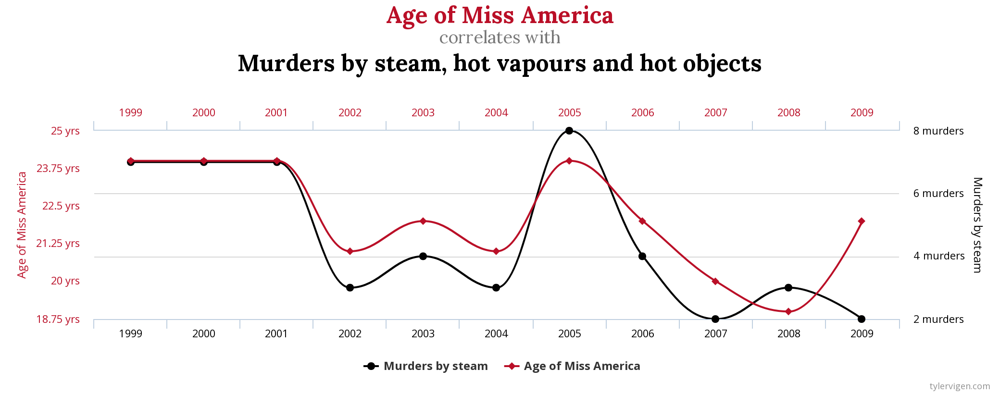
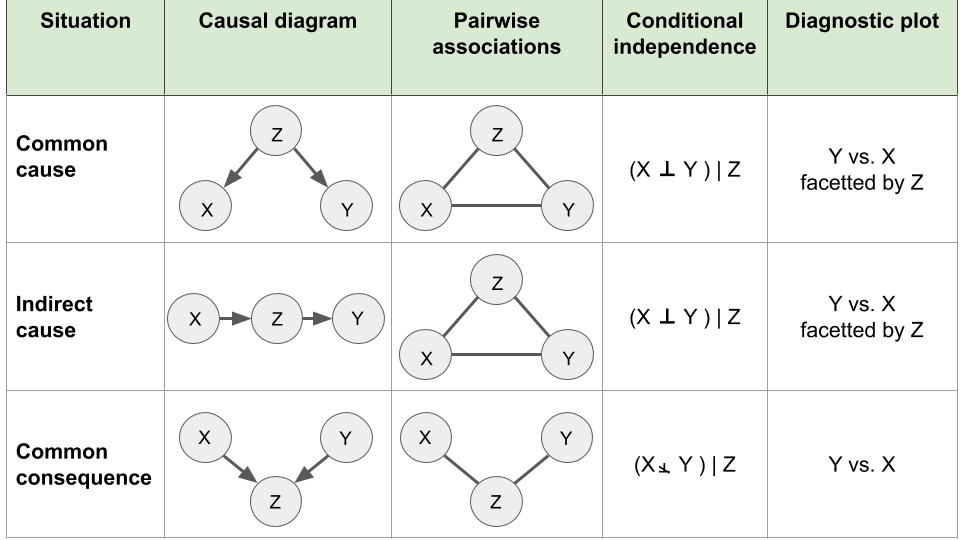
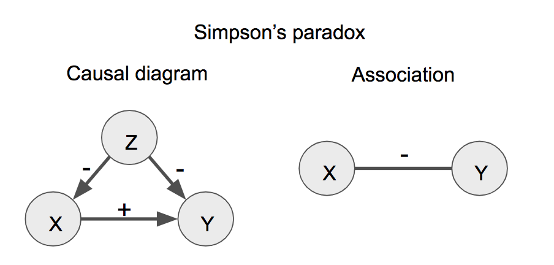
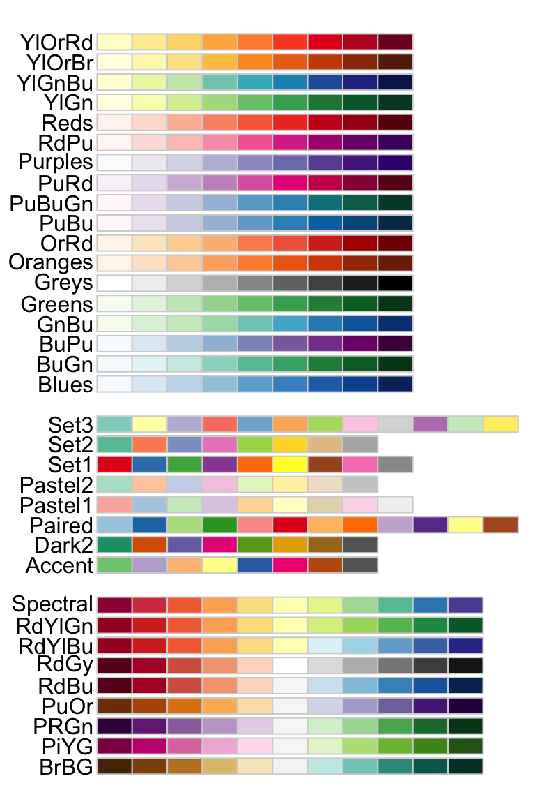

```{r global_options2, include=FALSE, cache=F}
library(data.table)
library(gridExtra)
library(ggplot2)
library(magrittr)
mysize <- 15
mytheme <- theme(
    axis.title = element_text(size=mysize), 
    axis.text = element_text(size=mysize),
    legend.title = element_text(size=mysize),
    legend.text = element_text(size=mysize)
    ) + theme_bw()

```


````{r global_options, include=FALSE, cache=F}
source("../../config.R")
library(gridExtra)
opts_chunk$set(
    echo=TRUE, warning=FALSE, message=FALSE, cache=F, 
    results="show",
    out.width="150px",
    out.height="100px", 
    fig.height = 3, fig.width = 4, 
    fig.align = 'center',
    dpi=200
)

```

<!-- ## Lecture overview -->

<!-- ```{r echo=F, fig.show = "hold", out.width = "70%", out.height="60%", fig.align = "center", fig.pos='H'} -->
<!-- knitr::include_graphics("../../assets/img/content_6.png") -->
<!-- ``` -->

# Motivation

## Motivation


* Having presented in the last chapters the different types of plots, we now consider the task of **structuring and presenting** an entire analysis.

* We want to be able to provide novel insights from a dataset. 

This lecture covers:

* the concepts of descriptive plots, for data exploration, and associative plots to support testable hypotheses

* how correlation and causation relate to each other

* good practices to organize reports and presentations and to have visuals to convey one's main message 


# Descriptive vs. associative plots

## Descriptive vs. associative plots

1. A typical data analysis starts with an exploration of the data. 

  * This is illustrated with **descriptive plots** showing how data distributes. 
  
  * This allows to get familiar with the dataset in an unbiased fashion.

2. Afterwards, one typically highlights some interesting relationships between variables.

  * This is often in order to suggest a testable, causal relationship.
  
  * We call the latter types of plots **associative plots**. 

## Descriptive plots

* Allow exploring how a variable or a set of variables distributes. 

  * For a univariate data these are histograms, single boxplots or violin plots. 

  * For multivariate data these are clustered heatmaps, PCA projections, etc.

* Correspond to descriptions of the distribution $p(X)$, where $X$ is the variable we want to explore.

* In Machine learning terms, they correspond to methods from unsupervised learning e.g. k-means clustering, hierarchical clustering, PCA.

## An example of a descriptive plot

For example, we consider the `diamonds` dataset which contains the prices and other attributes of several diamonds. 

To first visualize the distribution of the weights (`carat`) of the diamonds, we can build a histogram: 

```{r carat-distrib, fig.height=3}
ggplot(diamonds, aes(carat)) + geom_histogram() + mytheme
```

## Associative plots

* Show how a variable depends on another variable.

* Allow supporting a claim regarding a relationship between variables.

  * For instance a drug increases survival rates, sun exposure increases skin cancer probability, etc.

* For such plots, we typically use:

  * the y-axis for the response variable (e.g. survival rate, skin cancer occurrence) and 
  
  * the x-axis for the explanatory variables (e.g drug dose, sun exposure). 
  
## Associative plots
  
* Associative plots are graphical representation of the conditional distributions $p(y|X)$, where $y$ is the response and $X$ is the explanatory variable(s).

  * When the conditional distribution $p(y|x)$ actually depends on $x$, we say that $x$ and $y$ are dependent. 
  
  * For instance a scatterplot can show the trend that the response $y$ increases in average as $x$ increases. 
  
  * A boxplot can show that characteristic values of the distribution of $y$ (quartiles, median) depends on the value of the category $x$, etc.  


* In Machine learning terms, they correspond to methods from supervised learning (e.g. regression, classification).

  * For instance one can plot the results of a predictor that predicts the risk of skin cancer **given** the age and sun exposure of a person.

## An example of an associative plot

Based on the same `diamonds` dataset, we now construct an associative plot to graphically support the following hypothesis:

### The price of a diamond increases with increasing weight (carat)
```{r price-vs-carat, fig.height=3, message=FALSE, warning=FALSE}
ggplot(diamonds, aes(carat, price)) +
  geom_point(alpha = 0.05) + # alpha: point transparency
  stat_smooth() + mytheme 
```

## Correctly using descriptive and demonstrative plots

- A typical mistake is to use a descriptive plots to make a claim

- Example of a wrong statement:

  - *"My experiments are reproducible because the replicate samples group together on the projection of the first PCA 2D-plan"* 

  - PCA is a visualization designed to capture the joint distribution of all data and 

  - is **not** designed to assess how reproducibility between given pair of samples.

- To make a claim, use an associative plot between a response variable on the y-axis against a dependent variable on the x-axis.

    -  In this example, we can create a boxplot that shows the distribution of the correlation between pairs of samples (y-axis) for two categories (x-axis).

# Correlation and causation

## Correlation and causation

* One goal of data analysis is to provide hypothesis about the underlying causal mechanisms. 

  * We can assess statistical dependencies, or associations, between variables such as correlations, enrichment, etc. 
  
  * However, these do not necessarily imply a causal link. 

* We consider the elementary situations of **non-causal associations** and how to address these issues through data visualization. These are:

  1. The association is not statistically supported

  2. The causal relationship is reverse 
  
  3. The association is induced by a third variable

## The association is not statistically supported

* Often, the observed association arose by chance. 

  * Would the data collection be repeated, or performed for a longer period of time, the association would not show up any longer. 
  
* There are two main reasons for this:

  1. The association is driven by few data points. Hypothesis testing can be used to assess this possibility (See next Chapters). 

  2. The dataset includes so many variables that the chance to have one pair of variables associating is high. This is generally called data dredging, data fishing, data snooping, or cherry picking. 
  
## An example of data dredging

We look through many results produced by a random process and pick the one that shows a relationship that supports a theory we want to defend. 

In the statistical literature, this problem is called  "multiple testing" (See next Chapters). 

For instance:

```{r missamerica-murder, fig.width = 12, echo=FALSE, fig.cap="Example of a correlation discovered in a dataset with a very large set of variables. Source: http://www.tylervigen.com/spurious-correlations."}

```


## Reversing cause and effect

Unlike causal relationships, statistical dependencies are symmetric (if A correlates with B, then B correlates with A). Hence, a typical mistake are claims where cause and effects are reversed. 

Consider this quote from the article of the New York Times titled Parental Involvement Is Overrated^[https://opinionator.blogs.nytimes.com/2014/04/12/parental-involvement-is-overrated]:

  >> When we examined whether regular help with homework had a positive impact on children’s academic performance, we were quite startled by what we found. ... **consistent homework help almost never improved test scores or grades**... Even more surprising to us was that **when parents regularly helped with homework, kids usually performed worse**.

In fact, a very likely possibility is that the children needing regular parental help, receive this help because they don't perform well in school.


## Quiz

Which of the following claims could be an example of reversing cause and effect?

1. People with healthier diet have higher blood pressure.

2. Individuals in a low social status have a higher risk of schizophrenia.

3. The number of fire engines on a fire associates with higher damages.

4. Entering an intensive care unit increases your chances of dying.


## Solution

* All previous statements could be examples of reversing cause and effect...

* There is no firm way to decide the direction of causality from a mere association. It is therefore important to consider and discuss both possibilities when interpreting a correlation.

## The association is induced by a third variable

* Another general issue is when an association is due to a third variable. There are several scenarios.

* Given two variables of $X$ and $Y$, we will now consider three basic configurations where a third variable $Z$ could be causally related to them and how this affects associations between the variable $X$ and $Y$:


```{r causal-diagrams, fig.width = 8, echo=FALSE, fig.cap="Elementary causal diagrams involving two variables of interest X and Y and a third variable Z."}

```

## Quiz

**What is "wrong" with the negative correlation between tea drinking and lung cancer?**


```{r,  out.width = "125px",  out.height= "50px", echo=FALSE}
knitr::include_graphics("../../assets/img/confound1.png")
```

1. Even if the result is reported as significant, this could be pure chance.

2. It is confounded by the country people live in.

3. It does not make sense to investigate this correlation, because we know tea drinking does not have anything to do with cancer.

4. It is confounded by smoking status.

## Solution

**What is "wrong" with the negative correlation between tea drinking and lung cancer?**

1. Even if the result is reported as significant, this could be pure chance.
  * *No, that is exactly what significant means, it is not occuring by chance (if statistics are performed properly).*

2. It is confounded by the country people live in.

  * *Interesting idea, but not in this case.*

3. It does not make sense to investigate this correlation, because we know tea drinking does not have anything to do with cancer.

  * *That would introduce a severe research bias, I am excluding associations that I do not believe in.*

4. **It is confounded by smoking status.**

  * *Yes, smokers are not tea drinkers (they seem to prefer coffee), and smoking is causally related to lung cancer.*

## Solution 

- Consider: smokers are generally not tea drinkers but seem to prefer coffee. 

- Smoking is causally related to lung cancer

- Investigate whether lung cancer and tea drinking are confounded by smoking status:


```{r,  out.width = "150px", out.height="100px", echo=FALSE}
knitr::include_graphics("../../assets/img/confound2.png")
```

## Simpson's paradox

* The Simpson’s paradox is a phenomenon in data analysis, which may lead to spurious conclusions or misleading predictions. 

* The phenomenon, where a variable X seems to relate to a second variable Y in a certain way, but flips direction when the stratifying for another variable Z, is referred to as Simpson’s paradox.


```{r simpson-paradox, out.height="100px", out.width="200px", echo=FALSE, fig.cap="Simpson's paradox. The sign (+ or -) designates positive or negative effects (causal diagram, left) or associations (right)."}

```

## An example of the Simpson's paradox

We simulate a dataset for illustrating the Simpson's paradox with the help of the function `simulate_simpson()` from the library `correlation`:

```{r}
# devtools::install_github("easystats/correlation")
library(correlation)

data <- simulate_simpson(n = 100, groups = 4, r = 0.6) %>% as.data.table
colnames(data) <- c('X', 'Y', 'Z')
data
```

## An example of the Simpson's paradox

When visualizing the relationship between the variables `X` and `Y`, we can observe a negative correlation between `X` and `Y`:

```{r, warning=F}
ggplot(data, aes(X,Y)) + geom_point() + geom_smooth(method='lm') + mytheme
```

## An example of the Simpson's paradox

However, when grouping by the variable Z we observe a positive correlation which is the opposite direction as before:


```{r, warning=F}
ggplot(data, aes(x = X, y = Y)) +
  geom_point(aes(color = Z)) +
  geom_smooth(aes(color = Z), method = "lm") +
  geom_smooth(method = "lm") + mytheme
```


# Data presentation

## The importance of data presentation 

- Data presentation plays an essential role in data science but it is often underestimated

- The actual output of the analysis performed is almost singularly responsible for giving the message we want to give to the audience. 

- Be able to present the data and its analysis **clearly** and **efficiently**:

  - Create a good presentation that (like a good story) is easy to understand, has a clear message and is exciting

  - Definition of a story: set of observations, facts, or events, that are presented in a specific order such that they create an emotional reaction in the audience. The emotional reaction is created through the build-up of tension at the beginning of the story followed by some type of resolution towards the end of the story.
  

## Presentation structure

Usually, a presentation is clearly divided into three main elements just like a good story: 

1. Introduction: motivation, background and goals

2. Central part: hypotheses, claims, results (supported by plots)

3. Closure: summary, conclusion and outlook 

At the end of the presentation the audience should be able to answer the fundamental question: 

- *What did we learn from the presented data analysis?*

## The central part of a presentation

Goal: transform hypotheses, claims and results into slides
  
- Ideally, one slide contains exactly one claim supported by one plot
  
  - Choose the plot type carefully (descriptive vs. associative, continuous vs. discrete variables)
  
  - The title of the slide should give the take-home message of the presented visualization as a clear and simple interpretation of the plot
    
- Construct clear and transparent slides
    
  - Avoid confusing the audience and leading to wrong conclusions

## Two common misconceptions in data presentation

1. The audience can see our figures and immediately infer the points we are trying to make

2. The audience can rapidly process complex visualizations and understand the key trends and relationships that are shown

Help the audience understand the meaning of our visualizations and see the same patterns in the data that we see 

This usually means less is more

## Example: showing complex figures step by step

Sometimes, we do want to show more complex figures that contain a large amount of information at once.

In those cases, we can make things easier for our audience if we first show a simplified version of the figure: 

```{r, echo=F}
airquality <- as.data.table(airquality)
```

```{r}
ggplot(airquality[Month==5], aes(Solar.R, Temp)) + geom_point() + 
  labs(title='Month 5')
```


## Example: showing complex figures step by step

Then, we show the final figure in its full complexity:

```{r}
ggplot(airquality, aes(Solar.R, Temp)) + geom_point() + 
  facet_wrap(~Month) + stat_smooth(method='lm')
```

# Guidelines for coloring in data visualization

## Color coding in R

There are four options for color coding with `ggplot2` in R:

1. Using default colors

2. Explicitly setting color names (e.g. "red", "blue")

3. Explicitly setting RGB or HTML color codes (e.g. 00-FF)

4. Explicitly setting color palettes

## Color palettes  

The package `RColorBrewer` provides a set of nice color palettes:

```{r, eval=F}
library(RColorBrewer)
display.brewer.all()
```

```{r, echo=F, out.width="100px", out.height="175px"}

```


## Color palettes

Generally, use sequential palettes for continuous variables to show quantitative differences:

```{r,  out.width="200px", out.height="25px", echo=F}
knitr::include_graphics("../../assets/img/col_seq_pal.png")
```

Use qualitative palettes for categorical variables to separate items into distinct groups and  use diverging palettes for numeric variables that have a meaningful central value or breakout point (e.g. 0):

```{r, out.width="200px", out.height="25px", echo=F}

```

## General rules for color coding

### Rule #1: consistent background

If we want different objects of the same color in a table or graph to look the same, we have to make sure that the background is consistent:

```{r, echo=F}

```


## General rules for color coding

### Rule #2: sufficient contrast for visibility

If we want objects in a table or graph to be easily seen, we need to use a background color that contrasts sufficiently with the object that we want to visualize:

## General rules for color coding

### Rule #3: meaningful color usage

Use color coding only when we really need it to serve a particular communication goal. In the following example, the added colors provide no additional information:

```{r, warning=F, results='hide', echo=F, fig.height=7, fig.width=5}
poke_dt <- readRDS('../../extdata/tidy_pokemon_poke_dt.RDS')
dt <- poke_dt[,.(mean_hp = mean(HP, na.rm=T)), by=Type][order(mean_hp)]
dt[,Type:= factor(Type, levels = as.character(Type))]
ggplot(dt, aes(Type, mean_hp)) + geom_bar(stat = 'identity', aes(fill = Type)) + coord_flip()
```

## General rules for color coding

### Rule #4: color usage with restraint

Use different colors only when they correspond to differences of meaning in the data.

### Rule #5: less is more

Use `soft`, natural colors to display `most` information and `bright` and/or dark colors to `highlight` only particular information that requires greater attention.

# General do’s and dont's in data visualization

## Do's: Keep visualizations simple

- Common wrong assumption: complex plots are useful visualizations

- Good plots have simple messages and make the visualized data as easy to understand as possible

- Keep it effective and simple!
  
## Do's: Have meaningful and expressive titles

Figure title (or slide tile) states the finding (what do we observe?) and not the methods (how do you do it?)

An example of a good title:

```{r, echo=F, out.width="200px", out.height="125px", fig.height=4, fig.width=6}
flightsLAX <- fread('../../extdata/flights/flightsLAX.csv')
ggplot(flightsLAX[sample(.N,2000)], aes(DISTANCE, AIR_TIME)) +
  geom_point(alpha=0.2) +
  geom_smooth(method='lm') +
  labs(title = 'The further away an airport, the longer the flight')
```

Examples of bad titles: 

- *"The relationship between distance and flight time"* or
- *"Scatter plot of distance vs. flight time"*

## Do's: Always label the axes

- Axes, colors, and shapes should be labelled

- All labels should be legible for the audience (big fonts).

Example of a bad (incomplete) plot:

```{r, out.width="250px", out.height="125px", fig.height = 3, fig.width = 6, echo=F}
library(gapminder)
gm_dt <- as.data.table(gapminder)[year %in% c(1977, 2007)]
ggplot(data = gm_dt, aes(x = gdpPercap, y = lifeExp))  + 
  geom_point(aes(color=continent, size=pop)) + facet_grid(~year) + scale_x_log10() +
  labs(y="", x="", size="") + theme(legend.position = "none")
```

## Do's: Know when to include 0

- When using barplots it is typically dishonest not to start the bars at 0. This is because, by using a barplot, we are implying the length is proportional to the quantities being displayed. 
- By avoiding 0, relatively small differences can be made to look much bigger than they actually are. This approach is often used by politicians or media organizations trying to exaggerate a difference.

```{r, echo=F}
knitr::include_graphics("../../assets/img/chart_junk.jpg")
```

The plot was shown by Fox News (http://mediamatters.org/blog/2013/04/05/fox-news-newest-dishonest-chart-immigration-enf/193507)

## Do's: Know when to include 0

From the previousplot, it appears that apprehensions have almost tripled when in fact they have only increased by about 16%. Starting the graph at 0 illustrates this clearly:

```{r, echo=FALSE}
data.frame(Year = as.character(c(2011, 2012, 2013)),Southwest_Border_Apprehensions = c(165244,170223,192298)) %>%
  ggplot(aes(Year, Southwest_Border_Apprehensions )) +
  geom_bar(stat = "identity", fill = "grey", width = 0.65) + theme_bw()
```

## Dont's: Chart junk

Good plotting style is like good writing style: Say the most with the least. We can here quote Antoine de Saint-Exupery:

*“Perfection is achieved not when there is nothing more to add, but when there is nothing left to take away”* 

The concept of *data-ink ratio* is therefore useful to critically chose a visualization. In particular, visualizations that contain at least one the following criteria can be considered as chart junk and should be avoided:

* double encoding (color and axis encode the same)
* heavy or dark grid lines
* unnecessary text
* ornamented chart axes
* pictures within graphs
* shading or pseudo 3D plots

## Dont's: Chart junk

A good example of a transformation of a bad plot into a good plot:

https://www.darkhorseanalytics.com/blog/data-looks-better-naked/

## Dont's: Avoid pseudo three-dimensional plots

- The figure below, taken from the scientific literature [CITE: DNA Fingerprinting: A Review of the Controversy Kathryn Roeder Statistical Science Vol. 9, No. 2 (May, 1994), pp. 222-247] shows three variables: dose, drug type and survival. 

- Although our screens are flat and two dimensional, the plot tries to imitate three dimensions and assigns a dimension to each variable.

```{r, echo=FALSE}
knitr::include_graphics("../../assets/img/d3_plot.png")
```

## Dont's: Avoid pseudo three dimensional plots

- Humans are not good at seeing in three dimensions (which explains why it is hard to parallel park) and our limitation is even worse with pseudo-three-dimensions.

- To see this we can try to determine the values of the survival variable in the plot above. Probably, we cannot really tell when the purple ribbon intersects the red one.

## Dont's: Avoid pseudo three dimensional plots

Instead, use color to represent the categorical variable to avoid the pseudo 3 dimensional construction:

```{r  echo=FALSE}
##First read data
url <- "https://github.com/kbroman/Talk_Graphs/raw/master/R/fig8dat.csv"
dat <- read.csv(url) %>% as.data.table
##Now make alternative plot
dat %>% melt('log.dose',
             variable.name='drug',
             value.name='survival') %>%
  .[, drug := gsub('Drug.', '', drug)] %>%
  ggplot(aes(log.dose, survival, color = drug)) +
  geom_line() + mytheme
```

## Question

Which item is no chart junk?

1. A bright red plot border

2. Light grey major grid lines

3. Bold labels and grid lines

4. Data labels in Batik Gangster font


Bright colors and bold text draw attention. Batik Gangster actually exists. Grid lines are no data points.
Light grey does not draw attention and grid lines are less important than data.

## Solution

Which item is no chart junk?

2. **Light grey major grid lines**


Bright colors and bold text draw attention. Batik Gangster actually exists. Grid lines are no data points.

Light grey does not draw attention and grid lines are less important than data.


# Summary

## Summary

By now should be able to:

* Distinguish exploratory figures showing data distributions, from associative figures

* Know and mind the basic reasons for misleading associations:

  * not robust

  * reverse causal direction

  * common cause

  * indirect effect

  * common consequence

* Mind data/ink ratio by showing more data and reducing decorations 

* Prepare your report to provide novel insights. The audience should be able to easily answer the question: "What did I learn?"

## Resources

 * https://humansofdata.atlan.com/2019/02/dos-donts-data-visualization/

 * http://paldhous.github.io/ucb/2016/dataviz/week2.html

 * Fundamentals of Data Visualization, Claus O. Wilke, https://clauswilke.com/dataviz/telling-a-story.html

 * Introduction to Data Science, Rafael A. Irizarry, https://rafalab.github.io/dsbook/index.html
 
 * Advanced (proofs of conditional dependences for the 3-variable elementary causal diagrams):
C. Bishop, Pattern Recognition and Machine Learning. https://www.microsoft.com/en-us/research/people/cmbishop/prml-book/

 