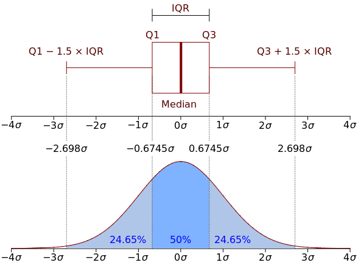

````{r global_options, include=FALSE, cache=F}
source("../../config.R")
library(gridExtra)
opts_chunk$set(
    echo=TRUE, warning=FALSE, message=FALSE, cache=F, 
    results="show",
    out.width="150px",
    out.height="100px", 
    fig.height = 3, fig.width = 4, 
    fig.align = 'center',
    dpi=200
)
mysize <- 15
mytheme <- theme(
    axis.title = element_text(size=mysize), 
    axis.text = element_text(size=mysize),
    legend.title = element_text(size=mysize),
    legend.text = element_text(size=mysize)
    ) + theme_bw()


```


## Lecture overview

```{r echo=F, fig.show = "hold", out.width = "70%", out.height="50%", fig.align = "center", fig.pos='H'}

```

# Motivation 

## Why plotting?
::: {.columns}

:::: {.column width=0.5}

* To observe: Discover associations or patterns in the data (Scientific method)

* To communicate findings effectively

::::

:::: {.column width=0.5}

```{r, out.width = "100px", out.height= "100px", echo=FALSE, fig.align='center'}
knitr::include_graphics("../../assets/img/scientific-method.png")
```

::::

:::

## Summary statistics lose information
::: {.columns}

:::: {.column width=0.7}
What have those 12 datasets in common?


```{r out.width = "170px", out.height = "170px", echo=FALSE, fig.align='center'}
knitr::include_graphics("../../assets/img/misleading-data-1.png")
```
::::

:::: {.column width=0.3}
::::

:::


## Summary statistics lose information
::: {.columns}

:::: {.column width=0.7}
What have those 12 datasets in common?


```{r out.width = "170px", out.height = "170px", echo=FALSE, fig.align='center'}
knitr::include_graphics("../../assets/img/misleading-data-1.png")
```
::::

:::: {.column width=0.3}
These statistics:

* X mean: 52.26
* Y mean: 47.83
* X standard deviation: 16.76
* Y standard deviation: 29.93
* Pearson correlation: -0.06
::::

:::


## Summary statistics lose information
::: {.columns}

:::: {.column width=0.7}
This dataset too..


```{r,  out.width = "100px", out.height = "100px", echo=FALSE, fig.align='center'}
knitr::include_graphics("../../assets/img/misleading-data-2.png")
```
::::

:::: {.column width=0.3}
These statistics:

* X mean: 52.26
* Y mean: 47.83
* X standard deviation: 16.76
* Y standard deviation: 29.93
* Pearson correlation: -0.06
::::

:::
See https://github.com/lockedata/datasauRus

## Why plotting?
::: {.columns}

:::: {.column width=0.5}

* To observe: Discover associations or patterns in the data (Scientific method)

* To communicate findings effectively

* Summary statistics lose information

::::

:::: {.column width=0.5}

```{r, out.width = "100px", out.height= "100px", echo=FALSE, fig.align='center'}
knitr::include_graphics("../../assets/img/scientific-method.png")
```

::::

:::


## Another motivating example

A vector containing 100 (hypothetical) height measurements for adults in Germany:

```{r echo=F}
set.seed(0)
height_dt <- data.table(height=c(round(rnorm(99, mean=1.73, sd=0.045),digits=2), 165))
```

```{r, echo=TRUE}
head(height_dt, n=5)
```

We want to know their average height:

```{r, echo=TRUE}
height_dt[, mean(height)]
```
Wait... what?


## Quiz
Calculating the mean height returns the following output:

```{r}
height_dt[, mean(height)]
```

**What happened?**

1. A. `mean()` is not the right function to assess what we want to know.

2. B. Adults in Germany are exceptionally tall

3. C. A decimal point error in one data point.

4. D. It's a multiple testing problem because we are looking at so many data points (n=100).


## Solution

**What happened?**<br/>

* A. `mean()` is not the right function to assess what we want to know.
  * *No, the mean is exactly what we want.*
* B. Adults in Germany are exceptionally tall.
  * *OK, no...*
* **C. A decimal point error in one data point.**
  * *Yes, see next slide.*
* D. It's a multiple testing problem because we are looking at so many data points (n=100).
  * *This question was intentionally misleading, this does not have anything to do with multiple testing.*


## Plotting helps to find outliers in the data 

```{r}
ggplot(height_dt , aes(height)) + geom_histogram() + mytheme
```


## Removing outliers in the data

A quick way to fix our dataset is to remove our outlier.

```{r, echo=TRUE}
height_dt <- height_dt[height < 3]
```

## Removing outliers in the data

```{r}
ggplot(height_dt , aes(height)) + geom_histogram() + mytheme
```

```{r, echo=TRUE}
height_dt[, mean(height)]
```

<!-- --- -->

<!-- ## The outlier... -->

<!-- This is how the broken dataset was generated: -->

<!-- ```{r, echo=TRUE} -->
<!-- height <- c(rnorm(499, mean=1.65, sd=0.045), 165) -->
<!-- ``` -->

## Why plotting?
::: {.columns}

:::: {.column width=0.5}

* To observe: Discover associations or patterns in the data (Scientific method)


* To communicate findings effectively


* Summary statistics lose information


* To find "bugs in the data" or bugs in your code

::::

:::: {.column width=0.5}

```{r, out.width = "100px", out.height= "100px", echo=FALSE, fig.align='center'}
knitr::include_graphics("../../assets/img/scientific-method.png")
```

::::

:::


## Our 3 visualization lectures

* Low dimensional visualizations
  * Grammar of graphics
  * 1-d and 2-d plots (e.g. boxplots, histograms, scatterplots)
  
* High-dimensional visualizations
  * Heatmaps
  * Clustering
  * Dimensionality reduction
  
* Graphically supported hypotheses
  * Descriptive vs. demonstrative plots
  * Confounding
  * Guidelines for data visualization and presentation

# Grammar of graphics and ggplot2

## Grammar of Graphics

The Grammar of Graphics is a visualization theory developed by 
Leland Wilkinson in 1999.

* influenced the development of graphics and visualization libraries alike 
* 3 key principles
  * Separation of data from aesthetics (e.g. x and y axis, color-coding)
  * Definition of common plot/chart elements (e.g. dot plots, boxplots, etc.)
  * Composition of these common elements (one can combine elements as layers)


## Plotting with ggplot2

The library `ggplot2` is a powerful implementation of the grammar of graphics and has become widely used by R programmers. 

Here is a sophisticated example to compare the relationship between per-capita gross domestic product (GDP) and life expectancy at birth for the years 1997 and 2007: 

```{r, out.width="250px", out.height="125px", fig.height = 3, fig.width = 6, echo=F}
library(gapminder)
gm_dt <- as.data.table(gapminder)[year %in% c(1977, 2007)]
ggplot(data = gm_dt, aes(x = gdpPercap, y = lifeExp)) +
  geom_point(aes(color = continent,size = pop)) +
  facet_grid(~year) + scale_x_log10() +
  labs(y="Life expectancy at birth", x="per-capita GDP", size="Population") +
  mytheme
```


## Example of a first plot with ggplot2

The code for generating the plot...
```{r, out.width="250px", out.height="125px", fig.height = 3, fig.width = 6}
library(gapminder)
gm_dt <- as.data.table(gapminder)[year %in% c(1977, 2007)]
ggplot(data = gm_dt, aes(x = gdpPercap, y = lifeExp)) + mytheme + 
  geom_point(aes(color=continent, size=pop)) + facet_grid(~year) + scale_x_log10() +
  labs(y="Life expectancy at birth", x="per-capita GDP", size="Population")
```

But how do we create such a plot step by step?

We will have a look at its components and recreate it step by step...


## Components of the layered grammar
* **Always**:

**Data:** `data.table` (or `data.frame`) object where columns correspond to variables

**Aesthetics:** mapping of data to visual characteristics - what we will see on the plot (`aes`)
 - position (x,y), color, size, shape, transparency

**Geometric objects:** geometric representation defining the type of the plot data (`geom_`)
 - points, lines, boxplots, ...

* **Often**:

**Scales:** for each aesthetic, describes how visual characteristic is converted to display values (`scale_`)
 - log scales, color scales, size scales, shape scales, ...

**Facets:** describes how data is split into subsets and displayed as multiple sub graphs (`facet_`)

* **Useful, but with care**:

**Stats:** statistical transformations that typically summarize data (`stat`)
 - counts, means, medians, regression lines, ...

* **Domain-specific**:

**Coordinate system:** describes 2D space that data is projected onto (`coord_`)
 - Cartesian coordinates, polar coordinates, map projections, ...


## Data

Let's have a quick look at our data
```{r}
head(gm_dt[, .(country, continent, gdpPercap, lifeExp, year)])
```


## Data layer

To start with the visualization we initiate a `ggplot` object loaded with the data. It generates an empty plot:
```{r}
ggplot(gm_dt)
```


## Aesthetics layer

**Selecting variables to visualize and their rendering**

We next add to the plot an "aesthetic mapping" layer with the function `aes()`, which defines which variables of the table will be visualized and how they map to so-called aesthetics: axis, colors, point shapes, etc. 

For a scatter plot, we need at least to define the mapping to `x` and `y`. Now the axes are rendered:

```{r}
ggplot(data=gm_dt, aes(x=gdpPercap, y=lifeExp))
```


## Geometric object layer

**Defining the type of the plot**

We next add to the plot a "geometric object" layer which defines the type of the plot.

A scatter plot can be plotted using the geometric object function `geom_point()`:

```{r}
ggplot(data=gm_dt, aes(x=gdpPercap, y=lifeExp)) + geom_point()
```


## Advantage of a layered grammar

**Storing `ggplot2` objects**

One of the advantages of plotting with `ggplot2` is that it returns an object which can be stored (e.g. in a variable called `p`). The stored object can be further edited and inspected using the `names()` function:

```{r}
p <- ggplot(data=gm_dt, aes(x=gdpPercap, y=lifeExp)) + geom_point()
p <- p + labs(x='per-capita GDP')
names(p)
```

## Advantage of a layered grammar

**Saving `ggplot2` objects**

We can also save the `ggplot2` object into a file with the help of the function `saveRDS()`:

```{r, eval=FALSE}
saveRDS(p, "../../extdata/my_first_plot.rds")
p <- readRDS("../../extdata/my_first_plot.rds")
```


## Advantage of a layered grammar

**Loading `ggplot2` objects**
Later, we can read the saved object with the help of the function `readRDS()`. We illustrate this by reading the previously saved plot into a variable `p` and adding a horizontal line at `y=50`:

```{r}
p <- readRDS("../../extdata/my_first_plot.rds")
p + geom_hline(yintercept=50)
```


## Scale layer

For a better visualization of the data points, we apply log scaling (more details later).

```{r, out.width="250px", out.height="125px", fig.height = 3, fig.width = 6}
ggplot(data=gm_dt, aes(x=gdpPercap, y=lifeExp)) +
  geom_point() + scale_x_log10()
```

## Facets layer

To compare the data from the year 1977 with the data from 2007, we create a multi-panel plot with `facet_grid()`, which takes a formula as argument specifying by which variable(s) the plot should be split by. 

```{r, out.width="250px", out.height="125px", fig.height = 3, fig.width = 6}
ggplot(data = gm_dt, aes(x=gdpPercap, y=lifeExp)) +
  geom_point() + scale_x_log10() + facet_grid(~year) # "~year"  means "by year"
```

## Stats layer
Stats layer are statistical transformations that typically summarize data. Examples are counts, means, medians, regression lines, smooth trends.

Here is an example of smooth trends: 

```{r, out.width="250px", out.height="125px", fig.height = 3, fig.width = 6}
ggplot(data=gm_dt, aes(x=gdpPercap, y=lifeExp))+ 
  geom_point() + scale_x_log10() + facet_grid(~year) +
  stat_smooth()
```

Stats layers can be helpful. However, we recommend to use regression lines an smooth trends **if they are well understood** as they can mislead the interpretation of a plot. 


## More aesthetics: `color`

We can easily map variables to different colors, sizes or shapes depending on the value of the specified variable using the `aes()` function:

```{r}
ggplot(data=gm_dt, aes(x=gdpPercap, y=lifeExp, color=continent)) + 
  geom_point()
```


## More aesthetics: `shape`

To change the shape of our points we can override the `shape` argument of the `aes()` function:

```{r}
ggplot(data=gm_dt, aes(x=gdpPercap, y=lifeExp, shape=continent)) +
  geom_point()
```


## More aesthetics `size`

Additionally, we distinguish the population of each country by giving a size to the points in the scatter plot:

```{r}
ggplot(data=gm_dt, aes(x=gdpPercap, y=lifeExp, color=continent, size=pop)) +
geom_point()
```


## Polishing: Axes labels
We can give better labels of the plot with `labs()`:

```{r, out.width="250px", out.height="125px", fig.height = 3, fig.width = 6}
ggplot(data=gm_dt, aes(x=gdpPercap, y=lifeExp, color=continent, size=pop))+ 
  geom_point() + scale_x_log10() + facet_grid(~year) +
  labs(x="per-capita GDP", y="Life expectancy at birth", size = 'Population') 
```

## Polishing: Themes

Some default settings can be stored in a so-called `theme`. Themes can be reused, giving your plots a uniform style across a document. Here we create a theme based on the black and white theme of ggplot2. See `?theme()` for details.
```{r}
mysize <- 15 #font size
mytheme <- theme(
    axis.title = element_text(size=mysize), 
    axis.text = element_text(size=mysize),
    legend.title = element_text(size=mysize),
    legend.text = element_text(size=mysize)
    ) + theme_bw() # ggplot2's black-and-white theme
```

## Adding the theme
Et voilà:

```{r, out.width="250px", out.height="125px", fig.height = 3, fig.width = 6}
ggplot(data=gm_dt, aes(x=gdpPercap, y=lifeExp, color=continent, size=pop)) +  
  geom_point(aes(color=continent, size=pop)) + scale_x_log10() + facet_grid(~year) +
  labs(x="per-capita GDP", y="Life expectancy at birth", size = 'Population') +
  mytheme
```


## Global vs. individual mapping

**Global mapping** mapping is inherited by default to all layers, while mapping at individual layers is only recognized at that layer

```{r }
ggplot(data = gm_dt, aes(x = gdpPercap, y = lifeExp)) +
  geom_point(aes(color = continent,size = pop))
```


## Global versus individual mapping

**Local mapping** cannot be recognized by other layers. For instance, adding another layer for smoothing with `stat_smooth()` like this does not work:

```{r, eval=F}
# this doesn't work as stat_smooth didn't know aes(x , y)
ggplot(data = gm_dt) + geom_point(aes(x = gdpPercap, y = lifeExp)) + 
  stat_smooth()
```


## Global versus individual mapping

**Local mapping** works like this but is too redundant:

```{r}
# this would work but too redundant
ggplot(data = gm_dt) + geom_point(aes(x = gdpPercap, y = lifeExp, color=continent)) + 
  stat_smooth(aes(x = gdpPercap, y = lifeExp, color=continent))
```


## Global versus individual mapping

**Local mapping** without redundancy: 

```{r}
# the common aes(x, y) shared by all the layers can be put in the ggplot()
ggplot(data = gm_dt, aes(x = gdpPercap, y = lifeExp, color = continent)) + 
  geom_point(aes(size = pop)) + stat_smooth()
```


## Quiz

What's the result of the following command?

`ggplot(data = mpg)`

1. Nothing happens

2. A blank figure will be produced

3. A blank figure with axes will be produced

4. All data in `mpg` will be visualized

## Solution

`ggplot(data = mpg)`: a blank figure will be produced


## Quiz

What's the result of the following command?

`ggplot(data = mpg, aes(x = hwy, y = cty))`

1. Nothing happens

2. A blank figure will be produced

3. A blank figure with axes will be produced

4. A scatter plot will be produced

## Solution

`ggplot(data = mpg, aes(x = hwy, y = cty))`: A blank figure with axes will be produced


## Quiz

What's the result of the following command?

`ggplot(data = mpg, aes(x = hwy, y = cty)) + geom_point()`

1. Nothing happens

2. A blank figure will be produced

3. A blank figure with axes will be produced

4. A scatter plot will be produced


## Solution

`ggplot(data = mpg, aes(x = hwy, y = cty)) + geom_point()`: A scatter plot will be produced


# Types of plots for discrete and continuous variables

## Types of plots for low dimensional datasets

* In the previous examples, we had a look at scatter plots which are suitable for plotting the relationship between two continuous variables. 

* However, there are many more types of plots (e.g. histograms, boxplots) which can be used for plotting in different scenarios. 

* Mainly, we distinguish between plotting **one or two variables** and whether the variables are **continuous or discrete**.


## Plots for one continuous variable

For plotting **one continuous variable** we mainly use histograms, density plots, boxplots, violinplots and beanplots. 

Let us prepare some data for plotting continuous variables using the Human Development Index (HDI) dataset: 

```{r, echo=F}
ind <- fread('../../extdata/CPI_HDI.csv')
```

```{r}
head(ind, n=3)
```

with columns V1: row index, country, wbcode: World Bank Code, CPI: Corruption Perception Index, HDI: Human Development Index, and world region.

## Histograms

A histogram represents the frequencies of values of a continuous variable bucketed into ranges. For this, we can use the function `geom_histogram()`:

```{r}
ggplot(ind, aes(HDI)) + geom_histogram() + mytheme
```

## Histograms: setting the number of bins

By default, the number of bins in `ggplot2` is 30. We can change this by defining the number of desired bins in the `bins` argument of the `geom_histogram()` function:

```{r}
ggplot(ind, aes(HDI)) + geom_histogram(bins=10) + mytheme
```

## Density plots
Sometimes densities are shown instead of histograms.
In `ggplot2` we use the function `geom_density()`:

```{r}
ggplot(ind, aes(HDI)) + geom_density() + mytheme
```

These smoothed distribution plot are typically obtained by kernel density estimation:<br/><br/>
[https://en.wikipedia.org/wiki/Kernel_density_estimation](https://en.wikipedia.org/wiki/Kernel_density_estimation)


## Density plots: setting the bandwidth
The `bw` argument of the `geom_density()` function allows to tweak the bandwidth of a density plot manually.

Smaller bandwidth:
```{r, fig.height=4}
ggplot(ind, aes(HDI)) + geom_density(bw=0.01) + ggtitle('Small bandwidth') +
  mytheme
```

## Density plots: setting the bandwidth
Larger bandwidth:
```{r, fig.height=4}
ggplot(ind, aes(HDI)) + geom_density(bw=1) + ggtitle('Large bandwidth') +
  mytheme
```

Be careful with density plots as the bandwidth can have strong visual effects. Histograms are not that bad and show the data 'raw'.

***General principle***: Show the data as raw as possible.

## Boxplots

Box plots can give a good graphical insight into the distribution of the data.

<!--  -->
```{r, echo=FALSE}

```

* Median: the center of the data, middle value of a sorted list, 50% quantile of the data
* First quantile (Q1) and the third quantile (Q3): 25% and 75% quantiles of the data
* Interquantile range (IQR): the distance between Q1 and Q3

## Boxplots: example

Here is an example of a boxplot with log-normal distribution, which is an asymmetric distribution. The corresponding histogram is shown for comparison. 

```{r, echo=TRUE, eval=FALSE}
dt <- data.table(x=rlnorm(1000,meanlog=0,sdlog=0.5)) # 1,000 random draws of log-normal distribution
ggplot(dt, aes(x)) + geom_boxplot()
```

```{r, echo=FALSE}
set.seed(0)
dt <- data.table(x=rlnorm(1000,meanlog=0,sdlog=0.5))
p1 <- ggplot(dt, aes(x)) + geom_histogram(bins=30) + coord_flip() + mytheme
p2 <- ggplot(dt, aes(x)) + geom_boxplot() + ylab("   ") + coord_flip() + mytheme
grid.arrange(p2, p1, ncol=2)
```

## Boxplots are not appropriate for discrete data
For discrete data (e.g. number of gears of a car, rolls of a dice), a boxplot is not appropriate. Choose a barplot or histogram.

```{r, echo=FALSE}
xl <- c(0,6)
dt <- data.table(x=c(1,1,2,2,2,2,5)) # Discrete data, bad for boxplot
p1 <- ggplot(dt, aes(x)) + geom_bar() + coord_flip() + mytheme + xlim(xl)
p2 <- ggplot(dt, aes(x)) + geom_boxplot() + ylab("   ") + coord_flip() + mytheme + xlim(xl)
grid.arrange(p2, p1, ncol=2)
```

## Boxplots are not appropriate for multi-modal distribution
Boxplot are misleading for multi-modal distributions, i.e. distribution with multiple peaks of densities, for instance made of two separate clusters of data. Choose a histogram.

```{r, echo=FALSE}
xl <- c(-5,5)
dt <- data.table(x=c(rnorm(100,-3),rnorm(100,3)))
p1 <- ggplot(dt, aes(x)) + geom_histogram() + coord_flip() + mytheme + xlim(xl)
p2 <- ggplot(dt, aes(x)) + geom_boxplot() + ylab("   ") + coord_flip() + mytheme + xlim(xl)
grid.arrange(p2, p1, ncol=2)
```


## Plots for two variables: one continuous and one discrete variable

For plotting **one continuous variable** and **one discrete variable** we mainly use 

* barplots,
* boxplots by category and 
* violinplots by category.

## Barplots

Barplots are used to highlight individual quantitative values per category. For creating a barplot with `ggplot2` we can use the function `geom_bar()`:

```{r, echo = F}
countries_dt <- data.table(Continent = c("North America", "South America",
                                         "Africa", "Asia", "Europe", "Oceania"), 
                           Number_countries = c(23, 12, 54, 49, 50, 16))
```

```{r }
ggplot(countries_dt, aes(Continent, Number_countries)) + 
  geom_bar(stat = 'identity', width = .7) + mytheme
```


## Barplots with errorbars

Visualizing uncertainty is important, otherwise, barplots with bars as a result of an aggregation can be misleading. One way to visualize uncertainty is with error bars.

As error bars, we can consider the standard deviation (SD) which can be computed in R with the function `sd()`.


## Barplots with errorbars

In the following example, we plot the average highway miles per gallon `hwy` per vehicle class `class` including error bars computed as the average plus/minus standard devation of `hwy`: 

```{r }
as.data.table(mpg) %>%  .[, .(mean = mean(hwy), sd = sd(hwy)), by = class] %>% 
  ggplot(aes(class, mean, ymax=mean+sd, ymin=mean-sd)) + 
  geom_bar(stat='identity') + geom_errorbar(width = 0.3) + mytheme
```


## Boxplots by category

Boxplots are well suited to compare distributions, i.e. plotting distributions of a continuous variable with respect to some categories: 

```{r}
ggplot(mpg, aes(class, hwy)) + geom_boxplot() + mytheme

```

One favor boxplots over barplots for showing median as they show more data (IQR, outliers)
***General principle*** Increase the data/ink ratio


## Boxplots with dots 
We can add dots (or points) to a box plot using the functions `geom_dotplot()` or `geom_jitter()`:

```{r, echo=F}
mpg_ <- as.data.table(mpg)
mpg_ <- mpg_[class%in% c('subcompact', 'suv', 'minivan')]
```

```{r, out.width="200px", out.height="100px", fig.height = 6, fig.width = 8}
p <- ggplot(mpg_, aes(class, hwy)) + geom_boxplot() + mytheme
p1 <- p + geom_dotplot(binaxis='y', stackdir='center', dotsize=0.5)
p2 <- p + geom_jitter(width=0.3)
cowplot::plot_grid(p1, p2)
```

***General principle*** Show the data as raw as possible
***General principle*** Increase the data/ink ratio


## Violin plots

A violin plot is an alternative to the boxplot. An advantage of the violin plot over the boxplot is that it also shows the distribution of the data. This can be particularly interesting when dealing with multimodal data. For this, we use the `geom_violin()` function:


```{r }
ggplot(mpg, aes(class, hwy)) + geom_violin() + mytheme
```

## Quiz

For which type of data will boxplots produce meaningful visualizations? (2 possible answers)

1. For discrete data.

2. For bi-modal distributions.

3. For non-Gaussian, symmetric data.

4. For exponentially distributed data.


## Solution

**For which type of data will boxplots produce meaningful visualizations?**

* **3. For non-Gaussian, symmetric data.**
* **4. For exponentially distributed data.**

Boxplots are bad for bimodal data since they only show one mode (the median), but are ok for both symmetric and non-symmetric data, since the quartiles are not symmetric.


## Plots for two continuous variables

For plotting **two continuous variables** we mainly use 

* scatterplots and 
* line plots


## Scatter plots

Scatter plots are a useful plot type for easily visualizing the relationship between two continuous variables. To make a scatter plot we use the `geom_point()` function:

```{r }
ggplot(mpg, aes(displ, hwy)) + geom_point() + mytheme
```

## Scatter plots with logarithmic scaling

Consider this scatter plot showing the weights of the brain and body of different animals:

```{r, echo=T}
library(MASS) # to access Animals data sets
animals_dt <- as.data.table(Animals)
```

```{r}
ggplot(animals_dt, aes(x = body, y = brain)) + geom_point() + mytheme
```

We can clearly see that there are a few points which are notably larger than most of the points. This makes it harder to interpret the relationships between most of these points. In such cases, we can consider **logarithmic** transformations and/or scaling. 

---

A first idea would be to manually transform the values into a logarithmic space and plot the transformed values instead of the original values:

```{r}
animals_dt[, c('log_body', 'log_brain') := list(log10(body), log10(brain)) ]
ggplot(animals_dt, aes(x = log_body, y = log_brain)) + geom_point() + mytheme
```

---

A better option is to logarithmic scales of the plot. The functions `scale_x_log10()` and `scale_y_log10()` allow appropriate scaling and labeling of the axes:

```{r}
ggplot(animals_dt, aes(x = body, y = brain)) + geom_point() +
  scale_x_log10() + scale_y_log10() + mytheme
```

---

Log-scale ticks on the axis using `annotation_logticks()` make very obvious we look at a logarithmic scale:


```{r}
ggplot(animals_dt, aes(x = body, y = brain)) + geom_point() +
  scale_x_log10() + scale_y_log10() + 
annotation_logticks()  + mytheme
```


## Scatter plots with text labeling

Labeling the individual points in a scatter plot may be useful in some applications. For this, `ggplot2` offers the function `geom_text()`. However, these labels tend to overlap:

```{r, echo=F}
set.seed(12)
mpg_subset <- mpg[sample(1:nrow(mpg), 30, replace=FALSE),] 
```

```{r  out.width="250px", out.height="150px", fig.height = 3, fig.width = 6}
ggplot(mpg_subset, aes(displ, hwy, label=manufacturer)) + geom_point() +
  geom_text() + mytheme
```

## Scatter plots with text labeling 

For a better understanding of the labels we exchange the function `geom_text()` by `geom_text_repel()` from the library `ggrepel`:

```{r  out.width="250px", out.height="150px", fig.height = 3, fig.width = 6}
library(ggrepel) 
ggplot(mpg_subset, aes(displ, hwy, label=manufacturer)) + 
  geom_point() + geom_text_repel() + mytheme
```


## Line plots

Line plots can be also used to plot two continuous variables. For this we use the function `geom_line()`:

```{r}
ggplot(economics, aes(date, unemploy/pop)) + geom_line() + mytheme
```

<!-- Line plots are useful for connecting a series of individual data points or to display the trend of a series of data points. -->
<!-- This can be particularly interesting to show the shape of data as it flows and changes from point to point. -->


## Quiz

When to use a line plot?

A. To show a connection between a series of individual data points
B. To show a correlation between two quantitative variables
C. To highlight individual quantitative values per category
D. To compare distributions of quantitative values across categories


## Solution

When to use a line plot?

A. **To show a connection between a series of individual data points**

A line plot can be considered for connecting a series of individual data points or to display the trend of a series of data points. This can be particularly useful to show the shape of data as it flows and changes from point to point.


## 2D-Density plots


In scatter plots, we can not clearly see how many points are at a certain position. This is especially problematic with large datasets. A 2D density plot counts the number of observations within a particular area of the 2D space.

The function `geom_hex()` is particularly useful for creating 2D density plots in R:

```{r}
x <- rnorm(10000); y=x+rnorm(10000)
data.table(x, y) %>% ggplot(aes(x, y)) +
  geom_hex() + mytheme
```

# Further plots for low dimensional datasets


## Scatterplot matrix

A scatter plot matrix is useful for exploring the distributions and correlations of a few variables in a matrix-like representation. We can use the function `ggpairs()` from the library `GGally` for constructing plot matrices:

```{r out.width="250px", out.height="150px", fig.height = 3, fig.width = 6}
library(GGally)
ggpairs(mpg, columns = c("displ","cyl","cty","hwy")) + mytheme
```

Pearson correlations are shown in the upper triangle and their statistical significance marked with "*" (later lectures).


## Correlation plot

A correlation plot is a graphical representation of a correlation matrix. It is useful to highlight the most correlated variables in a dataset. As an example, we visualize the correlation between the variables of the dataset `mtcars` with the help of the function `ggcorr()` from the library `GGally`:

```{r out.width="250px", out.height="150px", fig.height = 3, fig.width = 6}
ggcorr(mtcars, geom = 'circle') 
```

# Summary


## Conclusion - You should remember...
* Visualization helps to 
  * explore data
  * communicate observations
  * find "bugs" in the data

* The layers of grammar of graphics

* Which plots to use for univariate and bivariate situations

* Interpret elements of a boxplot

* Plotting guiding principles
  * Show the data as raw as possible
  * Increase data/ink ratio

## References

* H. Wickham, A Layered Grammar of Graphics, Journal of Computational and Graphical Statistics, 2010 https://vita.had.co.nz/papers/layered-grammar.pdf

* See also [Udacity's Data Visualization and D3.js](https://www.udacity.com/courses/all)
