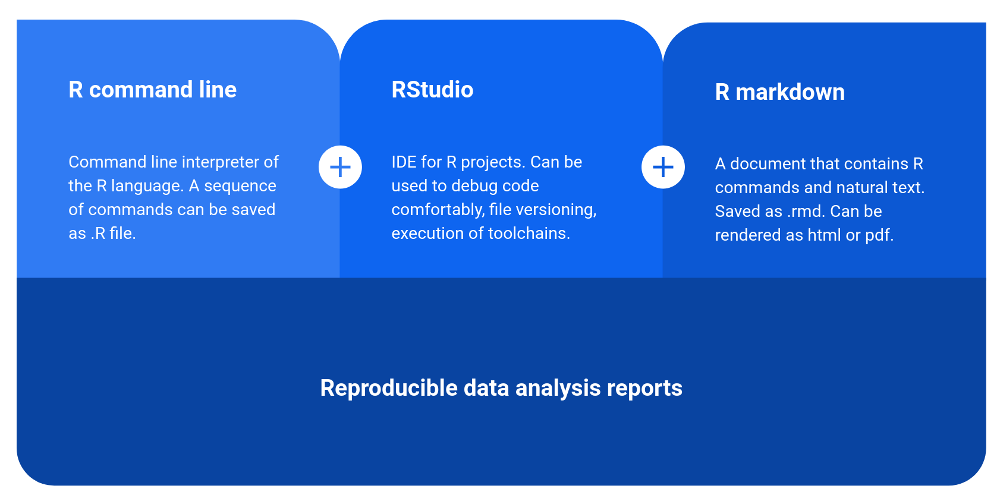
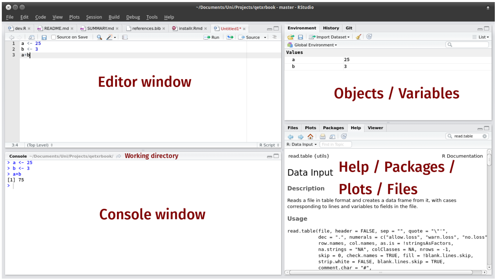

```{r, echo=F}
rm(list = ls())
```
# Introduction to R and RStudio

## The programming language R

- R is an open source implementation of S (S-Plus is a commercial implementation)
- R is available under GNU Copy-left
- R is group project run by a core group of developers (with new releases semi-annually)

## R and RStudio

R markdown builds on top of R and RStudio

```{r, out.width = "250px", echo=FALSE}
 
```

## Rstudio

- Rstudio is a software that allows to program in R and interactively analyse data with R

- It organizes the R session into 4 panes:

<!-- {#id .class width=600px height=400px} -->
```{r, out.width = "250px", echo=FALSE}
 
```

# First steps with R

## Disclaimer

This section is largely borrowed from the book Introduction to Data Science by Rafael Irizarry. [https://rafalab.github.io/dsbook]

You can find the whole book of our Data Analysis and Visualization in R lecture here:
[https://gagneurlab.github.io/dataviz/]

A cheatsheet for R studio can be obtained here: [https://raw.githubusercontent.com/rstudio/cheatsheets/master/rstudio-ide.pdf]

While a cheatsheet for R basics can be obtained here: [https://www.rstudio.com/wp-content/uploads/2016/10/r-cheat-sheet-3.pdf]

## Assignments

All big (programming) journeys start with a small step (or assignment). 

We use `<-` to assign **values** to **variables**. 

```{r eval=T}
a <- 9
b <- 3 + 2
```

We can also assign values using `=` instead of `<-`, but we recommend against using `=` to avoid confusion.

## Objects

To see the value stored in a variable, we simply ask R to evaluate `a` and it shows the stored value:

```{r}
a
```

A more explicit way to ask R to show us the value stored in `a` is using `print` like this:

```{r}
print(a)
```

We use the term _object_ to describe stuff that is stored in R. Variables are examples, but objects can also be more complicated entities such as functions.

<!-- ## Workspace -->

## Functions 

The data analysis process can usually be described as a series of _functions_ applied to the data. R includes several predefined functions and most of the analysis pipelines we construct make extensive use of these. 

For example, we can compute the square root of `a` with `sqrt` or see all the variables saved in our workspace by calling the function `ls`:

```{r}
sqrt(a)
ls()
```

Unlike `ls`, most functions require one or more _arguments_. 

---

In general, we need to use parentheses to evaluate a function. Without them, the function is not evaluated and instead R shows the code that defines the function:

```{r}
sqrt
```

We can find out what the function expects and what it does by reviewing the manuals included in R  with the help of the shorthand `?` (available for most functions):

```{r, eval=FALSE}
?log
```

The help page will show us that `log` needs `x` and `base` to run and that the argument `base` is optional.

---

We can change the default values of optional arguments by simply assigning another object:

```{r, eval=F}
log(8, base = 2)
```

If no argument name is used, R assumes we are entering arguments in the order shown in the help file. So by not using the names, it assumes the arguments are `x` followed by `base`:

```{r, eval=FALSE}
log(8,2)
```

If using the arguments' names, then we can include them in whatever order we want:

```{r, eval=F}
log(base = 2, x = 8)
```

To specify arguments, we must use `=`, and cannot use `<-`.

<!-- ## Other objects: datasets -->
<!-- ## Variables: name conventions -->

# Data Types in R

## Data types

Variables in R can be of different types. For example, we need to distinguish numbers from character strings and tables from simple lists of numbers. The function `class` helps us determine what type of object we have:

```{r}
a <- 2
class(a)
```

To work efficiently in R, it is important to learn the different types of variables and what we can do with these.

## Vectors: numerics, characters, and logical

```{r, echo=FALSE}
my_vector <- c(1, 2, 3, 4, 5)
```
```{r}
my_vector
```
The object `my_vector` is not one number but several. We call these types of objects _vectors_, which can be stored as variables. 

The function `length` tells you how many entries are in the vector:

```{r}
length(my_vector)
```

This particular vector is _numeric_ since it contains numbers:

```{r}
class(my_vector)
```

---

To store character strings, vectors can also be of class _character_. For example, we can create a vector containing strings as follows:

```{r}
char_vec <- c('DatViz', 'is', 'cool')
char_vec
class(char_vec)
```

Note that we can use the function `c()`, which stands for _concatenate_, to create vectors of any type.

---

Another important type of vectors are _logical vectors_. These must be either `TRUE` or `FALSE`. 

```{r}
z <- c(3 == 2, 5>4)
z
class(z)
```

The `==` is a relational operator asking if 3 is equal to 2. 

If we just use one `=`, we actually assign a variable, but if we use two `==` you test for equality. 

## Naming vectors

Sometimes it is useful to name the entries of a vector.

For example, when defining a vector of country codes, we can use the names to connect the two:

```{r}
codes <- c(italy = 380, canada = 124, egypt = 818)
codes
```

We can also assign names to an unnamed vector using the `names` function:

```{r}
codes <- c(380, 124, 818)
country <- c("italy","canada","egypt")
names(codes) <- country
```

## Vectors of sequences

Another useful function for creating vectors generates sequences:

```{r}
seq(1, 10)
```

The first argument defines the start, and the second defines the end which is included. The default is to go up in increments of 1, but a third argument lets us tell it how much to jump by:

```{r}
seq(1, 10, 2)
```

## Vectors containing repetitions

The `rep` function replicates values for a specific number of times. It can be useful when want to create a vector that contains repetitions.

For example, we can create the following vector with the `c` function:

```{r, eval=F}
x <- c(1,2,3,1,2,3,1,2,3,1,2,3)
```

But we can also create the same vector much easier with `rep`:

```{r}
x <- rep(1:3, times=4)
x
```

---

We can also pass a vector to the `rep` function and tell it that we want each entry to be repeated a certain number of times:

```{r}
s <- c("Jump", 'Go')
x <- rep(s, each=3)
x
```

Or we can define the output length and let R figure out how many times it should repeat the entries in the given vector:

```{r}
x <- rep(c(TRUE,FALSE,FALSE), len=10)
x
```

## Subsetting vectors

We use square brackets to access specific elements of a vector.

For instance, we can access the second element of a vector using:
```{r}
codes[2]
```

We can get more than one entry by using a multi-entry vector as an index:
```{r}
codes[c(1,3)]
```

---

We can access consecutive entries in a vector:

```{r}
codes[1:2]
```

If the elements have names, we can also access the entries using these names. Below are two examples.

```{r}
codes["canada"]
codes[c("egypt","italy")]
```


## Rescaling a vector

In R, arithmetic operations on vectors occur _element-wise_. 

For a quick example, we can convert a vector containing height values in inches to centimeters:

```{r}
inches <- c(69, 62, 66, 70, 70, 73, 67, 73, 67, 70)
inches * 2.54
```
 
We can not also multiply a vector times a scalar, but also perform additions and substractions:

```{r}
inches - 69
```

## Arithmetics with two vectors

If we have two vectors of the same length, and we sum them in R, they will be added entry by entry as follows:

$$
\begin{pmatrix}
a\\
b\\
c\\
d
\end{pmatrix}
+
\begin{pmatrix}
e\\
f\\
g\\
h
\end{pmatrix}
=
\begin{pmatrix}
a +e\\
b + f\\
c + g\\
d + h
\end{pmatrix}
$$

The same holds for other mathematical operations, such as `-`, `*` and `/`.

## Coercion in R

In general, _coercion_ is an attempt by R to be flexible with data types. 

When an entry does not match the expected, some of the prebuilt R functions try to guess what was meant before throwing an error. 

--- 

We said that vectors must be all of the same type. So if we try to combine, say, numbers and characters, you might expect an error:

```{r}
x <- c(1, "canada", 3)
```

But we don't get one, not even a warning! What happened? Look at `x` and its class:

```{r}
x
class(x)
```

R _coerced_ the data into characters!

## Not availables (NA)

When a function tries to coerce one type to another and encounters an impossible case, it usually gives us a warning and turns the entry into a special value called an `NA` for "not available".  For example:

```{r}
x <- c("1", "b", "3")
as.numeric(x)
```

R does not have any guesses for what number we want when you type `b`, so it does not try.

We will encounter the `NA`s often as they are generally used for missing data, a common problem in real-world datasets.

---

## Vector exercises

---

## Factors

```{r, echo=FALSE}
my_factor <- factor(c("Mutant", "Mutant", "Mutant", "WT", "WT", "WT"))
```
```{r}
my_factor
```
The `my_factor` variable, might look like a character vector. However, it is a _factor_:

```{r}
class(my_factor)
```

Factors are useful for storing categorical data.

We can inspect the categories (or levels) of a factor by using the `levels` function:

```{r}
levels(my_factor)
```

--- 

By default the levels are the unique values, sorted by alphanumerical order. We can construct a factor as follows:

```{r}
dogs <- factor(c('Beagle', 'Poodle',
                 'Labrador', 'Beagle', 'Akita'))
dogs
```

In the background, R stores these _levels_ as integers and keeps a map to keep track of the labels. This is more memory efficient than storing all the characters. 

## Further data types

Other data types in R include:

- **lists** as the generalization of data frames
- **matrices ** for two dimensional data

See the script for more information about them!

---

## Factor exercises

---


# Sorting and ranking

## Sorting

The function `sort` sorts a vector in increasing order:

```{r}
my_vector <- c(6, 1, 2, 5, 10, 9, 8)
sort(my_vector)
```

or in decreasing order:

```{r}
sort(my_vector, decreasing = TRUE)
```

## Ordering

The function `order` takes a vector as input and, rather than sorting the input vector, it returns the index that sorts input vector:


```{r}
x <- c(31, 4, 15, 92, 65)
index <- order(x)
index 
x[index]
```

This is the same output as that returned by `sort(x)`.

## `max` and `which.max`

If we are only interested in the entry with the largest value, we can use `max` for the value:

```{r}
my_vector <- c(6, 1, 2, 5, 10, 9, 8)
max(my_vector)
```

and `which.max` for the index of the largest value:

```{r}
i_max <- which.max(my_vector)
i_max
my_vector[i_max]
```

For the minimum, we can use `min` and `which.min` in the same way.

## Ranking

The function `rank` is also related to order and can be useful. For any given vector it returns a vector with the rank of the first entry, second entry, etc., of the input vector. Here is a simple example:

```{r}
x <- c(31, 4, 15, 92, 65)
rank(x)
```

<!-- ## Subsetting with logicals -->
<!-- ## which -->
<!-- ## match -->
<!-- ## %in% -->
<!-- ## Logical vectors -->

# Installing and loading packages

Packages are the fundamental units of reproducible R code. Several packages are automatically included. 

We can install and load new packages by typing:

```{r, eval=F}
install.packages("vegan") # install new package called vegan
library(vegan) # and load it
```

Vegan is a package to analyze biodiversity. To lean more about an installed package try:

```{r, eval=F}
browseVignettes(“vegan”)
```


## Curious about learning more R basics?

- Read the first chapter and appendix of our script!
- Ask questions on Slack!
- Practice with DataCamp!

# Data wrangling

## Data wrangling

- Data wrangling refers to the task of processing raw data into useful formats

- This Chapter introduces basic data wrangling operations in R using `data.tables` from the R package `data.table`:

```{r}
# install.packages("data.table")
library(data.table) 
```

A cheatsheet for R basics can be obtained here: [https://www.rstudio.com/wp-content/uploads/2016/10/r-cheat-sheet-3.pdf]

A cheatsheet for simple data.table manipulations can be obtained here:
[https://datacamp-community-prod.s3.amazonaws.com/6fdf799f-76ba-45b1-b8d8-39c4d4211c31]

```{r include=F}
DATADIR <- file.path('../../extdata')
library(magrittr)
```

# Introduction to Data.tables

## Overview

- `data.table` objects are a modern implementation of tables containing 
  
  - variables stored in columns and 
  - observations stored in rows
  

- A `data.table` is a memory efficient and faster implementation of `data.frame`. 

  - more efficient because it operates on its columns by reference (without copying)

  - from now on: work only with `data.table`
  
- Each column can have a different type

- A `data.table` does not have row names

- Shorter and more flexible syntax than `data.frame`

## Basic `data.table` syntax


The general basic form of the data.table syntax is:

    DT[ i,  j,  by ] #
        |   |   |
        |   |    -------> grouped by what?
        |    -------> what to do with the columns?
         ---> on which rows?
         
"Take `DT`, subset rows by `i`, then compute `j` grouped by `by`". 


## Creating `data.tables` 

To create a `data.table`, we just name its columns and populate them:

```{r}
library(data.table)
DT <- data.table(x = rep(c("a","b","c"), each = 3), y = c(1, 3, 6), v = 1:9)
DT # note how column y was recycled
```


All the columns have to have the same length. 

If vectors of different lengths are provided upon creation of a `data.table`, R automatically recycles the values of the shorter vectors.


## Converting into `data.table`

If we want to convert any other R object to a `data.table`, all we have to do is to call the `as.data.table()` function. 

This is typically done for `data.frame` objects:

```{r}
#install.packages("dslabs")
library(dslabs)
brexit_polls <- as.data.table(brexit_polls)
class(brexit_polls)
```

`titanic_df` is now both a `data.table` and a `data.frame` as `data.table` inherits from `data.frame`

## Loading `data.tables`

- We can read files from disk and process them using `data.table`

- The easiest way to do so is to use the function `fread()`

## Loading `data.tables`

Example: Kaggle flight and airports dataset that is limited to flights going and in or to the Los Angeles airport:

```{r, eval=FALSE}
flights <- fread('path_to_file/flightsLAX.csv')
```

```{r, echo=FALSE}
flights <- fread(file.path(DATADIR, 'flights/flightsLAX.csv'))
flights <- flights[, .(YEAR, MONTH, DAY, DAY_OF_WEEK, AIRLINE, FLIGHT_NUMBER, TAIL_NUMBER, ORIGIN_AIRPORT,
                        DESTINATION_AIRPORT, DEPARTURE_TIME, AIR_TIME, DISTANCE, ARRIVAL_TIME)]
```

```{r}
head(flights, n=5)
```


## Inspecting tables


A first step in any analysis should involve inspecting the data we just read in.

After looking at the first and last rows of the table, the next information we are often interested in is the **size** of our data set:

```{r}
ncol(flights)   # nrow(flights) for number of rows
dim(flights)    # returns nrow and ncol
```

## Basic statistics

Next, we are often interested in **basic statistics** on the columns. 

To obtain this information we can call the `summary()` function on the table:

```{r}
summary(flights[,1:6])

```

... But for categorical data this is not very insightful, as we can see for the `AIRLINE` column

## Inspecting categorical variables

First we list all **unique elements** using in a categorical variable:
```{r}
flights[, unique(AIRLINE)]

```

Another valuable information for categorical variables is **how often** each category occurs: 

```{r}
flights[, table(AIRLINE)]
```

# Row subsetting

## Row subsetting using the `i` argument

Remember the basic syntax:


    DT[ i,  j,  by ] #
        |   |   |
        |   |    -------> grouped by what?
        |    -------> what to do with the columns?
        ---> on which rows?


- The `i` argument allows row indexing

- `i` can be any vector of integers corresponding to 
  
  - the row indices to select or 
  
  - some logical vectors indicating which rows to select
  
  
## Subsetting a single row by index

If we want to see the second element of the table, we can do the following:

```{r}
flights[2, ]   # Access the 2nd row (also flights[2] or flights[i = 2])
```

A shorter writing allows leaving out the comma:
```{r}
flights[2]  
```

## Subsetting multiple rows by indices

For accessing **multiple consecutive** rows we can use the `start:stop` syntax:
```{r}
flights[1:3]
```


## Subsetting multiple rows by indices

Accessing multiple rows that are **not necessarily consecutive** can be done by creating an index vector with `c()`:
```{r}
flights[c(3, 5)]
```

## Subsetting rows by logical conditions

- Often, a more useful way to subset rows is using logical conditions, using for `i` a logical vector

- We can create such logical vectors using the following binary operators:

  * `==`
  * `<`
  * `>`
  * `!=`
  * `%in%`


## Subsetting rows by logical conditions with `==`

For example, entries of flights operated by "AA" (American Airlines) can be extracted using:

```{r}
flights_subset <- flights[AIRLINE == "AA"]
head(flights_subset)
```

## Subsetting rows by logical conditions with `%in%`

We are now interested in all flights from any destination to the airports in NYC (`"JFK"` and `"LGA"`):

```{r}
flights_subset <- flights[DESTINATION_AIRPORT %in% c("LGA", "JFK")]
tail(flights_subset)
```

## Subsetting rows by logical conditions with `|` and `&` 

We can concatenate multiple conditions using the logical OR `|` or the logical AND `&` operator:

```{r}
flights_subset <- flights[AIRLINE=="AA" & DEPARTURE_TIME>600 & DEPARTURE_TIME<700]
tail(flights_subset)
```


# Column operations

## `data.table` environment

**Why does R correctly run code such as `flights[AIRLINE == "AA"]`?**


- Remember: `AIRLINE` is not a variable but a column of the `data.table` `flights`


- Such a call would not execute properly with a `data.frame`


- Answer: code entered inside the ``[]`` brackets of a `data.table` is interpreted using the `data.table` environment


  - Inside this environment, columns are seen as variables already
  
  - This makes the syntax very light and readable for row subsetting 

  - It becomes particularly powerful for column operations

## Accessing columns but names 

- Although feasible, it is not advisable to access a column by its number since
  
  - the ordering or number of columns can easily change.
  
  - Also, if you have a data set with a large number of columns (e.g. 50), how do you know which one is column 18? 

- Therefore, **use the column names** to access columns for 
 
  - preventing bugs and 
  
  - more readibility: `flights[, TAIL_NUMBER]` instead of `flights[, 7]`

## Accessing one column

```{r}
flights[1:10, TAIL_NUMBER]    # Access column x (also DT$x or DT[j=x]).
```

For accessing a specific cell (i.e. specific column and specific row), we can use the following syntax:
```{r}
flights[4, TAIL_NUMBER]   # Access a specific cell.
```

## Accessing multiple columns

This command for accessing multiple columns would return a vector:
```{r}
flights[1:2, c(TAIL_NUMBER, ORIGIN_AIRPORT)]
```

However, when accessing many columns, we probably want to return a `data.table` instead of a vector. For that, we need to provide R with a list, so we use ``list(colA, colB)`` or its simplified version ``.(colA, colB)``:

```{r}
flights[1:2, list(TAIL_NUMBER, ORIGIN_AIRPORT)]

# Same as before.
flights[1:2, .(TAIL_NUMBER, ORIGIN_AIRPORT)]
```


## Column operations

Since columns are seen as variables inside the ``[]`` environment, we can apply functions to them:

```{r}
# Similar to mean(flights[, AIR_TIME])
flights[, mean(AIR_TIME, na.rm=TRUE)]
flights[AIRLINE == "OO", mean(AIR_TIME, na.rm=TRUE)]
```

## Multiple column operations

- To compute operations in multiple columns, we must provide a list (unless we want the result to be a vector).

```{r}
# Same as flights[, .(mean(AIR_TIME), median(AIR_TIME))]
flights[, list(mean(AIR_TIME, na.rm=TRUE), median(AIR_TIME, na.rm=TRUE))]
```

- To give meaningful names to the computations from before, we can use the following command:
```{r}
flights[, .(mean_AIR_TIME = mean(AIR_TIME, na.rm=TRUE), 
            median_AIR_TIME = median(AIR_TIME, na.rm=TRUE))]
```

## Column operations

- Any operation can be applied to the columns, just as with variables

- This code computes the average speed as the ratio of `AIR_TIME` over `DISTANCE` for the 5 first entries of the table `flights`:

```{r}
flights[1:5,AIR_TIME/DISTANCE]
```

<!-- ### Advanced commands: *apply() over columns -->

<!-- The columns of a `data.table` are exposed as a list to the environment. Therefore functions applying to a list can be applied to them, including those of the `*apply` family such as sapply()`. For example: -->

<!-- ```{r, linewidth=80, error=TRUE} -->
<!-- sapply(flights, class)   # Try the same with lapply -->
<!-- ``` -->

<!-- ```{r} -->

<!-- # Note that we can access columns stored as variables by setting with=F. -->
<!-- # In this case, `colnames(iris_dt)!="Species"` returns a logical vector and ` -->
<!-- # iris_dt` is subseted by the logical vector -->

<!-- # Same as sapply(iris_dt[, 1:4], sum) -->
<!-- #sapply(iris_dt[, colnames(iris_dt)!="Species", with = F], sum)  -->
<!-- ``` -->

# Grouping

## The 'by' option

The ``by`` option allows executing the `j` command by groups. For example, we can use``by = `` to compute the mean flight time per airline:

```{r}
flights[, .(mean_AIRTIME = mean(AIR_TIME, na.rm=TRUE)), by = AIRLINE]
```

## The 'by' option

We can also compute the mean and standard deviation of the air time of every airline:

```{r}
flights[, .(mean_AIRTIME = mean(AIR_TIME, na.rm=TRUE), 
            sd_AIR_TIME = sd(AIR_TIME, na.rm=TRUE)), by = AIRLINE]
```

## Remark on the `data.table` syntax

- Although we could write ``flights[i = 5, j = AIRLINE]``, we usually ommit the ``i =`` and ``j =`` from the syntax, and write ``flights[5, ARILINE]`` instead. 

- However, for clarity we usually include the ``by =`` in the syntax.

# Counting occurences with `.N`

## Counting occurences with `.N`

The ``.N`` is a special in-built variable that counts the number observations within a table. Evaluating ``.N`` alone is equal to `nrow()` of a table:
```{r}
flights[, .N]
nrow(flights)
```


## Powerful statements using all three elements `i`, `j` and `by`

Remember the `data.table` definition: "Take **DT**, subset rows using **i**, then select or calculate **j**, grouped by **by**"

For example, we can, for each airline, get the number of flights arriving to the airport JFK: 

```{r}
flights[DESTINATION_AIRPORT == "JFK", .N, by = 'AIRLINE']
```

# Extending tables

## Creating new columns (the := command)

The ``:=`` operator updates the `data.table` inplace, so writing `DT <- DT[,... := ...]` is redundant. 

This operator changes the input by *reference*. No copy of the object is made, which makes the operation faster and less memory-consuming.

As an example, we can add a new column called `SPEED` (in miles per hour) whose value is the `DISTANCE` divided by `AIR_TIME` times 60:
```{r}
flights[, SPEED := DISTANCE / AIR_TIME * 60]
head(flights)
```

## Creating and using new columns (the := command)

Having computed a new column using the ``:=`` operator, we can use it for further analyses. 

For instance, we can compute the average speed, air time and distance for each airline:

```{r}
flights[, .(mean_AIR_TIME = mean(AIR_TIME, na.rm=TRUE),
            mean_SPEED = mean(SPEED, na.rm=TRUE),
            mean_DISTANCE = mean(DISTANCE, na.rm=TRUE)
            ), by=AIRLINE]
```


## Removing columns

Additionally we can use the ``:=`` operator to remove columns. 

If we for example observe that tail numbers are not important for our analysis we can remove them with the following statement:
```{r}
flights[, TAIL_NUMBER := NULL]
head(flights)
```

## Copying tables

**What do we mean when we say that `data.table` modifies columns *by reference*?**

It means that no new copy of the object is made in the memory, unless we actually create one using ``copy()``.

```{r}
or_dt <- data.table(a = 1:10, b = 11:20)
# No new object is created, both new_dt and or_dt point to the same memory chunk.
new_dt <- or_dt
new_dt[, ab := a*b]
colnames(or_dt)   # or_dt was also affected by changes in new_dt

or_dt <- data.table(a = 1:10, b = 11:20)
copy_dt <- copy(or_dt)   # By creating a copy, we have 2 objects in memory
copy_dt[, ab := a*b]
colnames(or_dt)    # Changes in the copy don't affect the original
```

---

## Data.table exercises

---
## Summary

By now, you should be able to answer the following questions:

* How to subset by rows or columns? Remember: DT[i, j, by].
* How to add columns?
* How to make operations with different columns?

## Data.table resources

The help page for `data.table`.

<https://cran.r-project.org/web/packages/data.table/>

<https://s3.amazonaws.com/../assets.datacamp.com/img/blog/data+table+cheat+sheet.pdf>

<http://r4ds.had.co.nz/relational-data.html>

<http://adv-r.had.co.nz/Environments.html>

# Rmarkdown

## Creating reproducible reports

* This is an R Markdown presentation. Markdown is a simple formatting syntax for authoring HTML, PDF, and MS Word documents. For more details on using R Markdown see <http://rmarkdown.rstudio.com>. 

* Simply go to File --> New File --> R Markdown

* Select PDF and you get a template.

* All the commands that you may need can be found on this cheatsheet: <https://raw.githubusercontent.com/rstudio/cheatsheets/master/rmarkdown-2.0.pdf>.

* When you click the **Knit** button a document will be generated that includes both content as well as the output of any embedded R code chunks within the document.  

# Recap

## In a nutshell

Today we learned:

* The basics of R and of the Rstudio interface

* How to manipulate the basic R data types

* How to load datasets and do operations on them with `data.table`

* How to make reproducible reports


# Reading

## Reading

You can read more details on the subjects that we discussed today on **Chapter 1: R basics** and **Chapter 2: Data wrangling**, as well as the **A: Importing data** and **B: R programming** of the **Appendix**, on <https://gagneurlab.github.io/dataviz/>.

# Cheatsheets

## Cheatsheets


You can find the whole book of our Data Analysis and Visualization in R lecture here:
[https://gagneurlab.github.io/dataviz/]

A cheatsheet for R studio can be obtained here: [https://raw.githubusercontent.com/rstudio/cheatsheets/master/rstudio-ide.pdf]

A cheatsheet for R basics can be obtained here: [https://www.rstudio.com/wp-content/uploads/2016/10/r-cheat-sheet-3.pdf]

A cheatsheet for simple data.table manipulations can be obtained here:
[https://datacamp-community-prod.s3.amazonaws.com/6fdf799f-76ba-45b1-b8d8-39c4d4211c31]

A cheatsheet for advanced data.table manipulations can be obtained here:
[https://raw.githubusercontent.com/rstudio/cheatsheets/master/datatable.pdf]

A cheatsheet on how to create Rmarkdowns can be obtained here:
[https://raw.githubusercontent.com/rstudio/cheatsheets/master/rmarkdown-2.0.pdf]