```{r include=FALSE}
options("width"=80)
knitr::opts_chunk$set(echo=TRUE, warning=FALSE, message=FALSE, cache=F, 
    results="show",
    out.width="400px", out.height="250px",
    fig.align="center",
    dpi=600, tidy = TRUE, tidy.opts=list(width.cutoff=80))
```

# Foreword

The aim of these series of lectures is to provide you with all the knowledge needed in order to make state of the art plots using the R programming language and Grammar of Graphics. The lectures cover the basic concepts of R, how to manipulate data and how to generate clear and meaningful plots for your target audience, using ggplot2 an implementation of Grammar of Graphics for R. 

# Data visualisation introduction

Data Science is crucial for many applications in a variety of fields and is the language of collaboration between biology, computer science, bioinformatics, physics, and mathematics.

Goals of this course include to introduce you to the R and Rstudio, and provide you general analytic techniques to extract knowledge, patterns, and connections between samples and variables, and how to communicate these in an intuitive and clear way. Some of the examples will be expressed in the field of bioinformatics.

## What is Data Science?

Data science is an interdisciplinary field about processes and systems to extract knowledge or insights from data in various forms, either structured or unstructured. It is a continuation of some of the data analysis fields such as statistics, data mining, and predictive analytics.

The Goals of Data Science include discovering new phenomena or trends from data, enabling decisions based on facts derived from data, and communicating findings from data.

Data science at its core is the heart of any scientific method. It starts with observations, makes hypotheses, experiments, and  visualizes the results in such a way that you can make claims about the validity of the hypothesis. These skills are applicable not only to whatever research topic interests you, but are also some of the hottest skills you may develop for the job market.

## What you'll learn (hopefully)

Opposed to many other statistics or machine learning lectures this course is designed to teach you the practical skills you need as a data scientist. We will not focus on the complex math that went into developing the high powered statistical tools, and machine learning techniques thought in many courses. We will focus on tidy data, visualizations, and data manipulation in R. 

## Our tool
* R- a language and program designed for data analytics. Not great for big applications, but an environment to work with data in an easy way based on scripts.
  + Scripting: work on the fly, define few functions and data structures but use existing packages to interpret your data along with your own intuition.
  + Package developer: robust, fast code, that copes with the inherent problems of the language.

## Breakdown of topics
* R markdown: Notebooks that allow you to quickly publish and share your code informally so that you can see the results and the code that generated it. (This is an R markdown file)
* Tidy data: standard way of structuring data for efficient memory storage and efficient operations
* Visualization with ggplot2: flexible grammar and frame-work to visualize data in concise and easy ways.


# Introduction to R and Rstudio
* R is the language of this course. It shares some aspects with python, but the syntax is often unique compared to other languages. All R files are named with a .R extension (dot - R)  
* Rstudio is an editor, it succinctly organizes your session into 4 windows each set up for you to do certain tasks in each window. Edit and write code (editor), run and execute code (console), list and name objects, and a window to show output in either function help, and plots.

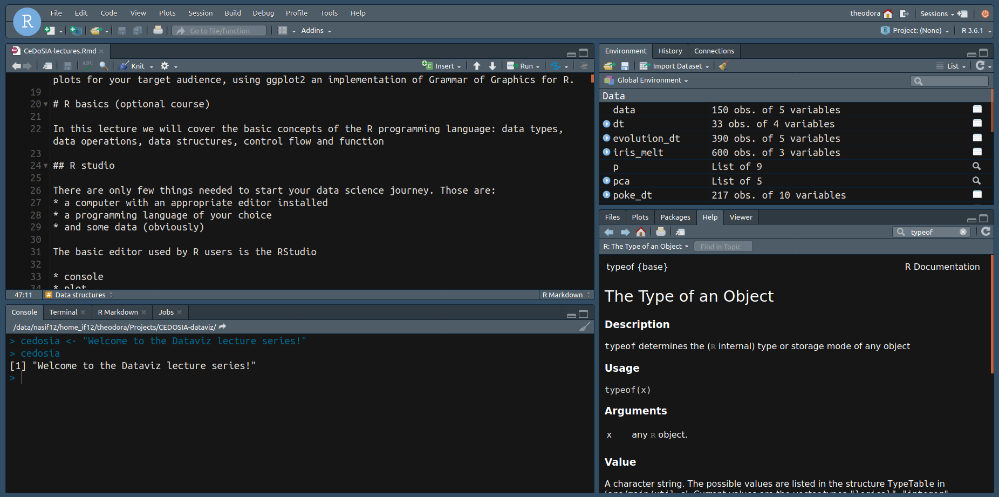


<!-- {#id .class width=600px height=400px} -->


The most commonly used editor by R users is the RStudio. It consists of the following sections such as:

* the main script section, for writing scripts [top left section] (Ctrl+1 to focus)
* the console tab, for typing R commands directly [bottom left section as tab] (Ctrl+2 to focus)
* the terminal tab, for direct access to your system shell [bottom left section] (Shift+Alt+T to focus)
* the plot tab, where you see the last plot generated [bottom right section as tab]
* the help tab, with useful documentation of R functions [bottom right section as tab] (F1 on the name of a function or Ctrl+3)
* the history tab, with the list of the R commands used [top right section as tab]
* the environment tab, with the created variables and functions loaded [top right section as tab]
* and the packages tab, with the available/loaded R packages [bottom right section as tab]

Check the View menu to find out the rest of useful shortcuts!

## Introduction to basic R syntax
  
* All code is run in the console (bottom left) you can write and alter code directly in here or in the editor above (top left) for easier editing/debugging
* All of your questions and issues can be investigated [Here](https://cran.r-project.org/doc/contrib/Paradis-rdebuts_en.pdf)
* R examples:
  +  basic operators
   ```{r}
   x <- 10
   x
   x + 5
   y <- x + 5
   y
   x == y
   x
  ```
  + built-in methods
  ```{r}
  x <- rnorm(10) #returns a vector of random numbers based on the normal distribution
  mean(x)
  ```
* **?** operator  
    `?mean` shows you information about the function you are calling. Look to the bottom right window.

We will introduce further details of the R language as they are needed throughout the course and refer you to the Appendix II for a more detailed introduction to R.

## Introduction to basic RStudio usage

Opening up Rstudio in an fresh R session, we see the R version and the architecture of our system (32-bit or 64-bit)
\newline
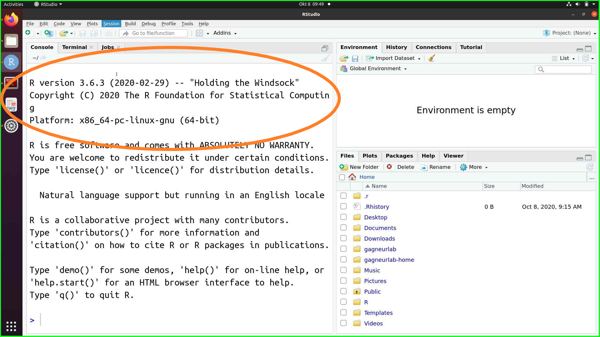

Now are going to show a super simple tutorial of a project setup.

1. From the menu bar we click **File > New Project**
   \newline
   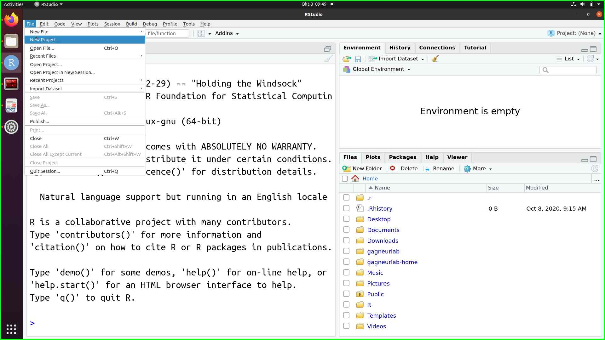
2. Then we choose **New Directory > New Project**
   \newline
   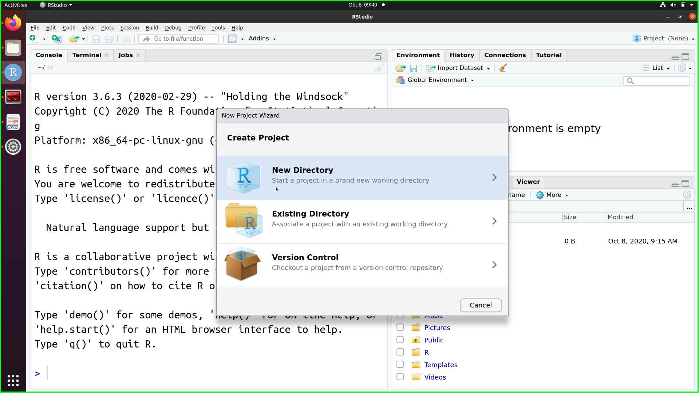
   \newline
   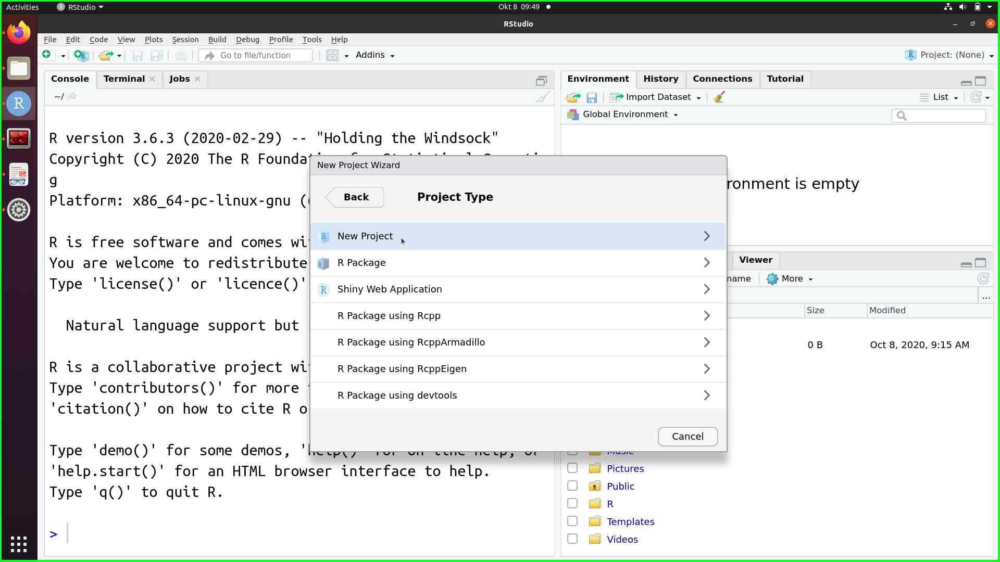

3. Give a name to your **New Project** eg. *dataviz-demo*, and set the path where the new project will be created and click **Create Project**
   \newline
   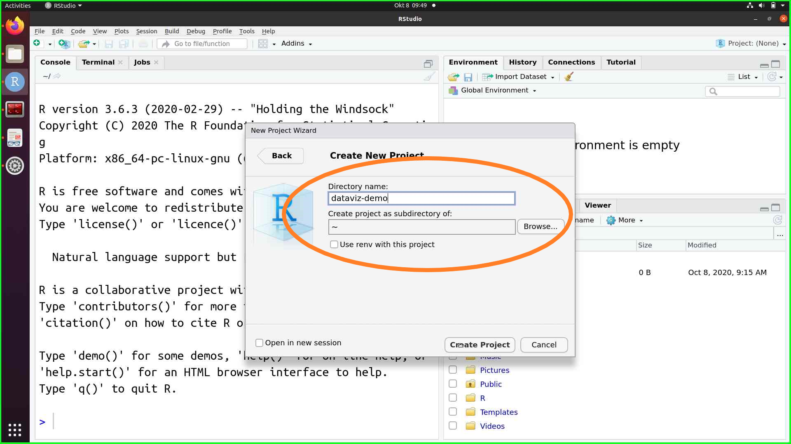
4. The new project will be loaded and you can see the name of your project on the top bar
   \newline
   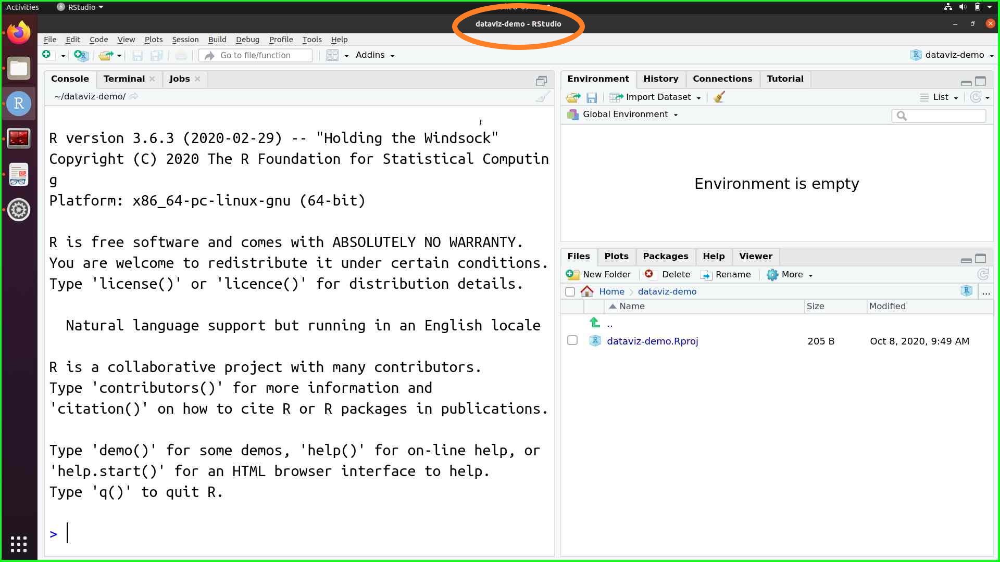
5. Now you can start typing command on the **Console Panel**
   \newline
   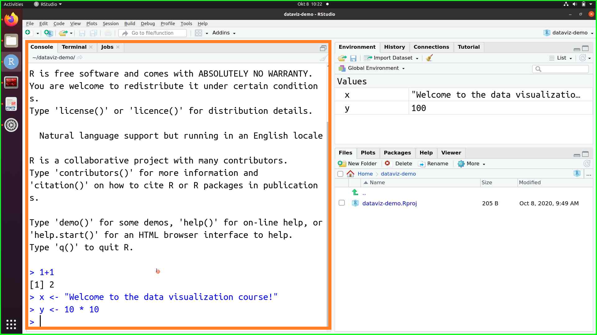
6. By assigning a variable, the variable and its value will appear on the **Environment Panel**
   \newline
   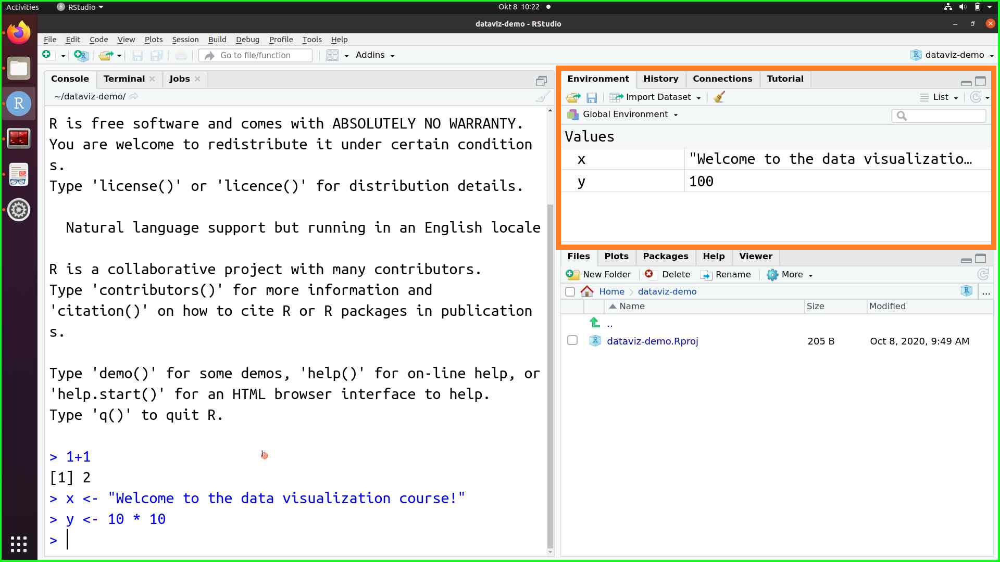
   
7. By typing the `?` before an function name e.g. `?toupper`, the toupper function will appear on the **Help Panel** with all the documentation of the function as well as usefull examples.
  \newline
   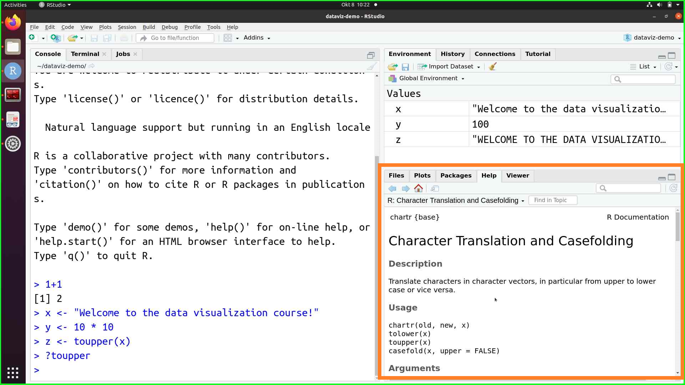
8. Typing endlessly commands in the console can cumbersome, so in order for us to be able to reproduce our code, what we do is that we write our commands in a script file. To make a new script file we can either click **File > New File > R** script or click or the **+** icon (below the File menu) and then click **R script** or simply press **Ctrl+Shift+N**. A new untitled empty script will appear on the **Source panel**
  \newline
  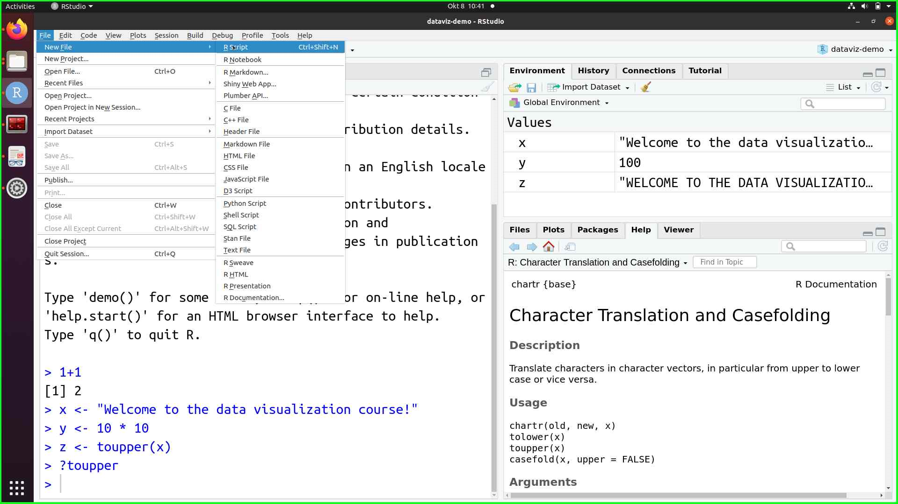
  \newline
  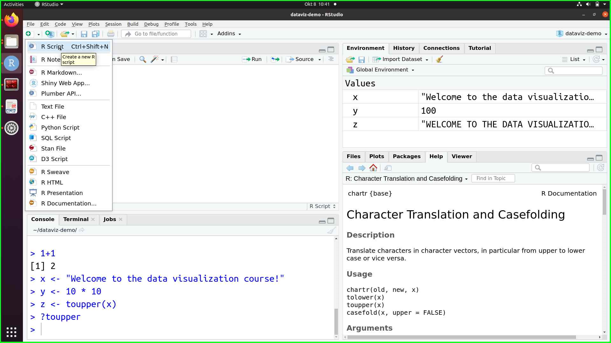
  \newline
  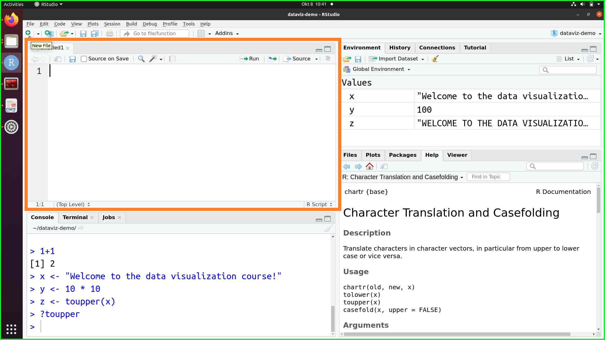
   \newline
   
\pagebreak


