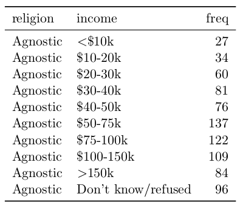
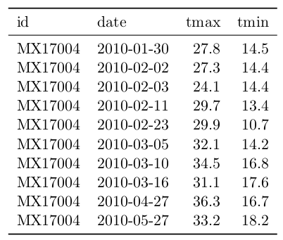
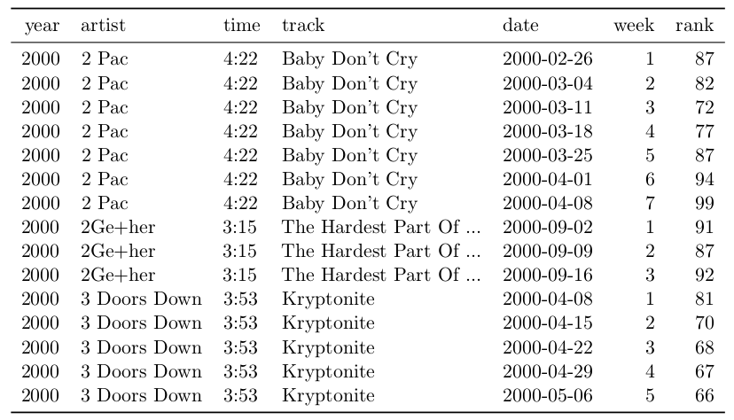
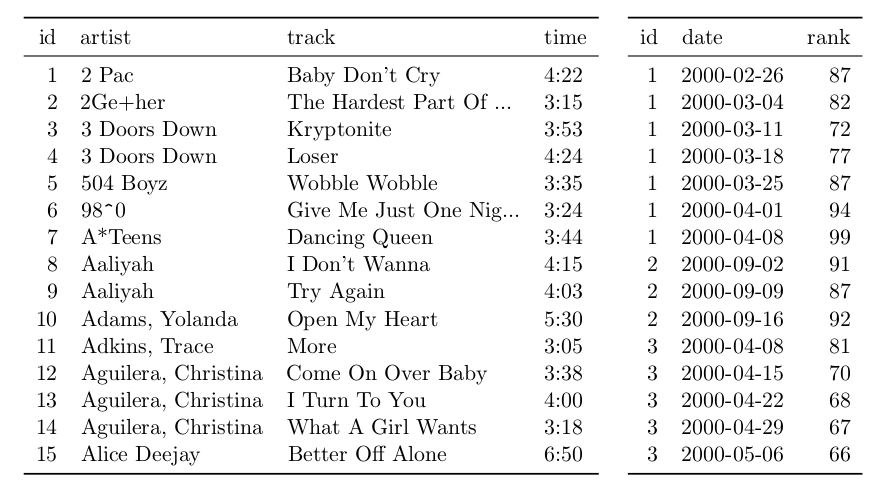

```{r include=FALSE}
options("width"=80)
knitr::opts_chunk$set(echo=TRUE, warning=FALSE, message=FALSE, cache=F, 
    results="show",
    out.width="400px", out.height="250px",
    fig.align="center",
    dpi=200, tidy = TRUE, tidy.opts=list(width.cutoff=80))
```

# Tidy data

## Tidy data prerequisites
```{r}
library(data.table) # melt, dcast, ...
library(magrittr)  # pipe operator %>% 
suppressMessages(library(tidyr)) # table1, table2, ...

# Data used throughout the lecture
table1 <- tidyr::table1 %>% as.data.table # use data.table instead of tibble
table2 <- tidyr::table2 %>% as.data.table
table3 <- tidyr::table3 %>% as.data.table
table4a <- tidyr::table4a %>% as.data.table
table4b <- tidyr::table4b %>% as.data.table
table5 <- tidyr::table5 %>% as.data.table
```

For clarity, we will often use the syntax: 
- `tidyr::unite()`
- instead of just `unite()`

We will also use the pipe operator `%>%`

- conceptually similar to the unix pipe: `$ cat file.txt | sort -u | head`
- makes the code more readable
- typical use cases:
    - exploratory analysis at the command line: `dt %>% unique %>% head`
    - dplyr data table operations
- <http://r4ds.had.co.nz/pipes.html>


```{r, eval = FALSE}
foo <- little_bunny()
```

```{r, eval = FALSE}
foo <- hop(foo, through = forest)
foo <- scoop(foo, up = field_mice)
foo <- bop(foo, on = head)
```

```{r, eval = FALSE}
foo %>%
  hop(through = forest) %>%
  scoop(up = field_mouse) %>%
  bop(on = head)
```


```{r}
## Argument not occurring first:
## use .
"hop_scoop_bop" %>% gsub("_", " ", .)
```


## Tidy data definition

1. Each **variable** must have its own **column**.
2. Each **observation** must have its own **row**.
3. Each **value** must have its own **cell**.

```{r}
table1
```


## Common signs of untidy datasets

* Column headers are values, not variable names.
* Multiple variables are stored in one column.
* Variables are stored in both rows and columns.
* Multiple types of observational units are stored in the same table.
* A single observational unit is stored in multiple tables.


Column headers are values, not variable names

Untidy: 1999 and 2000 are values of the variable *year*.

```{r}
table4a
```

<!-- :::::: {.columns} -->
<!-- ::: {.column width="48%"} -->
Untidy


<!-- ::: -->

<!-- ::: {.column width="48%"} -->
Tidy


<!-- ::: -->
<!-- :::::: -->

### Multiple variables are stored in one column

Untidy

```{r}
table3
```


### Variables are stored in both rows and columns

* The variable *date* is stored across rows and columns
* The `element` column is not a variable; it stores the names of variables

<!-- :::::: {.columns} -->
<!-- ::: {.column width="48%"} -->

Untidy: days of the month (d1, d2, ...) are values, not variables


<!-- ::: -->

<!-- ::: {.column width="48%"} -->
Tidy


<!-- ::: -->
<!-- :::::: -->

### Multiple types of observational units are stored in the same table

<!-- :::::: {.columns} -->
<!-- ::: {.column width="48%"} -->
Untidy


<!-- ::: -->

<!-- ::: {.column width="48%"} -->
Tidy



<!-- ::: -->
<!-- :::::: -->

### A single observational unit is stored in multiple tables

Untidy

```{r, echo = FALSE}
split(table1, table1$country) %>% lapply(. %>% subset(select = -country) %>% as.data.table)
```

### Recap - same dataset, different representations

```{r}
table1
head(table2)
```

```{r}
table3
table4a
table4b
```


## Importance of data.tables

* Easier manipulation using data.table commands
  * sub-setting by rows
  * sub-setting by columns
  * `by` operations
* Many other tools work better with tidy data - consistent way of storing data
  * example: ggplot2
* Vectorized operations become easier to use


Tidy data can be easily manipulated

```{r}
dt <- table1

# Compute rate per 10,000
dt[, rate := cases / population * 10000] # vectorized operations; dt is modified

# Compute cases per year
dt[, .(cases = sum(cases)), by = year] # note that this does not modify dt 
```

Tidy data works better with many packages

```{r leture05-ggplot-tidy-data}
ggplot(dt, aes(year, cases, color = country))+
         ggtitle( "Change over time") + 
         geom_line()
```


To sum up:

* In a tidy dataset, each variable must have its own column
* Each row corresponds to one unique observation
* Each cell contains a single value
* Tidy datasets are easier to work with
* Data.table library has functions to transform untidy datasets to tidy


Words to live by

**Happy families are all alike; every unhappy family is unhappy in its own way.**

*- Leo Tolstoy*

**Tidy datasets are all alike, but every messy dataset is messy in its own way.**

*- Hadley Wickham*


## Lists to data.table

Very frequent scenarios in R

* read in a bunch of similar `.csv` files (`date1.csv`, `date2.csv`, ...)
* nested data types (json/xml from API)
* `lapply` output (say doing a cross-validation, using different parameters, ...)

**If possible, have one data.table instead of a (nested) list of data.tables**

<!-- :::::: {.columns} -->
<!-- ::: {.column width="60%"} -->
JSON -> R list

```{r echo = FALSE}
sw_json <- '[
  {
    "Name": "Anakin",
    "Gender": "male",
    "Homeworld": "Tatooine",
    "Born": "41.9BBY",
    "Jedi": "yes"
  },
  {
    "Name": "R2-D2",
    "Gender": "unknown",
    "Homeworld": "Naboo",
    "Born": "33BBY",
    "Jedi": "no"
  }
]'

```

```{r}
# for demonstrational purposes 
# I've put 'simplifyDataFrame = FALSE'
sw_list <- jsonlite::fromJSON(sw_json, 
          simplifyDataFrame = FALSE) 
str(sw_list)
```
<!-- ::: -->

<!-- ::: {.column width="36%"} -->

JSON example

```{r}
sw_json <- '[
  {
    "Name": "Anakin",
    "Gender": "male",
    "Homeworld": "Tatooine",
    "Born": "41.9BBY",
    "Jedi": "yes"
  },
  {
    "Name": "R2-D2",
    "Gender": "unknown",
    "Homeworld": "Naboo",
    "Born": "33BBY",
    "Jedi": "no"
  }
]'

```
<!-- ::: -->
<!-- :::::: -->

To convert a list to a data.table, we use `as.data.table` to convert a list to a data.table with one row and `rbindlist` to stack data.tables

If something is not working as expected try with:
* `rbindlist(fill = TRUE, use.names = TRUE)`
* prefer data.table's `rbindlist` over `rbind`

```{r}
sw_dt <- lapply(sw_list, as.data.table) %>% rbindlist
sw_dt
```

A very common situation: **list name is a variable**

```{r, echo = FALSE}
dt_list <- list(
  "young" = data.table(x = 1:10, y = 1 * 1:10 + rnorm(10)),
  "old"   = data.table(x = 1:10, y = 2 * 1:10 + rnorm(10))
)
```

```{r}
dt_list %>% lapply(head, n = 3)
```

**How would you reshape it?**

```{r}

dt <- rbindlist(dt_list, idcol = "age")  # call the new variable "age"

dt %>% print(3)

```

## Melting and Casting (wide data <-> long data)

**Typical problem:**

1. One variable might be spread across multiple columns.
2. One observation might be scattered across multiple rows.

**Untidy datasets:**

<!-- :::::: {.columns} -->
<!-- ::: {.column width="48%"} -->

```{r}
## Wide data
print(table4a)
```
<!-- ::: -->

<!-- ::: {.column width="48%"} -->

```{r}
## Long data
print(table2)
```
<!-- ::: -->
<!-- :::::: -->

**Solution in R:**

Transform wide data -> long data

- `data.table::melt()`
- `tidyr::gather()`

Transform long data -> wide data

- `data.table::dcast()`
- `tidyr::spread()`


To make wide data into long data we use `data.table::melt`

```{r}
print(table4a)

table4a %>% data.table::melt(id.vars = "country",
                             measure.vars = c("1999", "2000"),
                             # would work also without specifying *either* measure.vars OR id.vars
                             variable.name = "year",
                             value.name = "cases")
## Alternatively: table4a %>% tidyr::gather(`1999`, `2000`, key = "year", value = "cases")
```	


To make long data into wide data we use `data.table::dcast`

```{r, eval=FALSE}
## Help
dcast(data, formula, fun.aggregate = NULL, sep = "_", ..., margins = NULL, subset = NULL, fill = NULL, 
    drop = TRUE, value.var = guess(data), verbose = getOption("datatable.verbose"))
```

<!-- :::::: {.columns} -->
<!-- ::: {.column width="48%"} -->

```{r}
data.table::dcast(table2, ... ~ type, 
                  value.var = "count")
```

<!-- ::: -->

<!-- ::: {.column width="48%"} -->

```{r}
print(table2)
```

<!-- ::: -->
<!-- :::::: -->

Compare

<!-- :::::: {.columns} -->
<!-- ::: {.columns width="48%"} -->

```{r}
dcast(table2, ... ~ type, 
      value.var = "count")
```

<!-- ::: -->

<!-- ::: {.columns width="48%"} -->

```{r}
print(table1)
```
<!-- ::: -->
<!-- :::::: -->


## Separating and Uniting (1 <-> more variables)

**Typical problem:**

1. One column contains multiple variables
2. Multiple columns contain one variable

**Untidy datasets**

<!-- :::::: {.columns} -->
<!-- ::: {.column width="52%"} -->

```{r}
## One column contains multiple variables
print(table3)
```

<!-- ::: -->

<!-- ::: {.column width="44%"} -->

```{r}
## Multiple columns contain one variable
print(table5)
```
<!-- ::: -->
<!-- :::::: -->

**Solution in R:**

1) variable -> multiple variables
    - `tidyr::separate()`

2) multiple variables -> 1 variables
    - `tidyr::unite()`

other useful functions: 

- `data.table::tstrsplit`, `strsplit`, `paste`, `substr`

To separate 1 variable to multiple variables we use `tidyr::separate()`.

```{r, eval = FALSE}
separate(data, col, into, sep = "[^[:alnum:]]+", remove = TRUE,
  convert = FALSE, extra = "warn", fill = "warn", ...)
```

<!-- :::::: {.columns} -->
<!-- ::: {.column width="56%"} -->

```{r}
table3
```

<!-- ::: -->

<!-- ::: {.column width="40%"} -->

```{r}
separate(table3, col = rate, 
         into = c("cases", "population"))
separate(table3, col = rate, 
         into = c("cases", "population")) %>% 
  class
```

<!-- ::: -->
<!-- :::::: -->


To unite multiple variables to 1 variable we use `tidyr::unite()`.

```{r, eval = FALSE}
unite(data, col, ..., sep = "_", remove = TRUE)
```

```{r}
table5
unite(table5, col = new, century, year, sep = "")
```


## Non-tidy data

* Performance advantage using certain functions
  + `colSums()` or `heatmap()` on matrices

* Field convention

* Memory efficiency

  + don't worry, you should be fine with tidy-data in `data.table`

Interesting blog post:

* <http://simplystatistics.org/2016/02/17/non-tidy-data/>


\pagebreak
