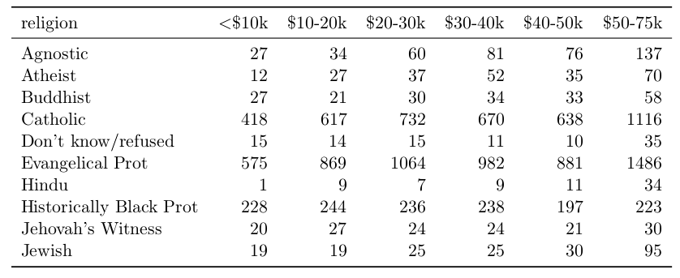

# Quizes

## data.table

1. From DT, display a named vector with the means of *y* and *v*. The names of the elements are mean_y and mean_v. Hint: remember which command returns a vector and which one a data.table.
    
    A. DT[, c(mean_y = mean(y), mean_v = mean(v))]
    
    B. DT[, list(mean_y = mean(y), mean_v = mean(v))]
    
    C. DT[, .(mean_y = mean(y), mean_v = mean(v))]

\vskip 0.5cm

2. As part of a new project, you got the results of a set of experiments from a lab in a data.table (x) with 3 columns: experiment id, sample id and value. On each experiment, more than one sample was measured. On another data.table (y) you got the dates of all the experiments the lab has made after a certain date. Some experiments are not part of your project, but the lab did not subset the table. Before a certain date, the lab could not find the experiments date, but you don't want to discard those results. You want to merge both data tables in order to have only one with 4 columns: experiment id, sample id, value and experiment date. Which merge would you use?
Hint: Sketch both data tables if necessary.

    A. Inner, all = FALSE

    B. Full, all = TRUE

    C. Left, all.x = TRUE

    D. Right, all.y = TRUE

## tidy data

1. What transformation are required to tidy following data?

    

    A. Cast
    
    B. Melt
    
    C. Cast and Melt
    
    D. Data are tidy already

\vskip 0.5cm

2. What transformation are required to tidy following data?

    

    A. Gather
    
    B. Unite
    
    C. Melt and cast
    
    D. Melt, unite and cast

## ggplot2

1. What's the result of the following command? `ggplot(data = mpg)`. Hint: ggplot builds plot layer by layer. 

    A. Nothing happens
    
    B. A blank figure will be produced
    
    C. A blank figure with axis will be produced
    
    D. All data in `mpg` will be visualized

\vskip 0.5cm

2. What's the result of the following command: `ggplot(data = mpg, aes(x = hwy, y = cty))`. Hint: ggplot builds plot layer by layer
  
    A. Nothing happens
    
    B. A blank figure will be produced
    
    C. A blank figure with axis will be produced
    
    D. A scatter plot will be produced

\vskip 0.5cm

3. What's the result of the following command: `ggplot(data = mpg, aes(x = hwy, y = cty)) + geom_point()`. Hint: ggplot builds plot layer by layer.
    
    A. Nothing happens
    
    B. A blank figure will be produced
    
    C. A blank figure with axis will be produced
    
    D. A scatter plot will be produced

\vskip 0.5cm

4. What's wrong with the following plot?

```{r echo=F}
knitr::include_graphics("../assets/img/lec07-bad1.png")
```

Xiong et al., Science 2014

\vskip 0.5cm

5. Which item is *not* chart junk?

    A. a bright red plot border

    B. light grey major grid lines

    C. bold labels and yellow grid lines

    D. data labels in Batik Gangster font