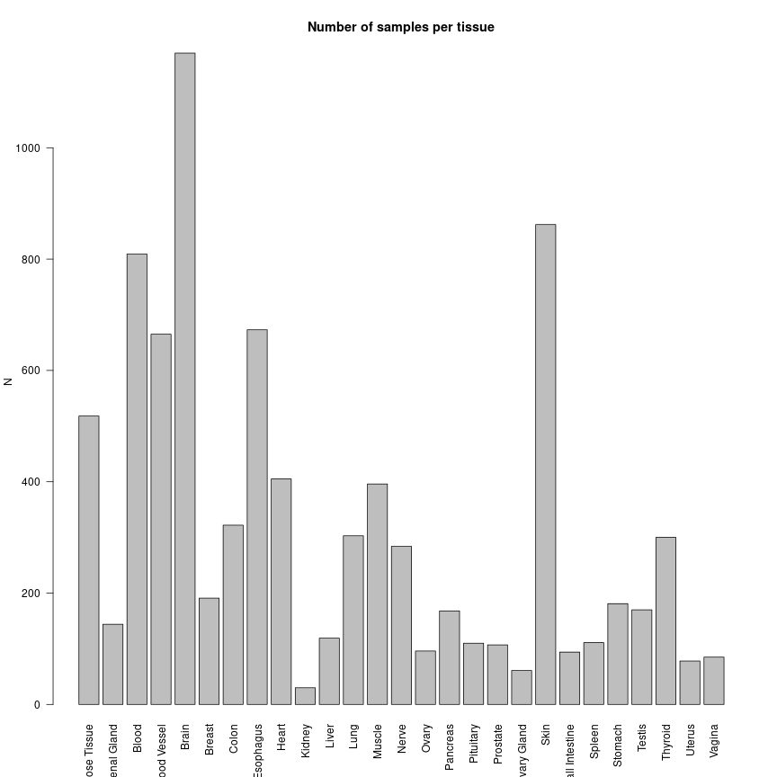
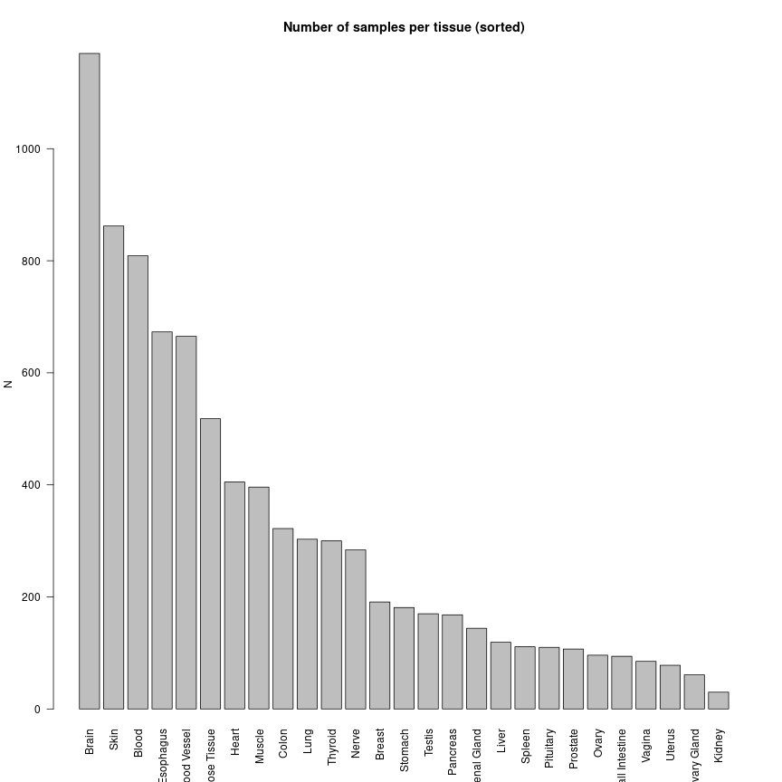

# Vectors 

First, create three named numeric vectors of size 10, 11 and 12 respectively in the following manner: 

1) One vector with the "colon" approach: *from:to*
2) One vector with the `seq()` function: *seq(from, to)*
3) And one vector with the `seq()` function and the `by` argument: *seq(from, to, by)*

For easier naming you can use the vector `letters` or `LETTERS` which contain the latin alphabet in small and capital, respectively. In order to select specific letters just use e.g. `letters[1:4]` to get the first four letters. 
Check their types. What is the outcome? Where do you think the difference comes from?


# Factors
1) Create a character vector consisting of three annotations *Mutant-1, Mutant-2, Control*.
2) Using this annotation vector, create a factor where each annotation is repeated 4 times in a sequential manner (*Mutant-1, Mutant-2, Control, Mutant-1, Mutant-2, Control, ...*). In addition, the levels are the sorted annotation values.
3) Print the results.


# Data tables

The purpose of this exercise is to get familiarized with data.table and try out some of its useful features.

## Basic operations
Please follow the steps listed below:

1) Download the GTEx data (annotation v7) from the Google drive:

2) Read the file downloaded above and store it in a variable named: *data*.

3) Inspect *data* by checking properties such as the class type, the number of rows and columns, its column names, the unique values in the *SMTS* column.

If the column names are unfamiliar to you, please take a look at the description list below for some of the relevant columns to this exercise:

column name | Description
------------ | --------------
SMTS | Tissue Type (area of retrieval)
SMAFRZE | Samples in GTEx Analysis Freeze
SME1MPRT | End 1 Mapping Rate
SMEXPEFF | Expression Profiling Efficiency

```
## Error in fread("~/GTEx_v7_Annotations_SampleAttributesDS.txt"): File '~/GTEx_v7_Annotations_SampleAttributesDS.txt' does not exist or is non-readable. getwd()=='/data/nasif12/home_if12/theodora/Projects/ncRNA-workshop/exercises/exercise-1'
```

```
## Error in data[1:3, 1:5]: object of type 'closure' is not subsettable
```

```
## Error in data$SMTS: object of type 'closure' is not subsettable
```

## More exciting operations
Continue from the previous part and perform the following actions:

4) Subset the data based on the *Brain* cell type sample and store the result in a variable called: *data_Brain*.

5) Inspect the *data_Brain* similar to the point 3 above.

6) Examine the range of values in *SMEXPEFF* (Expression Profiling Efficiency) column of *data_Brain*. How can you make it more meaningful?

7) For *data_Brain*, compute the average of the values stored in the *SMEXPEFF* column. Also, compute the min of values stored in *SME1MPRT* (End 1 Mapping Rate).

8) Compute the correlation between the two columns mentioned above.

9) Remove the rows that are NA from *data_Brain$SMEXPEFF* and *data_Brain$SME1MPRT*. Retry the correlation on the NA-removed *data_Brain_noNA*.

**Hint:** Use the *is.na()* function to find the rows that are NA.

```
## Error in data$SMTS: object of type 'closure' is not subsettable
```

```
## Error in eval(expr, envir, enclos): object 'data_Brain' not found
```

```
## Error in eval(expr, envir, enclos): object 'data_Brain' not found
```

```
## Error in is.data.frame(x): object 'data_Brain' not found
```

```
## Error in eval(expr, envir, enclos): object 'data_Brain' not found
```

```
## Error in unique(data_Brain$SMTS): object 'data_Brain' not found
```

```
## Error in eval(expr, envir, enclos): object 'data_Brain' not found
```

```
## Error in eval(expr, envir, enclos): object 'data_Brain' not found
```

```
## Error in mean(data_Brain$SMEXPEFF): object 'data_Brain' not found
```

```
## Error in mean(data_Brain$SMEXPEFF, na.rm = T): object 'data_Brain' not found
```

```
## Error in eval(expr, envir, enclos): object 'data_Brain' not found
```

```
## Error in eval(expr, envir, enclos): object 'data_Brain' not found
```

```
## Error in is.data.frame(y): object 'data_Brain' not found
```

```
## Error in eval(expr, envir, enclos): object 'data_Brain' not found
```

```
## Error in is.data.frame(y): object 'data_Brain' not found
```

# Looping
1) Initialize a variable called *counter* by 0.
2) Using a for loop that iterates 10 times,
- create a random number drawn from a uniform distribution with *min=0* and *max=5*.
- whenever this random number is bigger than or equal to 1, increment *counter* by 1.
3) Print the final value in *counter*.


# Functions
1) Write a function named *get_counts* that takes a GTEx data table as input and outputs the total counts of rows that the sample tissue type (*SMTS*) is *Heart* and the sample analysis freeze (*SMAFRZE*) is *RNASEQ*.
2) How about if you try the same but for *Blood*.

- If this task was too easy, can you modify your function such that instead of taking only one argument, it takes two additional ones, one for the *SMTS* and another for *SMAFRZE*. Iterate over all possible values of *SMTS* (**Hint:** *unique(data$SMTS)*) and call your function by providing the sample tissue type.


```
## Error in data$SMTS: object of type 'closure' is not subsettable
```

```
## Error in eval(expr, envir, enclos): object 'all_tissues' not found
```
# R Markdown
Downloaded and stored the *sample_annotation.tsv* file from Google drive. Then, create an Rmarkdown file and perform the following tasks:
1) Read the *sample_annotation.tsv* file.
2) Create a new variable containing the counts of each *tissue* existing in the data.
3) Use the *barplot* function to plot the number of tissue types in the GTEx data.
4) Try to sort the bars according to the tissue counts (optional).

