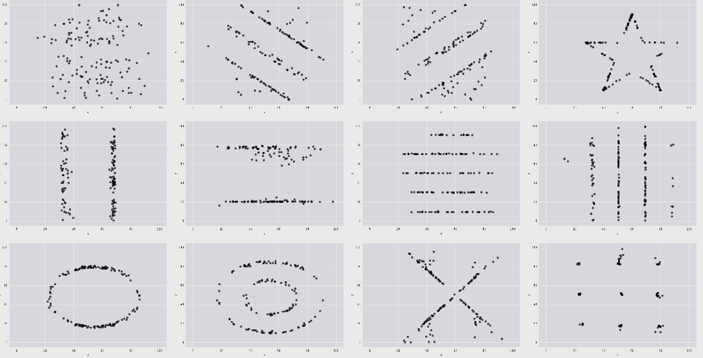
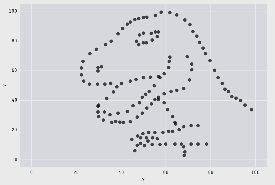
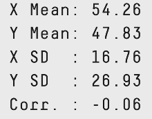

```{r include=FALSE}
options("width"=80)
knitr::opts_chunk$set(echo=TRUE, warning=FALSE, message=FALSE, cache=F, 
    results="show",
    out.width="400px", out.height="250px",
    fig.align="center",
    dpi=200, tidy = TRUE, tidy.opts=list(width.cutoff=80))
```

# Simple Data Manipulation and Visualization


````{r global_options, include=FALSE, cache=F}
library(data.table)
library(gridExtra)
library(ggplot2)


# data
ind <- fread('../extdata/CPI_HDI.csv')

mysize <- 15
mytheme <- theme(
    axis.title = element_text(size=mysize), 
    axis.text = element_text(size=mysize),
    legend.title = element_text(size=mysize),
    legend.text = element_text(size=mysize)
    ) + theme_bw()
```

## Why plotting?

Data in scientific publications are shown as plots because on their raw form they cannot give us the full picture. Other times, plotting the data can give us hints about bugs in our code (or even in the data!) and can help us to state-of-the-art methods. But even plotting on its one is not enough. One need but the statistical and the visualization part.

Do you see a pattern in these plots?


{ .class width=400px height=400px}
 

 Maybe now?
 
{ .class width=400px height=400px}


Well all those plots, including the infamous datasaurus, share the same statistics!

{ .class width=200px height=200px}

So this back and forth is a constant procedure that one has to go through when doing data science.

Here is a realistic to warm up. A vector containing (hypothetical) height measurements for adults in Germany:

```{r echo=F}
set.seed(0)
height <- c(rnorm(499, mean=1.73, sd=0.045), 165)
```

```{r, echo=TRUE}
length(height)
head(height, n=20)
```

Calculating the mean height:

```{r, echo=TRUE}
mean(height)
```

Wait... what?

What happened?

A) `mean()` is not the right function to assess what we want to know.

B) Adults in Germany are exceptionally tall

C) A decimal point error in one data point.

D) It's a multiple testing problem because we are looking at so many data points (n=500).


Solution
```{r, echo=TRUE}
mean(height)
```

**What happened?**

A) `mean()` is not the right function to assess what we want to know. *No, the mean is exactly what we want.*
B) Adults in Germany are exceptionally tall. *OK, no...*
C) A decimal point error in one data point. **Correct!**
D) It's a multiple testing problem because we are looking at so many data points (n=500). *This question was intentionally misleading, this does not have anything to do with multiple testing.*

Let's see what will happen if we try to plot the data...

```{r out.width=c('250px', '250px'), fig.show='hold'}
plot(height)
hist(height)
```

Interestingly, there is an outlier in our data! One particular person seems to have a height above 150 meters that it is obviously wrong! As a result, it inflates our mean giving us the false impression that Germans are exceptionally tall!

```{r, echo=TRUE}
mean(height)
```

A quick way to fix our dataset is to remove our outlier.

```{r, echo=TRUE}
fheight <- height[height < 3]
```

Now our data seem more realistic.
```{r out.width=c('250px', '250px'), fig.show='hold'}
plot(fheight)
hist(fheight)
```

```{r, echo=TRUE}
mean(fheight)
```

This is how the broken dataset was generated:

```{r, echo=TRUE}
height <- c(rnorm(499, mean=1.73, sd=0.045), 165)
```


## Grammar of Graphics

The Grammar of Graphics is a visualization theory developed by Leland Wilkinson in 1999.
It was influenced the development of graphics and visualization libraries alike and base
d on 3 key principles.

* Separation of data from aesthetics (e.g. x and y axis, color-coding)
* Definition of common plot/chart elements (e.g. dot plots, box-plots, etc.)
* Composition of these common elements (one can combine elements as layers)

Now let's try to create a sophisticated example.

```{r }
ggplot(mpg, aes(x=displ, y=cty, colour=class)) +  
  geom_point() +
  facet_wrap(~ class, ncol=4) + 
  theme(axis.title = element_text(size=15), legend.title = element_text(size=15)) +
  labs(title='displ vs cty', x='Engine displacement', y='city miles per gallon') +
  stat_smooth() 
```

This plot shows the relationship of between the number of miles per gallon inside the city and the engine displacement for each type of car. One can use such graph to help him or her decide which car to purchase for cheap and environmental friendly rides inside the city.

How to create such a sophisticated plot step by step?
```{r }
# quick look at the data, we want to plot cty against displ
mpg


# only background
ggplot()


# blank plot

# data: how variables in the data are mapped to aesthetic attributes
ggplot(data = mpg, aes(x=displ, y=cty, colour=class))  


# add layer of point

# layers: made up of geometric elements and statistical transformation.
ggplot(data = mpg, aes(x=displ, y=cty)) +
  geom_point() 


# add color to the point layer
ggplot(data = mpg, aes(x=displ, y=cty, colour=class)) +  
  geom_point() 


# add facet
ggplot(data = mpg, aes(x=displ, y=cty, colour=class)) +  
  geom_point() +  
  facet_wrap(~ class, ncol=4)  


# add labels
ggplot(data = mpg, aes(x=displ, y=cty, colour=class)) +  
  geom_point() +  
  facet_wrap(~ class, ncol=4) + 
  labs(title='displ vs cty', x='Engine displacement', y='city miles per gallon')


# make the font size larger
ggplot(data = mpg, aes(x=displ, y=cty, colour=class)) +  
  geom_point() +  
  facet_wrap(~ class, ncol=4) + 
  labs(title='displ vs cty', x='Engine displacement', y='city miles per gallon')+
  theme(axis.title = element_text(size=15), legend.title = element_text(size=15))


# add some statistics
ggplot(data = mpg, aes(x=displ, y=cty, colour=class)) +  
  geom_point() +  
  facet_wrap(~ class, ncol=4) + 
  theme(axis.title = element_text(size=15), legend.title = element_text(size=15)) +
  labs(title='displ vs cty', x='Engine displacement', y='city miles per gallon') +
  stat_smooth() 
```

## Grammar Defines Components of Graphics

**Data:** data.frame (or data.table) object where columns correspond to variables

**Aesthetics:** describes visual characteristics that represent data (`aes`)
 - for example: position, size, color, shape, transparency, fill

**Layers:** made up of geometric objects that represent data (`geom_`)
 - for example: points, lines, polygons, ...

**Scales:** for each aesthetic, describes how visual characteristic is converted to display values (`scale_`)
 - for example: log scales, color scales, size scales, shape scales, ...

**Facets:** describes how data is split into subsets and displayed as multiple sub graphs (`facet_`)

**Stats:** statistical transformations that typically summarize data (`stat`)
 - for example: counts, means, medians, regression lines, ...
 
**Coordinate system:** describes 2D space that data is projected onto (`coord_`)
 - for example: Cartesian coordinates, polar coordinates, map projections, ...


{ .class width=400px height=400px}


Here is a simple example: Human Development versus Corruption Perception

```{r}
ind <- fread('../extdata/CPI_HDI.csv')
ind
```

CPI: Corruption Perceptions Index (http://www.transparency.org/)

HDI: Human Development Index (http://hdr.undp.org/)

Year: 2014


Lets start with a simple scatter plot

```{r }
ggplot(ind, aes(CPI, HDI)) + geom_point()
```


ggplot returns an object which can be stored and further edited

```{r }
p <- ggplot(ind, aes(CPI, HDI)) + geom_point()
p
```


```{r }
names(p)
saveRDS(p, "../extdata/lec06_p.rds")
p <- readRDS("../extdata/lec06_p.rds")
p + geom_hline(yintercept = 0.7)
```


## Mapping of aesthetics, colors, sizes and shapes

Mapping of aesthetics can be done globally at `ggplot()` or at individual layers

You can code like this globally.

```{r }
ggplot(ind, aes(CPI, HDI)) + 
  geom_point(size=0.5) + 
  geom_text(aes(label = wbcode), size=2, vjust=0)
```

Or you can code like this for each layer.

```{r }
ggplot(ind) + 
  geom_point(aes(CPI, HDI))
```

Global mapping is inherited by default to all geom layers, while `aes` mapping at individual layer is only recognized at that layer.

```{r }
ggplot(ind) + 
  geom_point(aes(CPI, HDI), size=0.5) + 
  geom_text(aes(CPI, HDI, label = wbcode), size=2, vjust=0)
```


Individual layer mapping cannot be recognized by other layers

```{r, linewidth=80, error=TRUE}
# this doesn't work as geom_text didn't know aes(x = CPI, y = HDI)
ggplot(ind) + 
  geom_point(aes(x = CPI, y = HDI)) + 
  geom_text(aes(label = wbcode))
```

```{r}
# this would work but too rebundant
ggplot(ind) + 
  geom_point(aes(x = CPI, y = HDI)) + 
  geom_text(aes(x = CPI, y = HDI, label = wbcode))

# the common aes(x = CPI, y = HDI) shared by all the layers can be put in the ggplot()
ggplot(ind, aes(x = CPI, y = HDI)) + 
  geom_point() + 
  geom_text(aes(label = wbcode))
```

You can easily map variables to different colors, sizes or shapes!

ggplot2 automatically scales for you.

```{r}
ggplot(data = ind) + 
  geom_point(aes(CPI, HDI, color = region))
```

American `color` or British `colour` both acceptable.

```{r}
ggplot(data = ind) + 
  geom_point(aes(CPI, HDI, shape = region))
```

Aesthetic mappings can also be supplied in individual layers

```{r}
ggplot(ind, aes(CPI, HDI)) + 
  geom_point(aes(color = region))
```

## Plotting libraries

- http://www.r-graph-gallery.com/portfolio/ggplot2-package/
- http://ggplot2.tidyverse.org/reference/
- https://plot.ly/r/
- https://plot.ly/ggplot2/