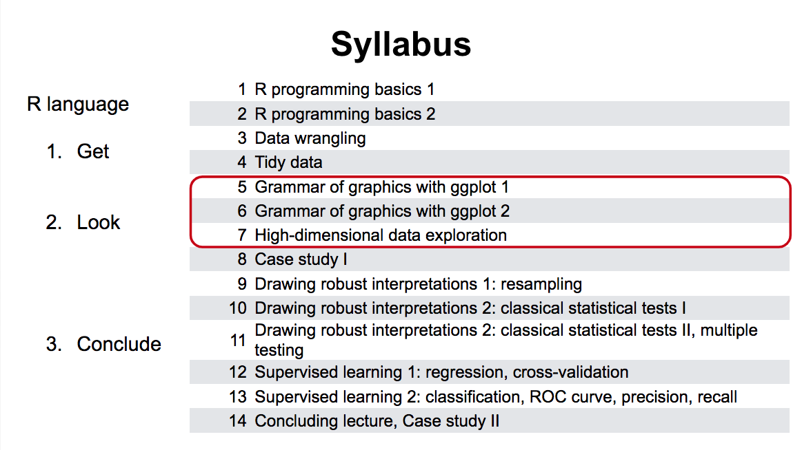

<style>
.eighteen > article > p {
   font-size: 18px !important;
}
</style>

<!-- Center image on slide -->
<script src="http://ajax.aspnetcdn.com/ajax/jQuery/jquery-1.7.min.js"></script>
<script type='text/javascript'>
$(function() {
    $("p:has(img)").addClass('centered');
});
</script>
</script>
<script type = 'text/javascript'>
$('p:has(img.build)').addClass('build')
</script>

<script type='text/javascript'>
// parameters
var sections = ["R basics",
"Data Wrangling using Data.table",
"Analysis execution flow",
"Reproducible science with Rmardown reports"];

var title = "Overview";
var fontsize = "20pt"
var unselected_color = "#888888"
// function
function toc(cur) {
  // header
  document.write("<h2>"+title+"</h2>");
  // find current
  ind = sections.indexOf(cur);
  if (ind==-1 && cur.length>0) {
     document.write("<br/>Error: section not defined '"+cur+"'");
     return;
  }
  // write all out
  document.write("<br/><ul>");
  for (i = 0; i < sections.length; i++) { 
    if (cur=="") 
      // all the same
      document.write("<li style='font-size:"+fontsize+"'>"+sections[i]+"</li>");
    else {
      if (i==ind)
        document.write("<li style='font-size:"+fontsize+"'><b>"+sections[i]+"</b></li>");
      else
        document.write("<li style='color:"+unselected_color+";font-size:"+fontsize+"'>"+sections[i]+"</li>");
    }
  }
  document.write("</ul>");
}
</script>

````{r global_options, include=FALSE, cache=F}
# setwd(file.path("/Users/gagneur/project/dataviz/lectures-WS1920/lecture-05"))
source("../../config.R")
library(gridExtra)
opts_chunk$set(
    echo=TRUE, warning=FALSE, message=FALSE, cache=F, 
    results="show",
    out.width="500px", out.height="400px", fig.height = 3, fig.width = 4, 
    dpi=200
)


mysize <- 15
mytheme <- theme(
    axis.title = element_text(size=mysize), 
    axis.text = element_text(size=mysize),
    legend.title = element_text(size=mysize),
    legend.text = element_text(size=mysize)
    ) + theme_bw()


options(knitr.package.unnamed.chunk.label="day-01")
```

```{r include=F}
DATADIR <- file.path('../../../extdata')
```

<!-- START LECTURE -->

```{r syllabus, out.width = "800px", echo=FALSE}

```

---

<script type='text/javascript'>toc("")</script>

---

<script type='text/javascript'>toc("R basics")</script>

---

## Assignments

All big (programming) journeys start with a small step (or assignment). In R assignments are done using the `<-` operator :

```{r eval=F}
objectName <- value
```

It is also possible to assign with the *equal* sign.

```{r eval=F}
objectName = value
```

---

## Assignments

```{r}
x <- 5 # Both methods have the same outcome
y = 5
x
y
```

---

## Assignments

However, the "equal" sign is used for argument passing to functions. Thus if nesting, the equal sign will be interpreted as a argument assignment and might throw an error:

```{r, linewidth=80, error=TRUE}
## We want to measure the running time of the inner product of a large vector and 
## assign the outcome of the function to a variable simultaneously
system.time(a <- t(1:1e6)%*%(1:1e6))
system.time(a = t(1:1e6)%*%(1:1e6)) ## This would cause an error
```

Right Alt + - gives a quick shortcut to add **<-** ;)

---

## Vectors

Vectors are 1-dimensional data structures which can contain one or more variables, regardless of their type.

Usually created with `c()` (from *concatenation*):
```{r}
c(1, 5, 8, 10)
str(c(1, 5, 8, 10))
length(c(1, 5, 8, 10))
c("a", "B", "cc")
c(TRUE, FALSE, c(TRUE, TRUE))
c(1, "B", FALSE)
```

---

## Vectors

There are multiple ways to create a numeric sequence depending on the desired result.

Usually for an integer sequence *from:to* is enough. For different results we may need to use `seq()` function utilizing its arguments to increase by a *step* of our choice or to split the range depending on the desired length of the output.

```{r}
1:10 
seq(from = 1, to = 10, by = .3)
```
---

## Vectors

```{r}
seq(from = 1, to = 10, length.out = 12)
```

Keep in mind that sometimes different approaches, give different data types as results so when weird things happen, always check the documentation (devil is in the details)!

---

## Vectors

For non numeric values e.g. logical, character, `rep()` function comes also in handy. 

The *replicate* function `rep()` replicates a vector a certain number of *times* and concatenates them: 
```{r}
rep(c(TRUE, FALSE), times = 5)
```

To replicate *each* entry of the input vector at the time:
```{r}
rep(c(TRUE, FALSE), each = 5)
```

---

## Vectors

Vector elements are accessed via the ```[``` operator:
```{r}
## Create an A,B,C,D,E vector
x <- LETTERS[1:5]
x
## access the third entry
x[3]
## modify the third entry
x[3] <- 'Z'
x
```

---

## Vectors

Elements in vectors can have names. 
Using names instead of index to access entries in a vector make code more robust to re-ordering, sub-setting, and changes in data input.  
Names can be created at initialization or set afterwards with `names()`. 

```{r}
x <- c(a = 1, b = 2, c = 3)
x
names(x) <- c("A", "B", "C")
x
```

Names don't have to be unique, but should preferably be, as sub-setting by names will only return the first match
```{r}
x <- c(a = 1, a = 2, b = 3)
x["a"]
```

Not all elements need to have names.
```{r}
c(a = 1, 2, 3)
```

---

## Vector exercise

---

<script type='text/javascript'>toc("Data Wrangling using Data.table")</script>

---

## Data Wrangling using Data.table

Data Wrangling includes tasks of processing raw data into interesting formats....

Data.tables are a modern implementation of tables in R and we will exclusively used data.tables in this course.They are a memory efficient and faster implementation of data.frame (basic R table type) offering:

* sub-setting
* ordering
* merging

---

## Data Wrangling using Data.table

It accepts all data.frame functions, it has a shorter and more flexible syntax (not so straightforward in the beginning but pays off) and saves time on two fronts:

* programming (easier to code, read, debug and maintain)
* computing (fast and memory efficient)

The general form of data.table syntax is:

    DT[ i,  j,  by ] # + extra arguments
        |   |   |
        |   |    -------> grouped by what?
        |    -------> what to do?
         ---> on which rows?

The way to read this out loud is: "Take DT, subset rows by i, then compute j grouped by by. Here are some basic usage examples expanding on this definition.

---

## Loading data as a data.table

We can read files from disk and process them using data.table. 
The easiest way to do so is to use the function `fread()`.

```{r, eval=FALSE}
flights <- fread('path_to_file/flightsLAX.csv')
```

```{r, echo=FALSE}
flights <- fread(file.path(DATADIR, 'flightsLAX.csv'))
flights <- flights[, .(YEAR, MONTH, DAY, DAY_OF_WEEK, AIRLINE, FLIGHT_NUMBER, TAIL_NUMBER, ORIGIN_AIRPORT,
                        DESTINATION_AIRPORT, DEPARTURE_TIME, AIR_TIME, DISTANCE, ARRIVAL_TIME)]
```
Calling `head()` on the table showes us the first few lines of the table and we observe that reading the file was succesfull.
```{r}
head(flights)
```

---

## Creating a data.table

To create a data.table, give a name to the columns and we populate them.

```{r}
library(data.table)
DT <- data.table(x = rep(c("a", "b", "c"), each = 3),
                 y = c(1, 3, 6), 
                 v = 1:9)
DT # note how column y was recycled
```

---

## Creating a data.table

Any matrix-like object can be transformed to a `data.table` using the `as.data.table()` function

```{r}
class(iris)
iris.dt <- as.data.table(iris)
class(iris.dt)
```

---

## Inspecting tables

A first step in any analysis should involve inspecting the data we just read in. 
This often starts by looking the head of the table as we did above.

The next information we are often interested in is the size of our data set.
We can use the following commands to obtain it.
```{r}
nrow(flights)   # ncol(flights)
dim(flights)
```

---

## Accessing a data.table by `rows`

Data.tables can be subsetted by indices, if we for example care about the second element of the table.
We can do the following.
```{r}
flights[2, ]   # Access the 2nd row (also flights[2] or flights[i = 2])
```

---

## Accessing a data.table by `rows`

Data.tables can be subsetted by indices, if we for example care about the second element of the table.
We can do the following.

```{r}
flights[1:2]   # Access multiple consecutive rows.
```

---

## Accessing a data.table by `rows`

Data.tables can be subsetted by indices, if we for example care about the second element of the table.
We can do the following.

```{r}
flights[c(3, 5)]  # Access multiple rows.
```

---

## Accessing a data.table by `columns`

Additionally we can do the same for columns:
```{r}
head(flights[, 2 ])
```

---

## Accessing a data.table by `columns`

Additionally we can do the same for columns:


```{r}
head(flights[, c(3, 5)])
```

---

## Accessing a data.table by `columns`

Alternatively to subsetting by indices we can subset columns by their names.

```{r}
head(flights[, .(MONTH)])
```

---

## Accessing a data.table by `columns`

Alternatively to subsetting by indices we can subset columns by their names.

```{r}
head(flights[, .(DAY, AIRLINE)])
```

---

## Accessing a data.table by `rows and columns`

Based on the `dt[i, j, by]` syntax you can target specific rows and columns. However it is not advisable to access a column by its number. **Use the column name instead**.

```{r}
flights[1:5, TAIL_NUMBER]    # Access column x (also DT$x or DT[j=x]).
```

---

## Accessing a data.table by `rows and columns`

When accessing many columns, we probably want to return a data.table instead of a vector. For that, we need to provide R with a list, so we use ``list(colA, colB)``, or its simplified version ``.(colA, colB)``.

```{r}
# Note that 1 and 3 were coerced into strings because a vector can have only 1 type
flights[1:2, c(FLIGHT_NUMBER, ORIGIN_AIRPORT)]   
```

---

## Accessing a data.table by `rows and columns`

When accessing many columns, we probably want to return a data.table instead of a vector. For that, we need to provide R with a list, so we use ``list(colA, colB)``, or its simplified version ``.(colA, colB)``.

```{r}
# Access a specific subset. Data.frame: DF[1:2, c("x","y")] 
flights[1:2, list(TAIL_NUMBER, ORIGIN_AIRPORT)]

# Same as before.
flights[1:2, .(TAIL_NUMBER, ORIGIN_AIRPORT)]
```

---

## Sub-setting rows according to some condition

A often more usefull way is to subset rows using conditions!
We can subset a data table using the following operators:

* `==`
* `<` 
* `>`
* `!=`
* `%in%`

---

## Sub-setting rows according to some condition

For example if we are interested in analysing all the flights operated by "AA" (American Airlines) we can do that using the following command:

```{r}
head(flights[AIRLINE == "AA"])
```

---

## Sub-setting rows according to some condition

Alternatively if we are interested in all flights from any destination to the airports in NYC (JFK and LGA), we can subset the rows using the following command:
```{r}
head(flights[DESTINATION_AIRPORT %in% c("LGA", "JFK")])
```

---

## Sub-setting rows according to some condition


Additionally we can concatenate multiple condition using the logical OR `|` or AND `&` operator.
If we for example want to inspect all flights departing between 6am and 7am operated by American Airlines we can use the following statement:
```{r}
head(flights[AIRLINE == "AA" & DEPARTURE_TIME > 600 & DEPARTURE_TIME < 700])
```

---

## Grouping by rows (DT[i, j, ``by``])

The ``by = `` option allows us to apply a function to groups wtihin a data.table. For example, we can use the ``by = `` to compute the mean flight time per airline:

```{r}
# Compute the mean air time of every airline
flights.with.mean <- flights[, .(mean_AIRTIME = mean(AIR_TIME, na.rm=TRUE)), by = AIRLINE]
head(flights.with.mean)
```

---

## Grouping by rows (DT[i, j, ``by``])
This way we can easily spot that one airline conducts on average shorter flights.

```{r}
# Compute the mean and standard deviation of the air time of every airline
flights.with.mean.sd <- flights[, .(mean_AIRTIME = mean(AIR_TIME, na.rm=TRUE),
                                    sd_AIR_TIME = sd(AIR_TIME, na.rm=TRUE)), by = AIRLINE]
head(flights.with.mean.sd)
```

Although we could write ``flights[i = 5, j = AIRLINE]``, we usually ommit the ``i =`` and ``j =`` from the syntax, and write ``flights[5, ARILINE]`` instead. However, for clarity we usually include the ``by =`` in the syntax.

---

## Counting occurences (the `.N` command)

The ``.N`` is a special in-built variable that counts the number observations within a table.

Evaluating ``.N`` alone is equal to `nrow()` of a table.
```{r}
flights[, .N]
nrow(flights)
```

---

## Counting occurences (the `.N` command)

But the ``.N`` command becomes a lot more powerful when used with grouping or conditioning.
We already saw earlier how we can use it to count the number of occurrences of elements in categorical columns.

```{r}
# Get the number of flights for each AIRLINE
flights.by.company <- flights[, .N, by = 'AIRLINE']
head(flights.by.company)
```

---

## Counting occurences (the `.N` command)

Remembering the data.table definition: "Take **DT**, subset rows using **i**, then select or calculate **j**, grouped by **by**",
we can build even more powerful statements using all three elements.

```{r}
# For each airline, get the number of observations to NYC (JFK)
flights.by.company.filtered <- flights[DESTINATION_AIRPORT == "JFK", .N, by = 'AIRLINE']
head(flights.by.company.filtered)
```

---

## Creating new columns (the `:=` command)

The ``:=`` operator updates the data.table you are working on, so writing DT <- DT[,... := ...] is redundant. This operator, plus all ``set`` functions (TODO clarify), change their input by *reference*. No copy of the object is made, that is why it is faster and uses less memory.

```{r}
# Add a new column called SPEED whose value is the DISTANCE divided by AIR_TIME
flights[, SPEED := DISTANCE / AIR_TIME * 60]
head(flights)
```

---

## Creating new columns (the `:=` command)

Having computed a new column using the ``:=`` operator we can use it for further analyses.
```{r}
flights[, .(mean_AIR_TIME = mean(AIR_TIME, na.rm=TRUE), 
            mean_SPEED = mean(SPEED, na.rm=TRUE),
            mean_DISTANCE = mean(DISTANCE, na.rm=TRUE)
            ), by=AIRLINE] 
```

---

## Creating new columns (the `:=` command)

Now we can see that the flights by the carrier "OO" are not just shorter, but also slow. 
This could for example lead us to the hypothesis, that "OO" is a small regional carrier, which operates slower planes.

Additionally we can use the ``:=`` operator to remove columns. If we for example observe that tail numbers are not important for our analysis we can remove them with the following statement:

```{r}
flights[, FLIGHT_NUMBER := NULL]
head(flights)
```
Here we observe, that the tail numbers are gone from the data.table

---

## Data.table exercise
