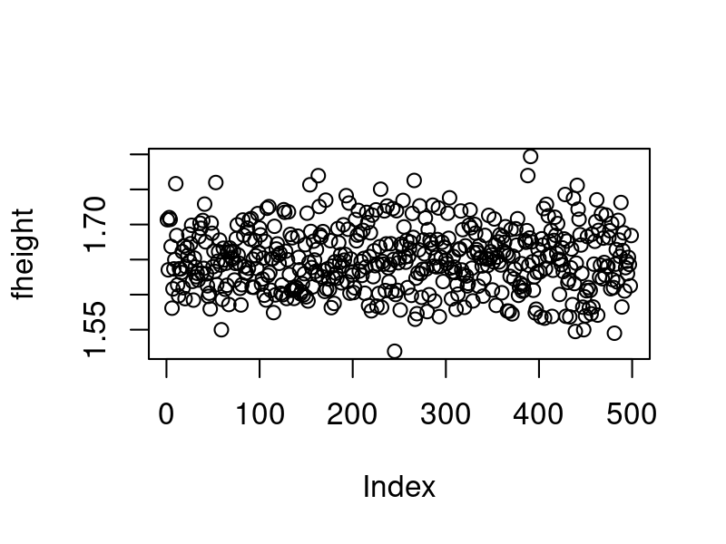
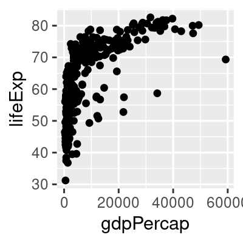
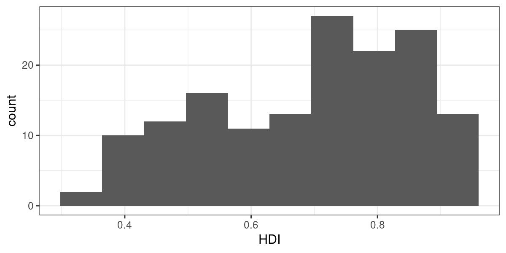
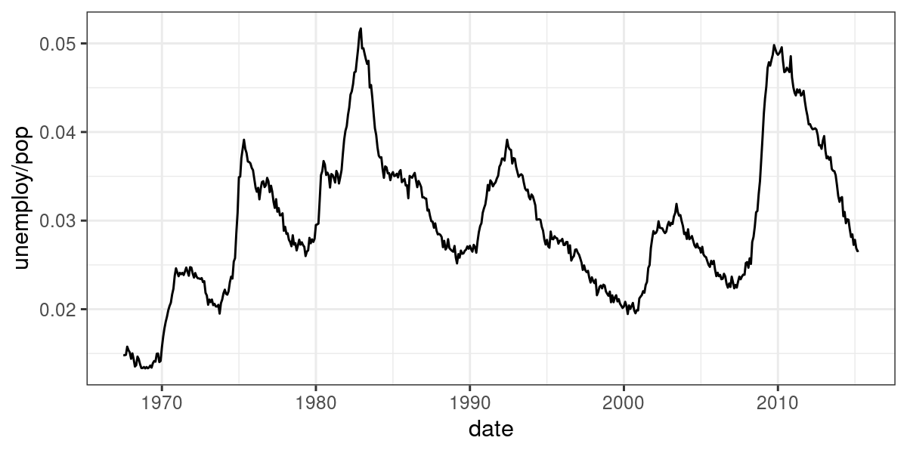

<style>
.eighteen > article > p {
   font-size: 18px !important;
}
</style>

<!-- Center image on slide -->
<script src="http://ajax.aspnetcdn.com/ajax/jQuery/jquery-1.7.min.js"></script>
<script type='text/javascript'>
$(function() {
    $("p:has(img)").addClass('centered');
});
</script>
</script>
<script type = 'text/javascript'>
$('p:has(img.build)').addClass('build')
</script>

<script type='text/javascript'>
// parameters
var sections = ["Why we plot",
"Grammar of graphics and ggplot2",
"Plots for one single continuous variable",
"Plots for two variables: one continuous, one discrete",
"Plots for two continuous variables",
"Tidy data"];

var title = "Overview";
var fontsize = "20pt"
var unselected_color = "#888888"
// function
function toc(cur) {
  // header
  document.write("<h2>"+title+"</h2>");
  // find current
  ind = sections.indexOf(cur);
  if (ind==-1 && cur.length>0) {
     document.write("<br/>Error: section not defined '"+cur+"'");
     return;
  }
  // write all out
  document.write("<br/><ul>");
  for (i = 0; i < sections.length; i++) { 
    if (cur=="") 
      // all the same
      document.write("<li style='font-size:"+fontsize+"'>"+sections[i]+"</li>");
    else {
      if (i==ind)
        document.write("<li style='font-size:"+fontsize+"'><b>"+sections[i]+"</b></li>");
      else
        document.write("<li style='color:"+unselected_color+";font-size:"+fontsize+"'>"+sections[i]+"</li>");
    }
  }
  document.write("</ul>");
}
</script>


<!-- START LECTURE -->


## Day 2 - Basic plotting and Tidy data


---

<script type='text/javascript'>toc("")</script>

---

<script type='text/javascript'>toc("Why we plot")</script>

---

## Do you see a common pattern in these plots?


---

## Maybe now?

<!-- {#id .class width=400px height=400px} -->

</br>


---

## Same statistics, different visualizations

</br>


---

## Why plotting?

It is nearly impossible for a single person to go through data line-by-line and see distinct patterns and make observations.

Data visualization becomes crucial for gaining **insight** into data that traditional descriptive statistics cannot.

**Plotting can give hints about bugs in our code (or even in the data!) and can help us to develop and improve methods and models.**


---

## A realistic example to warm up

A vector containing 500 (hypothetical) height measurements for adults in Germany:


```r
length(height)
```

```
## [1] 500
```

```r
head(height, n=10)
```

```
##  [1] 1.706833 1.635319 1.709841 1.707259 1.668659 1.580702 1.608214 1.636738
##  [9] 1.649740 1.758209
```

We want to know their average height:


```r
mean(height)
```

```
## [1] 1.976743
```
Wait... what?


--- &radio

```r
mean(height)
```

```
## [1] 1.976743
```
<br/>

What happened?

1. A. `mean()` is not the right function to assess what we want to know.

2. B. Adults in Germany are exceptionally tall

3. C. _A decimal point error in one data point._

4. D. It's a multiple testing problem because we are looking at so many data points (n=500).

***.explanation
See next slide

---

## Solution

```r
mean(height)
```

```
## [1] 1.976743
```

**What happened?**<br/>

* A. `mean()` is not the right function to assess what we want to know.
  * *No, the mean is exactly what we want.*
* B. Adults in Germany are exceptionally tall.
  * *OK, no...*
* **C. A decimal point error in one data point.**
  * *Yes, see next slide.*
* D. It's a multiple testing problem because we are looking at so many data points (n=500).
  * *This question was intentionally misleading, this does not have anything to do with multiple testing.*


---
## The outlier...


```r
plot(height)
hist(height)
```


```r
mean(height)
```

```
## [1] 1.976743
```

---
## The outlier...

A quick way to fix our dataset is to remove our outlier.


```r
fheight <- height[height < 3]
```

---
## The outlier...


```r
plot(fheight)
hist(fheight)
```




```r
mean(fheight)
```

```
## [1] 1.650043
```

---

## The outlier...

This is how the broken dataset was generated:


```r
height <- c(rnorm(499, mean=1.65, sd=0.045), 165)
```

---

## Our 2 visualization lectures

This lecture and the one that follows will cover:
* Grammar of graphics: a modular and felxible framework to build plots
* Standard plots based on dimension and nature of the data (discrete / continuous)
* Colors
* Dos and don'ts

---

<script type='text/javascript'>toc("Grammar of graphics and ggplot2")</script>

---
## Grammar of Graphics
The Grammar of Graphics is a visualization theory developed by 
Leland Wilkinson in 1999.
<br> 

* influenced the development of graphics and visualization libraries alike 
* 3 key principles
  * Separation of data from aesthetics (e.g. x and y axis, color-coding)
  * Definition of common plot/chart elements (e.g. dot plots, boxplots, etc.)
  * Composition of these common elements (one can combine elements as layers)


---
## ggplot2 and Grammar of Graphics

ggplot2 is a powerfull implementation of the grammar of graphics. Plotting with the help of the package ggplot2 has become widely used by R programmers. 

Lets see a sophisticated example...


```r
# install.packages('gapminder')
library(gapminder)

gm_dt <- as.data.table(gapminder)[year %in% c(1977, 2007)]

ggplot(data = gm_dt, aes(x = gdpPercap, y = lifeExp)) +
  geom_point(aes(color = continent,size = pop)) +
  facet_grid(~year) +
  scale_x_log10() +
  labs(y = "Life expectation at birth", x = "per-capita GDP", size = "Population") +
  mytheme
```

---

## ggplot2 and Grammar of Graphics


But how we create such a plot step by step?

--- .eighteen

## Grammar Defines Components of Graphics

**Data:** data.frame (or data.table) object where columns correspond to variables

**Aesthetics:** describes visual characteristics that represent data (`aes`)
 - position (x,y), color, size, shape, transparency

**Layers:** made up of geometric objects that represent data (`geom_`)
 - points, lines, boxplots, ...

**Scales:** for each aesthetic, describes how visual characteristic is converted to display values (`scale_`)
 - log scales, color scales, size scales, shape scales, ...

**Facets:** describes how data is split into subsets and displayed as multiple sub graphs (`facet_`)

**Stats:** statistical transformations that typically summarize data (`stat`)
 - counts, means, medians, regression lines, ...

**Coordinate system:** describes 2D space that data is projected onto (`coord_`)
 - Cartesian coordinates, polar coordinates, map projections, ...


---

</br>

## Grammar Defines Components of Graphics


---

## Defining the data and layers

Lets have a quick look in our data

```r
head(gm_dt[, .(country, continent, gdpPercap, lifeExp, year)])
```

```
##        country continent gdpPercap lifeExp year
## 1: Afghanistan      Asia  786.1134  38.438 1977
## 2: Afghanistan      Asia  974.5803  43.828 2007
## 3:     Albania    Europe 3533.0039  68.930 1977
## 4:     Albania    Europe 5937.0295  76.423 2007
## 5:     Algeria    Africa 4910.4168  58.014 1977
## 6:     Algeria    Africa 6223.3675  72.301 2007
```

---

## Defining the data and layers

For starting with the visualization we initiate a `ggplot` object which generates a plot with background:

```r
ggplot()
```


---

## Defining the data and layers

This `aes()` function defines which columns in the `data.table` object map to `x` and `y` coordinates and if they should be colored or have different shapes and sizes based on the values in a different column. These elements are called “aesthetic” elements, which we observe in the plot. 


```r
ggplot(data = gm_dt, aes(x = gdpPercap, y = lifeExp))
```


---
## Defining the data and layers

In R, a scatter plot can be plotted with ggplot2 using the function `geom_point`. We want to construct a
scatter plot containing the gdpPercap on the x-axis and the lifeExp on the y-axis.


```r
ggplot(data = gm_dt, aes(x = gdpPercap, y = lifeExp)) + geom_point()
```



---

## Defining the data and layers

One of the advantages of plotting with ggplot is that it returns an object which can be stored (e.g. in a variable
called p). The stored object can be further edited and you can also inspect its elements with the `names()` function:


```r
p <- ggplot(data = gm_dt, aes(x = gdpPercap, y = lifeExp)) + geom_point()
names(p)
```

```
## [1] "data"        "layers"      "scales"      "mapping"     "theme"      
## [6] "coordinates" "facet"       "plot_env"    "labels"
```

---
  
## Defining the data and layers

We can also save the ggplot object with the help of the function saveRDS(). Then, we can read the saved object
again with the help of the function readRDS() and add a horizontal line at y=50 to the plot:


```r
saveRDS(p, "extdata/my_first_plot.rds")
p <- readRDS("extdata/my_first_plot.rds")
```


---
  
## Defining the data and layers

We can also save the ggplot object with the help of the function saveRDS(). Then, we can read the saved object
again with the help of the function readRDS() and add a horizontal line at y=50 to the plot:


```r
p + geom_hline(yintercept = 50)
```


---

## Mapping of aesthetics `color`

We can easily map variables to different colors, sizes or shapes depending on the value of the specified variable using the `aes` function. 

```r
ggplot(data = gm_dt, aes(x = gdpPercap, y = lifeExp, color = continent)) + geom_point()
```


---

## Mapping of aesthetics `shape`

To change the shape of our points we can override the `shape` argument of the `aes`


```r
ggplot(data = gm_dt, aes(x = gdpPercap, y = lifeExp, shape = continent)) + geom_point()
```


---

## Mapping of aesthetics `size`

Additionally, we distinguish the population of each country by giving a size to the points in the scatter plot:


```r
ggplot(data = gm_dt, aes(x = gdpPercap, y = lifeExp, color = continent, size = pop)) +
geom_point()
```


---

## Global versus individual mapping

Global mapping is inherited by default to all geom layers (geom_point in the previous example), while mapping at individual layers is only recognized at that layer.


```r
ggplot(data = gm_dt, aes(x = gdpPercap, y = lifeExp)) +
  geom_point(aes(color = continent,size = pop))
```


---

## Global versus individual mapping

Individual layer mapping cannot be recognized by other layers. For instance, we can add another layer for
smoothing with `stat_smooth()`.


```r
# this doesn't work as stat_smooth didn't know aes(x , y)
ggplot(data = gm_dt) + geom_point(aes(x = gdpPercap, y = lifeExp)) + stat_smooth()
```

```
## Error: stat_smooth requires the following missing aesthetics: x and y
```


---

## Global versus individual mapping

Individual layer mapping cannot be recognized by other layers. For instance, we can add another layer for
smoothing with `stat_smooth()`.


```r
# this would work but too redundant
ggplot(data = gm_dt) + geom_point(aes(x = gdpPercap, y = lifeExp)) + 
  stat_smooth(aes(x = gdpPercap, y = lifeExp))
```


---

## Global versus individual mapping

Individual layer mapping cannot be recognized by other layers. For instance, we can add another layer for
smoothing with `stat_smooth()`.


```r
# the common aes(x, y) shared by all the layers can be put in the ggplot()
ggplot(data = gm_dt, aes(x = gdpPercap, y = lifeExp, color = continent)) + geom_point(aes(size = pop)) +
stat_smooth()
```


--- &radio

## Quiz

What's the result of the following command?

`ggplot(data = mpg)`

1. A Nothing happens

2. B _A blank figure will be produced_

3. C A blank figure with axes will be produced

4. D All data in `mpg` will be visualized

***.hint
ggplot builds plot layer by layer. 

***.explanation
Neither variables were mapped nor geometry specified. 


--- &radio

## Solution

What's the result of the following command?

`ggplot(data = mpg, aes(x = hwy, y = cty))`

1. A Nothing happens

2. B A blank figure will be produced

3. C _A blank figure with axes will be produced_

4. D A scatter plot will be produced

***.hint
ggplot builds plot layer by layer. 

***.explanation
Axis x and y are mapped. But no geometry specified.


--- &radio

## Quiz

What's the result of the following command?

`ggplot(data = mpg, aes(x = hwy, y = cty)) + geom_point()`

1. A Nothing happens

2. B A blank figure will be produced

3. C A blank figure with axes will be produced

4. D _A scatter plot will be produced_

***.hint
ggplot builds plot layer by layer. 

***.explanation
Data, axes and geometry specified.

---

## Solutions

`ggplot(data = mpg)`: a blank figure will be produced

`ggplot(data = mpg, aes(x = hwy, y = cty))`: A blank figure with axes will be produced

`ggplot(data = mpg, aes(x = hwy, y = cty)) + geom_point()`: A scatter plot will be produced

---

## Exercise 1

---

<script type='text/javascript'>toc("Plots for one single continuous variable")</script>

---

## Low dimensional plots

In the previous examples, we had a look at scatter plots which are suitable for plotting the relationship between
two continuous variables. However, there are many more types of plots (e.g. histograms, boxplots) which can be
used for plotting in different scenarios. Mainly, we distinguish between plotting one or two variables and whether the
variables are continuous or discrete.

---

## Low dimensional plots
Lets prepare some data for plotting using the Human Development Index (HDI) dataset: 


```r
ind <- fread('extdata/CPI_HDI.csv')
```


```r
head(ind)
```

```
##    V1     country wbcode CPI   HDI            region
## 1:  1 Afghanistan    AFG  12 0.465      Asia Pacific
## 2:  2     Albania    ALB  33 0.733 East EU Cemt Asia
## 3:  3     Algeria    DZA  36 0.736              MENA
## 4:  4      Angola    AGO  19 0.532               SSA
## 5:  5   Argentina    ARG  34 0.836          Americas
## 6:  6     Armenia    ARM  37 0.733 East EU Cemt Asia
```

---
## Histograms

To plot the values of a vector with continuous values we can use a histogram. A histogram represents the frequencies of values of a variable bucketed into ranges, using the function geom_histogram():


```r
ggplot(ind, aes(HDI)) + geom_histogram() + mytheme
```


---
## Histogram: setting the number of bins

By default, the number of bins in ggplot2 is 30. We can simply change this by defining the number of desired bins
in the `bins` argument of the `geom_histogram()` function:


```r
ggplot(ind, aes(HDI)) + geom_histogram(bins=10) + mytheme
```



---

## Exercise 2

---

<script type='text/javascript'>toc("Plots for two variables: one continuous, one discrete")</script>

---

## Boxplots by category

Boxplots are well suited for plotting one continuous variable. However, we can also use boxplots
to show distributions of continuous variables with respect to some categories. This can be particularly interesting for
comparing the different distributions of each category.


```r
ggplot(mpg, aes(class, hwy)) + geom_boxplot() + mytheme
```


---

## Violin plots

A violin plot is an alternative to the boxplot for visualizing either one continuous variable (grouped by categories). An advantage of the violin plot over the boxplot is that it also shows the entire distribution of the data. This can be particularly interesting when dealing with multimodal data. You can make a violin plot using the `geom_violin()` function.


```r
ggplot(mpg, aes(class, hwy)) + geom_violin() + mytheme
```


---

## Boxplots and Violin plots

It is possible to not show the outliers. However, we strongly recommend to keep them.
Outliers can reveal interesting data points (discoveries "out of the box") or bugs in data preprocessing. 

--- &radio

## Quiz

For which type of data will boxplots produce meaningful visualizations? (2 possible answers)

1. A. For discrete data.

2. B. For bi-modal distributions.

3. C. For non-Gaussian, symmetric data.

4. D. For exponentially distributed data.

---

## Solution

For which type of data will boxplots produce meaningful visualizations? (2 possible answers)

**For which type of data will boxplots produce meaningful visualizations?**
* **C. For non-Gaussian, symmetric data.**
* **D. For exponentially distributed data.**

Boxplots are bad for bimodal data since they only show one mode (the median), but are ok for both symmetric and non-symmetric data, since the quartiles are not symmetric.

```r
dt <- data.table(x=c(1,1,1,2,2,2,8,8,8), # Discrete data, bad for boxplot
                 y=rbeta(n=1000,shape1=2,shape2=2),
                 z=rexp(n=1000, rate=1),
                 group='x') %>% melt(id.var="group")
ggplot(dt, aes(group, value)) + geom_boxplot() + facet_wrap(~variable) + mytheme
```

---

## Solution

**For which type of data will boxplots produce meaningful visualizations?**
* **C. For non-Gaussian, symmetric data.**
* **D. For exponentially distributed data.**

Boxplots are bad for bimodal data since they only show one mode (the median), but are ok for both symmetric and non-symmetric data, since the quartiles are not symmetric.


---

## Exercise 3

---

<script type='text/javascript'>toc("Plots for two continuous variables")</script>

---

## Scatter plots

Scatter plots are a useful plot type for easily visualizing the relationship between two continuous variables. To make a scatter plot we use the `geom_point()` function.


```r
ggplot(mpg, aes(displ, hwy)) + geom_point() + mytheme
```


---

## Scatter plots grouped by discrete variable

We can modify the previous plot by coloring the points depending on the vehicle class:


```r
ggplot(mpg, aes(displ, hwy, color = class)) + geom_point() + mytheme
```


---

## Scatter plots grouped by discrete variable

Sometimes, too many colors can be hard to distinguish. In such cases, we can use facet to separate them into different plots:

```r
ggplot(mpg, aes(displ, hwy)) + geom_point() + facet_wrap(~class) + mytheme
```


---

## Line plots

A line plot can be considered for connecting a series of individual data points or to display the trend of a series of
data points. This can be particularly useful to show the shape of data as it flows and changes from point to point.
We can also show the strength of the movement of values up and down through time.


```r
ggplot(economics, aes(date, unemploy/pop)) + geom_line() + mytheme
```



--- &radio

## Quiz

When to use a line plot?

1. A _To show a connection between a series of individual data points_
2. B To show a correlation between two quantitative variables
3. C To highlight individual quantitative values per category
4. D To compare distributions of quantitative values across categories

--- 

## Solution

When to use a line plot?

A **To show a connection between a series of individual data points**

---

## Exercise 4

---

<script type='text/javascript'>toc("Tidy data")</script>

---

## Tidy data definition


One can briefly summarize the tidy definition in the three following statements:
  
1. Each **variable** must have its own **column**.
2. Each **observation** must have its own **row**.
3. Each **value** must have its own **cell**.


---

## Let's load some data

```r
library(data.table) # melt, dcast, ...
library(magrittr)  # To get the pipe operator %>% 
library(tidyr) # To get table1, table2, ...
library(dslabs) # To get te murder dataset

# Data used throughout the lecture
table1 <- tidyr::table1 %>% as.data.table # use data.table instead of tibble
table2 <- tidyr::table2 %>% as.data.table
table3 <- tidyr::table3 %>% as.data.table
table4a <- tidyr::table4a %>% as.data.table
table4b <- tidyr::table4b %>% as.data.table
table5 <- tidyr::table5 %>% as.data.table
```

---


## Example of a good dataset

The `murders` dataset is an example of a tidy dataset.


```
##        state abb region population total
## 1    Alabama  AL  South    4779736   135
## 2     Alaska  AK   West     710231    19
## 3    Arizona  AZ   West    6392017   232
## 4   Arkansas  AR  South    2915918    93
## 5 California  CA   West   37253956  1257
## 6   Colorado  CO   West    5029196    65
```

---

## Common signs of untidy datasets

On the other hand one can often quickly identify untidy datasets by one or more of the following statements:
  
* Column headers are values, not variable names.
* Multiple variables are stored in one column.
* Variables are stored in both rows and columns.
* Multiple types of observational units are stored in the same table.
* A single observational unit is stored in multiple tables.

---

## Advantages of tidy data

* Easier manipulation using data.table commands
* sub-setting by rows
* sub-setting by columns
* `by` operations
* Many other tools work better with tidy data - consistent way of storing data
* example: ggplot2
* Vectorized operations become easier to use

---

## Tidy data can be easily manipulated


```r
head(dt)
```

```
##        country year  cases population
## 1: Afghanistan 1999    745   19987071
## 2: Afghanistan 2000   2666   20595360
## 3:      Brazil 1999  37737  172006362
## 4:      Brazil 2000  80488  174504898
## 5:       China 1999 212258 1272915272
## 6:       China 2000 213766 1280428583
```

---

## Tidy data can be easily manipulated

For example in the table above we can easily compute the rate of cases within the population or the number of cases per year using the following commands:
  

```r
# Compute rate per 10,000
dt[, rate := cases / population * 10000] # vectorized operations; dt is modified
head(dt)
```

```
##        country year  cases population     rate
## 1: Afghanistan 1999    745   19987071 0.372741
## 2: Afghanistan 2000   2666   20595360 1.294466
## 3:      Brazil 1999  37737  172006362 2.193930
## 4:      Brazil 2000  80488  174504898 4.612363
## 5:       China 1999 212258 1272915272 1.667495
## 6:       China 2000 213766 1280428583 1.669488
```

---

## Tidy data can be easily manipulated

For example in the table above we can easily compute the rate of cases within the population or the number of cases per year using the following commands:


```r
# Compute cases per year
dt[, .(cases = sum(cases)), by = year] # note that this does not modify dt
```

```
##    year  cases
## 1: 1999 250740
## 2: 2000 296920
```

---

## Tidy data can be easily manipulated

Additionally, tidy data works better with many packages like ggplot2 which we are going to use in this course.


```r
ggplot(dt, aes(year, cases, color = country))+
  ggtitle( "Change over time") +
  geom_line()
```


---

## Exercise 5

---

## Cleaning untidy data

In the remaining part of this chapter we will learn how to transform untidy datasets into tidy ones using data.table functions.

---

## Cleaning untidy data 

### `Column headers are values, not variable names`

Untidy: 1999 and 2000 are values of the variable *year*.


```r
table4a
```

```
##        country   1999   2000
## 1: Afghanistan    745   2666
## 2:      Brazil  37737  80488
## 3:       China 212258 213766
```

---

## Cleaning untidy data 

### `Column headers are values, not variable names`


---

## Cleaning untidy data 

### `Column headers are values, not variable names`
  
This can be solved by using the __data.table__ function `melt()`. When melting all values in all columns specified in the `measure.vars` argument are gathered into one column whose name can be specified using the `value.name` argument. Additionally a new column named using the argument `variable.name` is created containing all the values which where previously stored in the column names.


```r
melt(table4a, id.vars = "country",  measure.vars = c("1999", "2000"), variable.name = "year", value.name = "cases")
```

```
##        country year  cases
## 1: Afghanistan 1999    745
## 2:      Brazil 1999  37737
## 3:       China 1999 212258
## 4: Afghanistan 2000   2666
## 5:      Brazil 2000  80488
## 6:       China 2000 213766
```

```r
# would work also without specifying *either* measure.vars OR id.vars
```

---

## Cleaning untidy data 

### `Multiple variables are stored in one column`

Untidy: multiple variables are stored in the *count* column.


```r
table2
```

```
##         country year       type      count
##  1: Afghanistan 1999      cases        745
##  2: Afghanistan 1999 population   19987071
##  3: Afghanistan 2000      cases       2666
##  4: Afghanistan 2000 population   20595360
##  5:      Brazil 1999      cases      37737
##  6:      Brazil 1999 population  172006362
##  7:      Brazil 2000      cases      80488
##  8:      Brazil 2000 population  174504898
##  9:       China 1999      cases     212258
## 10:       China 1999 population 1272915272
## 11:       China 2000      cases     213766
## 12:       China 2000 population 1280428583
```

---

## Cleaning untidy data 

### `Multiple variables are stored in one column`


---

## Cleaning untidy data 

### `Multiple variables are stored in one column`

This problem can be solved using the dcast function. Here is the help of that function:
  
  ```r
  ## Help
  dcast(data, formula, fun.aggregate = NULL, sep = "_", ..., margins = NULL, subset = NULL, fill = NULL,
      drop = TRUE, value.var = guess(data), verbose = getOption("datatable.verbose"))
  ```


---

## Cleaning untidy data 

### `Multiple variables are stored in one column`

To use it for our case we only need to specify which column is the key in the "formula" and which value should be spread.


```r
dcast(table2, ... ~ type,  value.var = "count")
```

```
##        country year  cases population
## 1: Afghanistan 1999    745   19987071
## 2: Afghanistan 2000   2666   20595360
## 3:      Brazil 1999  37737  172006362
## 4:      Brazil 2000  80488  174504898
## 5:       China 1999 212258 1272915272
## 6:       China 2000 213766 1280428583
```

---

## Separating and Uniting column content

### `One variable <-> multiple variables`

**Typical problem:**
  
1. One column contains multiple variables
2. Multiple columns contain one variable

---

## Separating and Uniting column content

### `One variable <-> multiple variables`

**Untidy datasets**
  

```r
## One column contains multiple variables
print(table3)
```

```
##        country year              rate
## 1: Afghanistan 1999      745/19987071
## 2: Afghanistan 2000     2666/20595360
## 3:      Brazil 1999   37737/172006362
## 4:      Brazil 2000   80488/174504898
## 5:       China 1999 212258/1272915272
## 6:       China 2000 213766/1280428583
```

---

## Separating and Uniting column content 

### `One variable <-> multiple variables`


```r
## Multiple columns contain one variable
print(table5)
```

```
##        country century year              rate
## 1: Afghanistan      19   99      745/19987071
## 2: Afghanistan      20   00     2666/20595360
## 3:      Brazil      19   99   37737/172006362
## 4:      Brazil      20   00   80488/174504898
## 5:       China      19   99 212258/1272915272
## 6:       China      20   00 213766/1280428583
```

---

## Separating and Uniting column content

### `One variable <-> multiple variables`

**Solution in R:**
  
1) one variable -> multiple variables
  - `tidyr::separate()`

2) multiple variables -> one variables
  - `tidyr::unite()`

other useful functions:
  
  - `data.table::tstrsplit`, `strsplit`, `paste`, `substr`

---

## Separating column content

### `One to multiple variables`

To separate one variable to multiple variables we use `tidyr::separate()`.


```r
separate(data, col, into, sep = "[^[:alnum:]]+", remove = TRUE,
         convert = FALSE, extra = "warn", fill = "warn", ...)
```

---

## Separating column content

### `One to multiple variables`


```r
table3
```

```
##        country year              rate
## 1: Afghanistan 1999      745/19987071
## 2: Afghanistan 2000     2666/20595360
## 3:      Brazil 1999   37737/172006362
## 4:      Brazil 2000   80488/174504898
## 5:       China 1999 212258/1272915272
## 6:       China 2000 213766/1280428583
```

---

## Separating column content

### `One to multiple variables`


```r
separate(table3, col = rate,
         into = c("cases", "population"))
```

```
##        country year  cases population
## 1: Afghanistan 1999    745   19987071
## 2: Afghanistan 2000   2666   20595360
## 3:      Brazil 1999  37737  172006362
## 4:      Brazil 2000  80488  174504898
## 5:       China 1999 212258 1272915272
## 6:       China 2000 213766 1280428583
```

---

## Separating column content

### `One to multiple variables`


```r
separate(table3, col = rate, into = c("cases", "population")) %>% class
```

```
## [1] "data.table" "data.frame"
```

---

## Separating column content

### `One to multiple variables`


---

## Uniting column content 

### `Multiple variables to one`

To unite multiple variables to one variable we use `tidyr::unite()`.


```r
unite(data, col, ..., sep = "_", remove = TRUE)
```

---


## Uniting column content 

### `Multiple variables to one`


```r
table5
```

```
##        country century year              rate
## 1: Afghanistan      19   99      745/19987071
## 2: Afghanistan      20   00     2666/20595360
## 3:      Brazil      19   99   37737/172006362
## 4:      Brazil      20   00   80488/174504898
## 5:       China      19   99 212258/1272915272
## 6:       China      20   00 213766/1280428583
```


```r
unite(table5, col = new, century, year, sep = "")
```

---

## Uniting column content 

### `Multiple variables to one`


```r
unite(table5, col = new, century, year, sep = "")
```

```
##        country  new              rate
## 1: Afghanistan 1999      745/19987071
## 2: Afghanistan 2000     2666/20595360
## 3:      Brazil 1999   37737/172006362
## 4:      Brazil 2000   80488/174504898
## 5:       China 1999 212258/1272915272
## 6:       China 2000 213766/1280428583
```

---


## Uniting column content 

### `Multiple variables to one`


---

## Words to live by

**Happy families are all alike; every unhappy family is unhappy in its own way.**

*- Leo Tolstoy*

**Tidy datasets are all alike, but every messy dataset is messy in its own way.**

*- Hadley Wickham*


---

## Exercise 6

---

## Merging

Sometimes we may have multiple tables giving parts of information that we want to have in one table. In such cases, `merge()` functions allows us to combine tables based on common columns using the `by` argument.

There are different types of merging but this is more advanced.

---

## Merging

If we for example want to know how the airports are called behind the IATA_CODE codes, we can load another table containing additional information about the airports.

```r
airports <- fread('extdata/airports.csv')
```


```r
head(airports)
```

```
##    IATA_CODE                             AIRPORT        CITY STATE COUNTRY
## 1:       ABE Lehigh Valley International Airport   Allentown    PA     USA
## 2:       ABI            Abilene Regional Airport     Abilene    TX     USA
## 3:       ABQ   Albuquerque International Sunport Albuquerque    NM     USA
## 4:       ABR           Aberdeen Regional Airport    Aberdeen    SD     USA
## 5:       ABY  Southwest Georgia Regional Airport      Albany    GA     USA
## 6:       ACK          Nantucket Memorial Airport   Nantucket    MA     USA
##    LATITUDE  LONGITUDE
## 1: 40.65236  -75.44040
## 2: 32.41132  -99.68190
## 3: 35.04022 -106.60919
## 4: 45.44906  -98.42183
## 5: 31.53552  -84.19447
## 6: 41.25305  -70.06018
```

---

## Merging

If we for example want to know how the airports are called behind the IATA_CODE codes, we can load another table containing additional information about the airports.

```r
flights <- fread('extdata/flightsLAX.csv')
```


```r
head(flights)
```

```
##    YEAR MONTH DAY DAY_OF_WEEK AIRLINE FLIGHT_NUMBER TAIL_NUMBER ORIGIN_AIRPORT
## 1: 2015     1   1           4      AA          2336      N3KUAA            LAX
## 2: 2015     1   1           4      AA           258      N3HYAA            LAX
## 3: 2015     1   1           4      US          2013      N584UW            LAX
## 4: 2015     1   1           4      DL          1434      N547US            LAX
## 5: 2015     1   1           4      AA           115      N3CTAA            LAX
## 6: 2015     1   1           4      UA          1545      N76517            LAX
##    DESTINATION_AIRPORT SCHEDULED_DEPARTURE DEPARTURE_TIME DEPARTURE_DELAY
## 1:                 PBI                  10              2              -8
## 2:                 MIA                  20             15              -5
## 3:                 CLT                  30             44              14
## 4:                 MSP                  35             35               0
## 5:                 MIA                 105            103              -2
## 6:                 IAH                 115            112              -3
##    TAXI_OUT WHEELS_OFF SCHEDULED_TIME ELAPSED_TIME AIR_TIME DISTANCE WHEELS_ON
## 1:       12         14            280          279      263     2330       737
## 2:       15         30            285          281      258     2342       748
## 3:       13         57            273          249      228     2125       745
## 4:       18         53            214          210      188     1535       601
## 5:       14        117            286          276      255     2342       832
## 6:       11        123            183          175      156     1379       559
##    TAXI_IN SCHEDULED_ARRIVAL ARRIVAL_TIME ARRIVAL_DELAY DIVERTED CANCELLED
## 1:       4               750          741            -9        0         0
## 2:       8               805          756            -9        0         0
## 3:       8               803          753           -10        0         0
## 4:       4               609          605            -4        0         0
## 5:       7               851          839           -12        0         0
## 6:       8               618          607           -11        0         0
##    CANCELLATION_REASON AIR_SYSTEM_DELAY SECURITY_DELAY AIRLINE_DELAY
## 1:                                   NA             NA            NA
## 2:                                   NA             NA            NA
## 3:                                   NA             NA            NA
## 4:                                   NA             NA            NA
## 5:                                   NA             NA            NA
## 6:                                   NA             NA            NA
##    LATE_AIRCRAFT_DELAY WEATHER_DELAY
## 1:                  NA            NA
## 2:                  NA            NA
## 3:                  NA            NA
## 4:                  NA            NA
## 5:                  NA            NA
## 6:                  NA            NA
```

---

## Merging


```r
head(merge(flights, airports,
           by.x = "DESTINATION_AIRPORT", by.y = 'IATA_CODE'))
```

```
##    DESTINATION_AIRPORT YEAR MONTH DAY DAY_OF_WEEK AIRLINE FLIGHT_NUMBER
## 1:                 ABQ 2015     1   1           4      OO          2575
## 2:                 ABQ 2015     1   1           4      WN          2077
## 3:                 ABQ 2015     1   1           4      OO          2623
## 4:                 ABQ 2015     1   1           4      WN          2520
## 5:                 ABQ 2015     1   1           4      OO          6474
## 6:                 ABQ 2015     1   1           4      WN          4721
##    TAIL_NUMBER ORIGIN_AIRPORT SCHEDULED_DEPARTURE DEPARTURE_TIME
## 1:      N477CA            LAX                 915            921
## 2:      N387SW            LAX                 950            943
## 3:      N492SW            LAX                1450           1449
## 4:      N652SW            LAX                1815           1851
## 5:      N980SW            LAX                1955           1951
## 6:      N934WN            LAX                2040           2041
##    DEPARTURE_DELAY TAXI_OUT WHEELS_OFF SCHEDULED_TIME ELAPSED_TIME AIR_TIME
## 1:               6       20        941            115          113       87
## 2:              -7        8        951            105          109       88
## 3:              -1       15       1504            110          121       89
## 4:              36        7       1858            105          103       90
## 5:              -4       19       2010            115          125      100
## 6:               1        6       2047            100          107       88
##    DISTANCE WHEELS_ON TAXI_IN SCHEDULED_ARRIVAL ARRIVAL_TIME ARRIVAL_DELAY
## 1:      677      1208       6              1210         1214             4
## 2:      677      1219      13              1235         1232            -3
## 3:      677      1733      17              1740         1750            10
## 4:      677      2128       6              2100         2134            34
## 5:      677      2250       6              2250         2256             6
## 6:      677      2315      13              2320         2328             8
##    DIVERTED CANCELLED CANCELLATION_REASON AIR_SYSTEM_DELAY SECURITY_DELAY
## 1:        0         0                                   NA             NA
## 2:        0         0                                   NA             NA
## 3:        0         0                                   NA             NA
## 4:        0         0                                    0              0
## 5:        0         0                                   NA             NA
## 6:        0         0                                   NA             NA
##    AIRLINE_DELAY LATE_AIRCRAFT_DELAY WEATHER_DELAY
## 1:            NA                  NA            NA
## 2:            NA                  NA            NA
## 3:            NA                  NA            NA
## 4:            34                   0             0
## 5:            NA                  NA            NA
## 6:            NA                  NA            NA
##                              AIRPORT        CITY STATE COUNTRY LATITUDE
## 1: Albuquerque International Sunport Albuquerque    NM     USA 35.04022
## 2: Albuquerque International Sunport Albuquerque    NM     USA 35.04022
## 3: Albuquerque International Sunport Albuquerque    NM     USA 35.04022
## 4: Albuquerque International Sunport Albuquerque    NM     USA 35.04022
## 5: Albuquerque International Sunport Albuquerque    NM     USA 35.04022
## 6: Albuquerque International Sunport Albuquerque    NM     USA 35.04022
##    LONGITUDE
## 1: -106.6092
## 2: -106.6092
## 3: -106.6092
## 4: -106.6092
## 5: -106.6092
## 6: -106.6092
```

---

## Take-home

* Visualization is as important as statistics. Both are needed.
* Visualization can help finding "bugs" in the data
* Grammar of graphics separates data, aesthetics, and geometries
* Show as much as the raw data as you can:
  * Extend boxplot and barplots with beeswarm plots
  * Combine density and individual data points in 1D or 2D.
* In a tidy dataset, each variable must have its own column
* Each row corresponds to one unique observation
* Each cell contains a single value
* Tidy datasets are easier to work with
* Data.table library has functions to transform untidy datasets to tidy


---

## References

* Main reference: [Udacity's Data Visualization and D3.js](https://www.udacity.com/courses/all)
* perceptual edge:
  * [the right graph](http://www.perceptualedge.com/articles/ie/the_right_graph.pdf)
  * [visual perception](http://www.perceptualedge.com/articles/ie/visual_perception.pdf)
  * [rules for color](http://www.perceptualedge.com/articles/visual_business_intelligence/rules_for_using_color.pdf)
  * [choosing color](http://www.perceptualedge.com/articles/b-eye/choosing_colors.pdf)
* flowingdata.com: [graphical perception](http://flowingdata.com/2010/03/20/graphical-perception-learn-the-fundamentals-first/)
* [Color Brewer](http://colorbrewer2.org/)
* Graphics principles
  * [paper] (https://onlinelibrary.wiley.com/doi/full/10.1002/pst.1912)
  * [cheatsheet](https://graphicsprinciples.github.io/)

Interesting blog post:
  * <http://simplystatistics.org/2016/02/17/non-tidy-data/>

---

## Plotting libraries

- http://www.r-graph-gallery.com/portfolio/ggplot2-package/
- http://ggplot2.tidyverse.org/reference/
- https://plot.ly/r/
- https://plot.ly/ggplot2/
