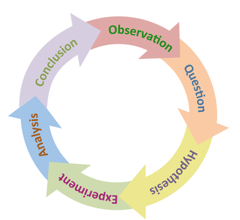

<style>
.eighteen > article > p {
   font-size: 18px !important;
}
</style>

<!-- Center image on slide -->
<script src="http://ajax.aspnetcdn.com/ajax/jQuery/jquery-1.7.min.js"></script>
<script type='text/javascript'>
$(function() {
    $("p:has(img)").addClass('centered');
});
</script>
</script>
<script type = 'text/javascript'>
$('p:has(img.build)').addClass('build')
</script>

<script type='text/javascript'>
// parameters
var sections = ["Why we plot",
"Grammar of graphics and ggplot2",
"Plots for one single continuous variable",
"Plots for two variables: one continuous, one discrete",
"Plots for two continuous variables",
"Tidy data"];

var title = "Overview";
var fontsize = "20pt"
var unselected_color = "#888888"
// function
function toc(cur) {
  // header
  document.write("<h2>"+title+"</h2>");
  // find current
  ind = sections.indexOf(cur);
  if (ind==-1 && cur.length>0) {
     document.write("<br/>Error: section not defined '"+cur+"'");
     return;
  }
  // write all out
  document.write("<br/><ul>");
  for (i = 0; i < sections.length; i++) { 
    if (cur=="") 
      // all the same
      document.write("<li style='font-size:"+fontsize+"'>"+sections[i]+"</li>");
    else {
      if (i==ind)
        document.write("<li style='font-size:"+fontsize+"'><b>"+sections[i]+"</b></li>");
      else
        document.write("<li style='color:"+unselected_color+";font-size:"+fontsize+"'>"+sections[i]+"</li>");
    }
  }
  document.write("</ul>");
}
</script>

````{r global_options, include=FALSE, cache=F}
# setwd(file.path("/Users/gagneur/project/dataviz/lectures-WS1920/lecture-05"))
source("../../config.R")
library(gridExtra)
opts_chunk$set(
    echo=TRUE, warning=FALSE, message=FALSE, cache=F, 
    results="show",
    out.width="500px", out.height="400px", fig.height = 3, fig.width = 4, 
    dpi=200
)

# data
ind <- fread('../../../extdata/CPI_HDI.csv')

mysize <- 15
mytheme <- theme(
    axis.title = element_text(size=mysize), 
    axis.text = element_text(size=mysize),
    legend.title = element_text(size=mysize),
    legend.text = element_text(size=mysize)
    ) + theme_bw()


options(knitr.package.unnamed.chunk.label="lecture-02")
```

<!-- START LECTURE -->


## Day 2 - Basic plotting and Tidy data

```{r syllabus, out.width = "800px", echo=FALSE}
knitr::include_graphics("assets/img/syllabus-day-2.png")
```

---

<script type='text/javascript'>toc("")</script>

---

<script type='text/javascript'>toc("Why we plot")</script>

---

## Do you see a common pattern in these plots?

```{r out.width = "1200px", out.height = "1200px", echo=FALSE}
knitr::include_graphics("assets/img/missleading-data-1.png")
```

---

## Maybe now?

<!-- {#id .class width=400px height=400px} -->

</br>

```{r,  out.width = "500px", out.height = "500px", echo=FALSE}
knitr::include_graphics("assets/img/missleading-data-2.png")
```

---

## Same statistics, different visualizations

</br>
```{r,  out.width = "500px", out.height = "500px", echo=FALSE}
knitr::include_graphics("assets/img/missleading-data.png")
```

---

## Why plotting?

It is nearly impossible for a single person to go through data line-by-line and see distinct patterns and make observations.

Data visualization becomes crucial for gaining **insight** into data that traditional descriptive statistics cannot.

**Plotting can give hints about bugs in our code (or even in the data!) and can help us to develop and improve methods and models.**

```{r, out.width = "300px", out.height= "300px", echo=FALSE}

```

---

## A realistic example to warm up

A vector containing 500 (hypothetical) height measurements for adults in Germany:

```{r echo=F}
set.seed(0)
height <- c(rnorm(499, mean=1.65, sd=0.045), 165)
```

```{r, echo=TRUE}
length(height)
head(height, n=10)
```

We want to know their average height:

```{r, echo=TRUE}
mean(height)
```
Wait... what?


--- &radio
```{r}
mean(height)
```
<br/>

What happened?

1. A. `mean()` is not the right function to assess what we want to know.

2. B. Adults in Germany are exceptionally tall

3. C. _A decimal point error in one data point._

4. D. It's a multiple testing problem because we are looking at so many data points (n=500).

***.explanation
See next slide

---

## Solution
```{r, echo=TRUE}
mean(height)
```

**What happened?**<br/>

* A. `mean()` is not the right function to assess what we want to know.
  * *No, the mean is exactly what we want.*
* B. Adults in Germany are exceptionally tall.
  * *OK, no...*
* **C. A decimal point error in one data point.**
  * *Yes, see next slide.*
* D. It's a multiple testing problem because we are looking at so many data points (n=500).
  * *This question was intentionally misleading, this does not have anything to do with multiple testing.*


---
## The outlier...

```{r out.width=c('300px', '300px'), fig.show='hold'}
plot(height)
hist(height)
```

```{r, echo=TRUE}
mean(height)
```

---
## The outlier...

A quick way to fix our dataset is to remove our outlier.

```{r, echo=TRUE}
fheight <- height[height < 3]
```

---
## The outlier...

```{r out.width=c('300px', '300px'), fig.show='hold'}
plot(fheight)
hist(fheight)
```

```{r, echo=TRUE}
mean(fheight)
```

---

## The outlier...

This is how the broken dataset was generated:

```{r, echo=TRUE}
height <- c(rnorm(499, mean=1.65, sd=0.045), 165)
```

---

## Our 2 visualization lectures

This lecture and the one that follows will cover:
* Grammar of graphics: a modular and felxible framework to build plots
* Standard plots based on dimension and nature of the data (discrete / continuous)
* Colors
* Dos and don'ts

---

<script type='text/javascript'>toc("Grammar of graphics and ggplot2")</script>

---
## Grammar of Graphics
The Grammar of Graphics is a visualization theory developed by 
Leland Wilkinson in 1999.
<br> 

* influenced the development of graphics and visualization libraries alike 
* 3 key principles
  * Separation of data from aesthetics (e.g. x and y axis, color-coding)
  * Definition of common plot/chart elements (e.g. dot plots, boxplots, etc.)
  * Composition of these common elements (one can combine elements as layers)


---
## ggplot2 and Grammar of Graphics

ggplot2 is a powerfull implementation of the grammar of graphics. Plotting with the help of the package ggplot2 has become widely used by R programmers. 

Lets see a sophisticated example...

```{r out.width='700px', fig.width=6, fig.height=3 , eval = FALSE}
# install.packages('gapminder')
library(gapminder)

gm_dt <- as.data.table(gapminder)[year %in% c(1977, 2007)]

ggplot(data = gm_dt, aes(x = gdpPercap, y = lifeExp)) +
  geom_point(aes(color = continent,size = pop)) +
  facet_grid(~year) +
  scale_x_log10() +
  labs(y = "Life expectation at birth", x = "per-capita GDP", size = "Population") +
  mytheme
```

---

## ggplot2 and Grammar of Graphics

```{r out.width='700px', fig.width=6, fig.height=3 , echo = FALSE}
library(gapminder)

gm_dt <- as.data.table(gapminder)[year %in% c(1977, 2007)]

ggplot(data = gm_dt, aes(x = gdpPercap, y = lifeExp)) + geom_point(aes(color = continent,size = pop)) +
  facet_grid(~year) +
  scale_x_log10() +
  labs(y = "Life expectation at birth", x = "per-capita GDP", size = "Population") +
  mytheme

```

But how we create such a plot step by step?

--- .eighteen

## Grammar Defines Components of Graphics

**Data:** data.frame (or data.table) object where columns correspond to variables

**Aesthetics:** describes visual characteristics that represent data (`aes`)
 - position (x,y), color, size, shape, transparency

**Layers:** made up of geometric objects that represent data (`geom_`)
 - points, lines, boxplots, ...

**Scales:** for each aesthetic, describes how visual characteristic is converted to display values (`scale_`)
 - log scales, color scales, size scales, shape scales, ...

**Facets:** describes how data is split into subsets and displayed as multiple sub graphs (`facet_`)

**Stats:** statistical transformations that typically summarize data (`stat`)
 - counts, means, medians, regression lines, ...

**Coordinate system:** describes 2D space that data is projected onto (`coord_`)
 - Cartesian coordinates, polar coordinates, map projections, ...


---

</br>

## Grammar Defines Components of Graphics


```{r, out.width = "800px", out.height= "800px", echo=FALSE}
knitr::include_graphics("assets/img/pyramid-of-graphics.png")
```

---

## Defining the data and layers

Lets have a quick look in our data
```{r}
head(gm_dt[, .(country, continent, gdpPercap, lifeExp, year)])
```

---

## Defining the data and layers

For starting with the visualization we initiate a `ggplot` object which generates a plot with background:
```{r, fig.height=2, fig.width=2, out.width = "400px", out.height= "300px"}
ggplot()
```

---

## Defining the data and layers

This `aes()` function defines which columns in the `data.table` object map to `x` and `y` coordinates and if they should be colored or have different shapes and sizes based on the values in a different column. These elements are called “aesthetic” elements, which we observe in the plot. 

```{r, fig.height=2, fig.width=2, out.width = "400px", out.height= "300px"}
ggplot(data = gm_dt, aes(x = gdpPercap, y = lifeExp))
```


---
## Defining the data and layers

In R, a scatter plot can be plotted with ggplot2 using the function `geom_point`. We want to construct a
scatter plot containing the gdpPercap on the x-axis and the lifeExp on the y-axis.

```{r, fig.height=2, fig.width=2, out.width = "400px", out.height= "300px"}
ggplot(data = gm_dt, aes(x = gdpPercap, y = lifeExp)) + geom_point()

```

---

## Defining the data and layers

One of the advantages of plotting with ggplot is that it returns an object which can be stored (e.g. in a variable
called p). The stored object can be further edited and you can also inspect its elements with the `names()` function:


```{r}
p <- ggplot(data = gm_dt, aes(x = gdpPercap, y = lifeExp)) + geom_point()
names(p)
```

---
  
## Defining the data and layers

We can also save the ggplot object with the help of the function saveRDS(). Then, we can read the saved object
again with the help of the function readRDS() and add a horizontal line at y=50 to the plot:


```{r, eval=FALSE}
saveRDS(p, "extdata/my_first_plot.rds")
p <- readRDS("extdata/my_first_plot.rds")
```

```{r, fig.height=2, fig.width=2, out.width = "400px", out.height= "300px", echo=FALSE}
saveRDS(p, "../../../extdata/my_first_plot.rds")
p <- readRDS("../../../extdata/my_first_plot.rds")
```

---
  
## Defining the data and layers

We can also save the ggplot object with the help of the function saveRDS(). Then, we can read the saved object
again with the help of the function readRDS() and add a horizontal line at y=50 to the plot:

```{r, fig.height=2, fig.width=2, out.width = "400px", out.height= "300px"}
p + geom_hline(yintercept = 50)
```

---

## Mapping of aesthetics `color`

We can easily map variables to different colors, sizes or shapes depending on the value of the specified variable using the `aes` function. 
```{r, out.width = "800px", out.height= "300px", fig.height=3, fig.width=6}
ggplot(data = gm_dt, aes(x = gdpPercap, y = lifeExp, color = continent)) + geom_point()
```

---

## Mapping of aesthetics `shape`

To change the shape of our points we can override the `shape` argument of the `aes`

```{r, out.width = "800px", out.height= "300px", fig.height=3, fig.width=6}
ggplot(data = gm_dt, aes(x = gdpPercap, y = lifeExp, shape = continent)) + geom_point()
```

---

## Mapping of aesthetics `size`

Additionally, we distinguish the population of each country by giving a size to the points in the scatter plot:

```{r, out.width = "800px", out.height= "300px", fig.height=3, fig.width=6}
ggplot(data = gm_dt, aes(x = gdpPercap, y = lifeExp, color = continent, size = pop)) +
geom_point()
```

---

## Global versus individual mapping

Global mapping is inherited by default to all geom layers (geom_point in the previous example), while mapping at individual layers is only recognized at that layer.

```{r out.width = "800px", out.height= "300px", fig.height=3, fig.width=6}
ggplot(data = gm_dt, aes(x = gdpPercap, y = lifeExp)) +
  geom_point(aes(color = continent,size = pop))
```

---

## Global versus individual mapping

Individual layer mapping cannot be recognized by other layers. For instance, we can add another layer for
smoothing with `stat_smooth()`.

```{r}
# this doesn't work as stat_smooth didn't know aes(x , y)
ggplot(data = gm_dt) + geom_point(aes(x = gdpPercap, y = lifeExp)) + stat_smooth()
```

---

## Global versus individual mapping

Individual layer mapping cannot be recognized by other layers. For instance, we can add another layer for
smoothing with `stat_smooth()`.

```{r fig.height=2, fig.width=2, out.width = "400px", out.height= "300px"}
# this would work but too redundant
ggplot(data = gm_dt) + geom_point(aes(x = gdpPercap, y = lifeExp)) + 
  stat_smooth(aes(x = gdpPercap, y = lifeExp))
```

---

## Global versus individual mapping

Individual layer mapping cannot be recognized by other layers. For instance, we can add another layer for
smoothing with `stat_smooth()`.

```{r fig.height=3, fig.width=6, out.width = "800px", out.height= "300px"}
# the common aes(x, y) shared by all the layers can be put in the ggplot()
ggplot(data = gm_dt, aes(x = gdpPercap, y = lifeExp, color = continent)) + geom_point(aes(size = pop)) +
stat_smooth()
```

--- &radio

## Quiz

What's the result of the following command?

`ggplot(data = mpg)`

1. A Nothing happens

2. B _A blank figure will be produced_

3. C A blank figure with axes will be produced

4. D All data in `mpg` will be visualized

***.hint
ggplot builds plot layer by layer. 

***.explanation
Neither variables were mapped nor geometry specified. 


--- &radio

## Solution

What's the result of the following command?

`ggplot(data = mpg, aes(x = hwy, y = cty))`

1. A Nothing happens

2. B A blank figure will be produced

3. C _A blank figure with axes will be produced_

4. D A scatter plot will be produced

***.hint
ggplot builds plot layer by layer. 

***.explanation
Axis x and y are mapped. But no geometry specified.


--- &radio

## Quiz

What's the result of the following command?

`ggplot(data = mpg, aes(x = hwy, y = cty)) + geom_point()`

1. A Nothing happens

2. B A blank figure will be produced

3. C A blank figure with axes will be produced

4. D _A scatter plot will be produced_

***.hint
ggplot builds plot layer by layer. 

***.explanation
Data, axes and geometry specified.

---

## Solutions

`ggplot(data = mpg)`: a blank figure will be produced

`ggplot(data = mpg, aes(x = hwy, y = cty))`: A blank figure with axes will be produced

`ggplot(data = mpg, aes(x = hwy, y = cty)) + geom_point()`: A scatter plot will be produced

---

## Exercise Iris

---

<script type='text/javascript'>toc("Plots for one single continuous variable")</script>

---

## Low dimensional plots

In the previous examples, we had a look at scatter plots which are suitable for plotting the relationship between
two continuous variables. However, there are many more types of plots (e.g. histograms, boxplots) which can be
used for plotting in different scenarios. Mainly, we distinguish between plotting one or two variables and whether the
variables are continuous or discrete.

---

## Low dimensional plots
Lets prepare some data for plotting using the Human Development Index (HDI) dataset: 

```{r eval=FALSE}
ind <- fread('extdata/CPI_HDI.csv')
```

```{r}
head(ind)
```

---
## Histograms

To plot the values of a vector with continuous values we can use a histogram. A histogram represents the frequencies of values of a variable bucketed into ranges, using the function geom_histogram():

```{r out.width="800px", fig.width=6, fig.height=3, message=FALSE}
ggplot(ind, aes(HDI)) + geom_histogram() + mytheme
```

---
## Histogram: setting the number of bins

By default, the number of bins in ggplot2 is 30. We can simply change this by defining the number of desired bins
in the `bins` argument of the `geom_histogram()` function:

```{r out.width="800px", fig.width=6, fig.height=3}
ggplot(ind, aes(HDI)) + geom_histogram(bins=10) + mytheme
```

---

## Exercise Histograms

---

<script type='text/javascript'>toc("Plots for two variables: one continuous, one discrete")</script>

---

## Boxplots by category

Boxplots are well suited for plotting one continuous variable. However, we can also use boxplots
to show distributions of continuous variables with respect to some categories. This can be particularly interesting for
comparing the different distributions of each category.

```{r, out.width="800px", fig.width=6, fig.height=3}
ggplot(mpg, aes(class, hwy)) + geom_boxplot() + mytheme

```

---

## Violin plots

A violin plot is an alternative to the boxplot for visualizing either one continuous variable (grouped by categories). An advantage of the violin plot over the boxplot is that it also shows the entire distribution of the data. This can be particularly interesting when dealing with multimodal data. You can make a violin plot using the `geom_violin()` function.


```{r out.width="800px", fig.width=6, fig.height=2.5}
ggplot(mpg, aes(class, hwy)) + geom_violin() + mytheme
```

---

## Boxplots and Violin plots

It is possible to not show the outliers. However, we strongly recommend to keep them.
Outliers can reveal interesting data points (discoveries "out of the box") or bugs in data preprocessing. 

--- &radio

## Quiz

For which type of data will boxplots produce meaningful visualizations? (2 possible answers)

1. A. For discrete data.

2. B. For bi-modal distributions.

3. C. For non-Gaussian, symmetric data.

4. D. For exponentially distributed data.

---

## Solution

For which type of data will boxplots produce meaningful visualizations? (2 possible answers)

**For which type of data will boxplots produce meaningful visualizations?**
* **C. For non-Gaussian, symmetric data.**
* **D. For exponentially distributed data.**

Boxplots are bad for bimodal data since they only show one mode (the median), but are ok for both symmetric and non-symmetric data, since the quartiles are not symmetric.
```{r fig.height = 2, fig.width = 4, fig.show='hold', eval=FALSE}  
dt <- data.table(x=c(1,1,1,2,2,2,8,8,8), # Discrete data, bad for boxplot
                 y=rbeta(n=1000,shape1=2,shape2=2),
                 z=rexp(n=1000, rate=1),
                 group='x') %>% melt(id.var="group")
ggplot(dt, aes(group, value)) + geom_boxplot() + facet_wrap(~variable) + mytheme
```

---

## Solution

**For which type of data will boxplots produce meaningful visualizations?**
* **C. For non-Gaussian, symmetric data.**
* **D. For exponentially distributed data.**

Boxplots are bad for bimodal data since they only show one mode (the median), but are ok for both symmetric and non-symmetric data, since the quartiles are not symmetric.

```{r, fig.height = 2, fig.width = 4, fig.show='hold', echo=FALSE}  
dt <- data.table(x=c(1,1,1,2,2,2,8,8,8), # Discrete data, bad for boxplot
                 y=rbeta(n=1000,shape1=2,shape2=2),
                 z=rexp(n=1000, rate=1),
                 group='x') %>% melt(id.var="group")
ggplot(dt, aes(group, value)) + geom_boxplot() + facet_wrap(~variable) + mytheme
```

---

## Boxplots/Violin plots exercise

---

<script type='text/javascript'>toc("Plots for two continuous variables")</script>

---

## Scatter plots

Scatter plots are a useful plot type for easily visualizing the relationship between two continuous variables. To make a scatter plot we use the `geom_point()` function.

```{r out.width='600px', fig.height = 3, fig.width = 4.5}
ggplot(mpg, aes(displ, hwy)) + geom_point() + mytheme
```

---

## Scatter plots grouped by discrete variable

We can modify the previous plot by coloring the points depending on the vehicle class:

```{r out.width='600px', fig.height = 3, fig.width = 4.5}
ggplot(mpg, aes(displ, hwy, color = class)) + geom_point() + mytheme
```

---

## Scatter plots grouped by discrete variable

Sometimes, too many colors can be hard to distinguish. In such cases, we can use facet to separate them into different plots:
```{r out.width='600px', fig.height = 4, fig.width = 6}
ggplot(mpg, aes(displ, hwy)) + geom_point() + facet_wrap(~class) + mytheme
```

---

## Line plots

A line plot can be considered for connecting a series of individual data points or to display the trend of a series of
data points. This can be particularly useful to show the shape of data as it flows and changes from point to point.
We can also show the strength of the movement of values up and down through time.

```{r out.width='600px', fig.height = 3, fig.width = 6}
ggplot(economics, aes(date, unemploy/pop)) + geom_line() + mytheme
```

--- &radio

## Quiz

When to use a line plot?

1. A _To show a connection between a series of individual data points_
2. B To show a correlation between two quantitative variables
3. C To highlight individual quantitative values per category
4. D To compare distributions of quantitative values across categories

--- 

## Solution

When to use a line plot?

A **To show a connection between a series of individual data points**

---

## Scatterplot exercise

---
## Take-home
* Visualization is as important as statistics. Both are needed.
* Visualization can help finding "bugs" in the data
* Grammar of graphics separates data, aesthetics, and geometries
* Show as much as the raw data as you can:
  * Extend boxplot and barplots with beeswarm plots
  * Combine density and individual data points in 1D or 2D.
  

---
## References

* Main reference: [Udacity's Data Visualization and D3.js](https://www.udacity.com/courses/all)
* perceptual edge:
  * [the right graph](http://www.perceptualedge.com/articles/ie/the_right_graph.pdf)
  * [visual perception](http://www.perceptualedge.com/articles/ie/visual_perception.pdf)
  * [rules for color](http://www.perceptualedge.com/articles/visual_business_intelligence/rules_for_using_color.pdf)
  * [choosing color](http://www.perceptualedge.com/articles/b-eye/choosing_colors.pdf)
* flowingdata.com: [graphical perception](http://flowingdata.com/2010/03/20/graphical-perception-learn-the-fundamentals-first/)
* [Color Brewer](http://colorbrewer2.org/)
* Graphics principles
  * [paper] (https://onlinelibrary.wiley.com/doi/full/10.1002/pst.1912)
  * [cheatsheet](https://graphicsprinciples.github.io/)


---
## Plotting libraries

- http://www.r-graph-gallery.com/portfolio/ggplot2-package/
- http://ggplot2.tidyverse.org/reference/
- https://plot.ly/r/
- https://plot.ly/ggplot2/